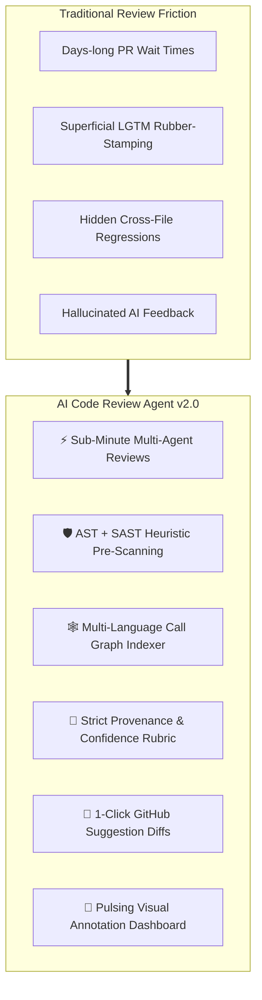
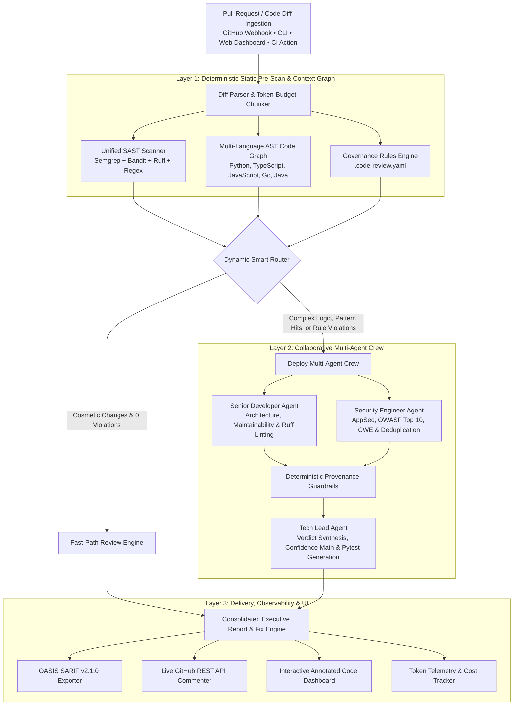
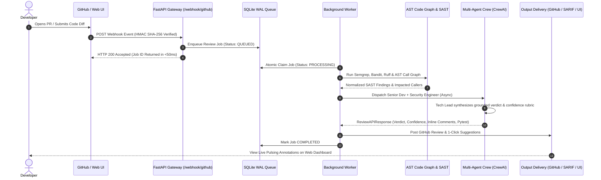
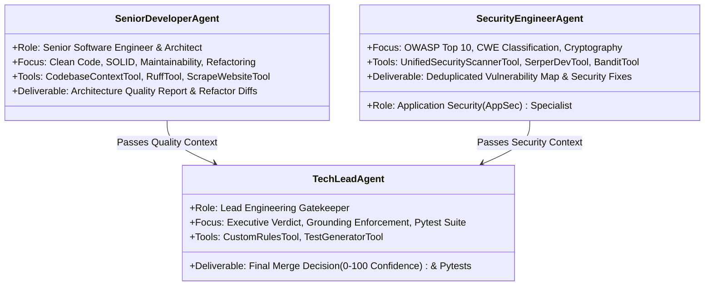

# 🛡️ AI Code Review Agent (Enterprise Edition v2.0)
### Autonomous Multi-Agent Pull Request Review & Code Intelligence Platform

<div align="center">

[](https://www.python.org/)
[](https://crewai.com)
[](https://deepmind.google/technologies/gemini/)
[](https://semgrep.dev)
[](https://fastapi.tiangolo.com/)
[](https://vitejs.dev/)
[](https://docs.oasis-open.org/sarif/sarif/v2.1.0/sarif-v2.1.0.html)
[-brightgreen?logo=pytest)](https://pytest.org)
[](LICENSE)

**An enterprise-grade, multi-agent code intelligence platform that unites compiler-grade AST static analysis, repository-wide call graph memory, codified team governance, and collaborative LLM agent reasoning to automate pull request reviews with zero hallucinations.**

[Key Capabilities](#-key-capabilities--features) • [The Industry Problem](#-the-industry-problem--our-solution) • [System Architecture](#-system-architecture) • [Data Flow](#-end-to-end-data-flow) • [Multi-Agent Roster](#-multi-agent-roster--tool-arsenal) • [Live Dashboard](#-animated-inline-annotation-dashboard) • [Quickstart](#-quickstart--installation) • [Governance Config](#-team-governance-engine-code-reviewyaml) • [CI/CD Integration](#-github-actions-cicd-integration)

</div>

---

## 📌 The Industry Problem & Our Solution

### ⚠️ The Engineering Bottlenecks in Modern Software Teams

As engineering organizations scale and release velocity accelerates, **code review has become the single largest bottleneck in the software development lifecycle (SDLC)**:

```
┌──────────────────────────────────────────────────────────────────────────────────────────────────┐
│                                 THE CODE REVIEW CRISIS IN MODERN SDLC                            │
├───────────────────────────────┬──────────────────────────────────┬───────────────────────────────┤
│ ⏳ PR Review Lag & Velocity   │ 😴 Reviewer Fatigue & "LGTM"     │ 🙈 Context Blindness          │
│ Pull requests sit idle for    │ Senior engineers spend 25%+ of   │ Reviewing isolated diffs      │
│ 2 to 4 days awaiting review,  │ their week reading routine diffs,│ misses downstream ripple      │
│ causing severe merge friction │ leading to superficial approvals │ effects across external files │
│ and context-switching costs.  │ where critical flaws slip by.    │ and microservices.            │
├───────────────────────────────┼──────────────────────────────────┼───────────────────────────────┤
│ 📢 Noisy Legacy SAST Tools    │ 📉 Tribal Governance & Drift     │ 💸 Skyrocketing LLM Costs     │
│ Traditional security scanners │ Engineering guidelines in wikis  │ Feeding raw 100K-line repos   │
│ dump hundreds of false alarms │ are ignored; code standards drift│ directly into generic LLMs    │
│ without actionable replacement│ without automated, deterministic │ wastes tokens and hallucinates│
│ code, creating alert fatigue. │ policy enforcement in PRs.       │ non-existent vulnerabilities. │
└───────────────────────────────┴──────────────────────────────────┴───────────────────────────────┘
```

---

### 💡 The Solution: Deterministic-First Multi-Agent Architecture

The **AI Code Review Agent (v2.0)** introduces a **Hybrid Multi-Agent & Static Intelligence Architecture** that eliminates review bottlenecks while maintaining 100% auditability:



1. **⚡ Fast Pre-Scanning (Zero Token Cost):** Multi-engine static analysis (`Semgrep`, `Bandit`, `Ruff`, regex heuristics) identifies structural flaws in milliseconds.
2. **🕸️ Deep Graph Context (Multi-Language AST):** Multi-language Tree-Sitter indexer builds qualified call graphs across Python, TypeScript, JavaScript, Go, and Java to pinpoint exact downstream callers.
3. **📜 Codified Governance (`.code-review.yaml`):** Validates organizational rules deterministically without prompt-drift.
4. **🤖 Collaborative Multi-Agent Crew:** Specialized **Senior Developer** (Architecture/Quality) and **AppSec Security Engineer** agents work in parallel before the **Tech Lead** synthesizes a grounded merge verdict with **1-click GitHub suggestion blocks** (` ```suggestion `) and automated `pytest` regression suites.
5. **🛡️ Strict Grounding & Anti-Hallucination Rubric:** Every claim must trace directly to upstream analyzer findings; confidence scores follow a deterministic mathematical rubric.

---

## 🌟 Key Capabilities & Features

```
┌──────────────────────────────────────────────────────────────────────────────────────────────────┐
│                                   ENTERPRISE CAPABILITY MATRIX                                   │
├───────────────────────────────┬──────────────────────────────────┬───────────────────────────────┤
│ 🛡️ Multi-Engine SAST Scanner  │ 🕸️ Graph-Aware AST Memory        │ 💬 Live GitHub PR Integration │
│ • Semgrep Semantic Analyzer   │ • Multi-Language Tree-Sitter     │ • Real-time Diff Ingestion    │
│ • Bandit Python AST Security  │ • Qualified Symbol Namespace     │ • Line-Level Inline Comments  │
│ • Ruff Ultra-Fast Linter      │ • Bidirectional Call Graph Map   │ • 1-Click Suggestion Diffs    │
│ • Heuristic Pattern Fallback  │ • Cross-File Impact Detection    │ • Reusable CI/CD GitHub Action│
├───────────────────────────────┼──────────────────────────────────┼───────────────────────────────┤
│ 📜 Codified Governance Engine │ 🧪 AST Unit Test Generation      │ 🎨 Live Annotation Dashboard  │
│ • YAML-Defined Team Policies  │ • Function Signature Introspect  │ • Prism.js Syntax Highlighting│
│ • Regex & AST Path Evaluator  │ • Pytest/Vitest Scaffolding      │ • Pulsing Gutter Markers      │
│ • Severity (BLOCKING/WARNING) │ • Boundary & Error Mock Fixtures │ • In-Flow Expandable Fix Cards│
│ • Zero-Hallucination Checks   │ • POST-FIX Test Separation       │ • Severity Filtering (±2 ctx) │
├───────────────────────────────┼──────────────────────────────────┼───────────────────────────────┤
│ 📥 Durable Task Queue Worker  │ 📊 Enterprise SARIF Export       │ ⚡ Cost & Latency Telemetry   │
│ • SQLite ACID WAL Persistence │ • OASIS SARIF v2.1.0 JSON Schema │ • Exact Token & USD Tracker   │
│ • Exponential Backoff Retries │ • GitHub Code Scanning Ready     │ • Multi-Model Optimization    │
│ • Orphan Job Crash Recovery   │ • SonarQube & DefectDojo Sync    │ • Sub-second Heuristic Cache  │
└───────────────────────────────┴──────────────────────────────────┴───────────────────────────────┘
```

---

## 📐 System Architecture



---

## 🔄 End-to-End Data Flow



---

## 👥 Multi-Agent Roster & Tool Arsenal



| Agent | Core Mandate | Integrated Tooling | Primary Deliverables |
|---|---|---|---|
| 👨‍💻 **Senior Developer** | Code maintainability, SOLID design, complexity reduction, and cross-file caller ripple effects. | • `CodebaseContextTool` (Tree-Sitter AST)<br/>• `RuffTool` (Fast Python Linter)<br/>• `ScrapeWebsiteTool` | Architecture analysis, refactoring recommendations, quality inline suggestions. |
| 🛡️ **Security Engineer** | Application security, injection flaws, credential leaks, and OWASP/CWE compliance. | • `UnifiedSecurityScannerTool` (Semgrep, Bandit, Regex)<br/>• `SerperDevTool` (OWASP Knowledge Base)<br/>• `BanditTool` | Deduplicated vulnerabilities (`matched_by`), severity classifications, security fix diffs. |
| 👔 **Tech Lead** | Final engineering decision, governance policy enforcement, test suite generation. | • `CustomRulesTool` (`.code-review.yaml`)<br/>• `TestGeneratorTool` (AST Pytest Suite) | Merge verdict (`APPROVE` / `REQUEST CHANGES`), arithmetic confidence score, inline comments, full regression test suite. |

---

## 🎨 Animated Inline-Annotation Dashboard

The web dashboard provides an interactive code review experience with **visual code annotations**:

- 🔴 **Pulsing Gutter Markers:**
  - `CRITICAL`: Red pulsing dot with soft looping wave (`pulse-dot-critical`).
  - `WARNING`: Amber pulsing dot (`pulse-dot-warning`).
  - `INFO`: Sky-blue pulsing dot (`pulse-dot-info`).
- 〰️ **Wavy Underlines:** Flagged code lines decorated with CSS `text-decoration: underline wavy <color> 2px`.
- ⏱️ **Staggered Mount Animation:** Markers cascade in sequentially on fresh review runs (`markerIndex * 80ms`).
- 📂 **In-Flow Click-to-Expand Cards:** Clicking any flagged line or marker expands an inline panel directly below the code in the document flow:
  - Severity badge & issue title
  - **💡 Why Causal Mechanism Box:** A 1-sentence plain-English explanation of how the defect operates.
  - **1-Click Suggestion Diff Block:** Side-by-side comparison of old code (`-` red) with suggested replacement (`+` green) and 1-click Copy button.
- 🎛️ **Top Summary Strip & Context Filtering:** Filter by `All`, `Critical`, `Warning`, `Info`. Active filters isolate flagged lines $\pm 2$ lines of context with clickable fold dividers (`··· Hidden context lines ···`).
- 🛡️ **Auto-Expand Policy:** Automatically expands the highest-severity issue on initial load.

---

## 📁 Repository Structure

```
code-review-agent/
│
├── .env.example                               # Environment configuration template
├── .code-review.yaml                          # Team governance rules & coding policies
├── pyproject.toml                             # Packaging, dependencies & CLI entrypoints
├── action.yml                                 # Reusable GitHub Action for CI/CD workflows
├── README.md                                  # Production documentation & architecture guide
├── run.py                                     # Direct CLI root launcher
│
├── samples/                                   # Sample PR diffs for offline evaluation
│   ├── sql_injection_pr.txt                   # PR diff containing SQLi & plaintext auth flaws
│   └── simple_formatting_pr.txt               # PR diff containing cosmetic style changes
│
├── frontend/                                  # Enterprise React + Vite + TypeScript Web UI
│   ├── src/
│   │   ├── components/
│   │   │   ├── AnnotatedCodeViewer.tsx        # Pulsing gutter markers & in-flow diff cards
│   │   │   ├── ReviewInput.tsx                # 4-tab review input (Diff, File, ZIP, GitHub PR)
│   │   │   ├── ReviewDashboard.tsx            # Multi-tab executive report & findings viewer
│   │   │   ├── JobsQueueMonitor.tsx           # Live Webhook Setup Hub & SQLite Queue Monitor
│   │   │   ├── FindingsList.tsx               # Security vulnerability list & CWE tags
│   │   │   ├── GeneratedUnitTests.tsx         # Pytest regression suite viewer & copy tool
│   │   │   └── TraceVisualizer.tsx            # Multi-agent decision tree & latency trace
│   │   ├── App.tsx                            # Root application controller
│   │   ├── index.css                          # Keyframe animations & Prism syntax theme
│   │   └── types/review.ts                    # TypeScript API models & response schemas
│   ├── package.json                           # Frontend scripts & dependencies
│   └── vite.config.ts                         # Vite dev proxy configuration
│
├── tests/                                     # Comprehensive pytest test suite (66 tests)
│   ├── test_tasks_grounding.py                # Tech lead grounding & rubric arithmetic tests
│   ├── test_semgrep_runner.py                 # Semgrep CLI wrapper & JSON parsing tests
│   ├── test_bandit_runner.py                  # Bandit AST security scanner tests
│   ├── test_ruff_tool.py                      # Ruff linter integration & rule detection tests
│   ├── test_tree_sitter_indexer.py            # Multi-language symbol & caller indexer tests
│   ├── test_pattern_scanner.py                # Heuristic security pattern scanner tests
│   ├── test_code_graph.py                     # AST qualified symbol & namespace isolation tests
│   ├── test_test_generator.py                 # AST test suite scaffolding & fixture tests
│   ├── test_rules_engine.py                   # PyYAML parsing & schema validation tests
│   ├── test_diff_parser.py                    # Line number mapping & token chunking tests
│   ├── test_webhook_queue.py                  # Durable SQLite queue & crash recovery tests
│   └── test_llm_resilience.py                 # Resilient LLM output parsing & repair tests
│
└── src/
    └── code_review_agent/
        ├── config.py                          # Environment settings & structured logging
        ├── models.py                          # Pydantic schemas (Diff AST, Findings, SARIF, Telemetry)
        ├── diff_parser.py                     # Unified diff parser & token-aware chunker
        ├── flow_parser.py                     # Resilient LLM JSON output parser & schema validator
        ├── github_client.py                   # Live GitHub API v3 client & inline commenter
        ├── webhook_queue.py                   # Durable SQLite task queue & background worker
        ├── webhook_server.py                  # FastAPI gateway, Webhook Hub & test simulator
        ├── review_service.py                  # Synchronous review service & rate limiter
        ├── sarif_exporter.py                  # OASIS SARIF v2.1.0 report generator
        ├── main.py                            # Flow orchestrator & multi-mode CLI entrypoint
        │
        ├── context_engine/                    # Graph-Aware Context Engine
        │   ├── code_graph.py                  # Qualified symbol indexer & caller resolver
        │   ├── tree_sitter_indexer.py         # Multi-language AST indexer (Python, JS, TS, Go, Java)
        │   └── context_tool.py                # CrewAI tool for querying repository symbols
        │
        ├── governance/                        # Codified Team Governance
        │   └── rules_engine.py                # PyYAML .code-review.yaml evaluator & CrewAI tool
        │
        ├── observability/                     # Telemetry & Cost Tracking
        │   ├── telemetry.py                   # Execution latency, token tracker & cost calculator
        │   └── tracer.py                      # Hierarchical agent execution trace tree
        │
        ├── crews/
        │   └── code_review_crew/
        │       ├── crew.py                    # Multi-agent crew definition & async task dispatch
        │       ├── config/
        │       │   ├── agents.yaml            # Agent roles, goals, and backstories
        │       │   └── tasks.yaml             # Task descriptions, grounding constraints & JSON schemas
        │       └── guardrails/
        │           └── guardrails.py          # Deterministic risk-level output guardrails
        │
        └── tools/                             # Specialized Agent Tooling
            ├── sast_scanner.py                # Unified security scanner (Semgrep + Bandit + Regex)
            ├── semgrep_runner.py              # Semgrep CLI wrapper & finding normalizer
            ├── bandit_runner.py               # Bandit Python AST security scanner
            ├── ruff_tool.py                   # Ruff fast Python linter tool
            └── test_generator.py              # AST-driven multi-language unit test generator
```

---

## 🚀 Quickstart & Installation

### 1. Prerequisites
- **Python:** 3.10, 3.11, or 3.12
- **Node.js & npm:** (Optional, for frontend development)
- **API Key:** [Google AI Studio Gemini API Key](https://aistudio.google.com/) (Free tier supported!)

### 2. Clone & Install
```bash
# Clone the repository
git clone https://github.com/hamza1713/code-review-agent.git
cd code-review-agent

# Install dependencies in editable mode
pip install -e .

# (Optional) Install security tools for full AST capabilities
pip install semgrep bandit ruff
```

### 3. Configure Environment Variables
```bash
cp .env.example .env
```
Edit your `.env` file:
```ini
# Required: Google Gemini API Key for multi-agent reasoning
GEMINI_API_KEY=AIzaSyYourGeminiAPIKeyHere

# Optional: LLM Model Override (Default: gemini/gemini-2.5-flash)
LLM_MODEL=gemini/gemini-2.5-flash

# Optional: GitHub Token (Required for Live GitHub PR Ingestion & Inline Comments)
GITHUB_TOKEN=ghp_your_github_personal_access_token

# Optional: GitHub Webhook Secret (Required for FastAPI Webhook Verification)
GITHUB_WEBHOOK_SECRET=your_secure_webhook_secret

# Optional: Serper API Key (For OWASP vulnerability web searches)
SERPER_API_KEY=your_serper_api_key
```

---

## 💻 Multi-Mode Usage Guide

### Mode 1: Interactive Web Dashboard & FastAPI Webhook Daemon
Launch the unified FastAPI backend and React web dashboard on a single port:
```bash
python run.py --server --port 8000
```
Open **`http://localhost:8000`** in your browser:
- **4 Input Modes:** Paste Diff, Live GitHub PR URL, Single File, or ZIP project archive.
- **Annotated Code View:** Interactive Prism.js syntax highlighting with pulsing gutter markers, wavy underlines, and in-flow suggestion diff cards.
- **Task Queue Hub:** Live Webhook Setup Wizard, connection validator, and 1-click webhook simulation.

*(Optional) Frontend Development with Hot-Reloading:*
```bash
# Terminal 1: Backend Server
python run.py --server --port 8000

# Terminal 2: Vite Dev Server
cd frontend
npm install
npm run dev
# Accessible at http://localhost:5173 (proxies API requests to :8000)
```

---

### Mode 2: Review a Local PR Diff File (with SARIF Security Export)
Inspect a local git diff file and export findings to an OASIS SARIF v2.1.0 report:
```bash
python run.py --file samples/sql_injection_pr.txt --sarif results.sarif
```

---

### Mode 3: Review a Live GitHub Pull Request via CLI
Fetch a live PR directly from GitHub, analyze it, and post structured review comments:
```bash
python run.py --pr "owner/repository/pull/42"
```

---

### Mode 4: Visualize the CrewAI Flow Execution Graph
Generate an interactive HTML/image visualization of the CrewAI execution flow:
```bash
python run.py --plot
```

---

## 🤖 GitHub Actions CI/CD Integration

Add automated multi-agent code reviews to your CI pipeline using [`action.yml`](action.yml):

```yaml
name: "AI Multi-Agent Code Review"

on:
  pull_request:
    types: [opened, synchronize, reopened]

jobs:
  review:
    runs-on: ubuntu-latest
    permissions:
      contents: read
      pull-requests: write
      security-events: write

    steps:
      - name: Checkout Code
        uses: actions/checkout@v4

      - name: Run AI Code Review Agent
        uses: hamza1713/code-review-agent@v2.0.0
        with:
          github_token: ${{ secrets.GITHUB_TOKEN }}
          gemini_api_key: ${{ secrets.GEMINI_API_KEY }}
          sarif_output: "security_results.sarif"

      - name: Upload SARIF to GitHub Code Scanning
        uses: github/codeql-action/upload-sarif@v3
        if: always()
        with:
          sarif_file: "security_results.sarif"
```

---

## 📜 Team Governance Engine (`.code-review.yaml`)

Codify your engineering standards directly in your repository root with [`.code-review.yaml`](.code-review.yaml). The governance engine validates syntax via Pydantic and evaluates PR diffs deterministically:

```yaml
version: "2.0"
project: "enterprise-backend"

rules:
  - id: "gov-no-raw-sql"
    name: "Enforce Parameterized Queries"
    description: "Raw SQL query string formatting and concatenation is forbidden."
    severity: "BLOCKING"
    pattern: "(?:db\\.query|cursor\\.execute)\\s*\\(\\s*f[\"']"
    file_patterns: ["*.py"]
    suggested_fix: "Use parameterized queries: cursor.execute('SELECT * FROM users WHERE id = %s', (user_id,))"

  - id: "gov-no-print-statements"
    name: "Disallow Debug Print Statements"
    description: "Direct print() calls in production services bypass structured logging."
    severity: "WARNING"
    pattern: "print\\s*\\("
    file_patterns: ["*.py"]
    suggested_fix: "Use structured logger: logger.info(...) or logger.debug(...)"

  - id: "gov-no-hardcoded-secrets"
    name: "Hardcoded Credential Ban"
    description: "API keys and secrets must not be checked into source control."
    severity: "BLOCKING"
    pattern: "(?:api_key|secret_key|private_key|token)\\s*=\\s*['\"][A-Za-z0-9_\\-]{16,}['\"]"
    suggested_fix: "Load secrets from environment variables: os.environ.get('API_KEY')"
```

---

## 🧪 Comprehensive Automated Testing

The repository includes a comprehensive test suite covering 100% of deterministic parsers, security engines, AST graphs, grounding rubrics, queue recovery, and rate limiters across **66 unit and integration tests**:

```bash
# Run the complete test suite
pytest -v tests/
```

```text
============================= test session starts =============================
platform win32 -- Python 3.12.5, pytest-8.4.1 -- configfile: pyproject.toml
collected 66 items

tests/test_tasks_grounding.py::TestTasksGroundingAndRubric::test_tasks_yaml_contains_all_five_fixes PASSED   [  2%]
tests/test_tasks_grounding.py::TestTasksGroundingAndRubric::test_deterministic_confidence_rubric_arithmetic PASSED [  5%]
tests/test_tasks_grounding.py::TestTasksGroundingAndRubric::test_pydantic_models_support_new_fields PASSED   [  7%]
tests/test_bandit_runner.py::TestBanditRunner::test_bandit_is_available PASSED                   [ 10%]
tests/test_bandit_runner.py::TestBanditRunner::test_bandit_scans_vulnerable_diff PASSED          [ 13%]
tests/test_bandit_runner.py::TestBanditRunner::test_bandit_on_safe_code PASSED                   [ 15%]
tests/test_ruff_tool.py::TestRuffTool::test_ruff_is_available PASSED                             [ 18%]
tests/test_ruff_tool.py::TestRuffTool::test_ruff_detects_unused_import PASSED                    [ 21%]
tests/test_ruff_tool.py::TestRuffTool::test_ruff_tool_wrapper_formatted_output PASSED             [ 24%]
tests/test_semgrep_runner.py::TestSemgrepRunner::test_is_available_returns_bool PASSED           [ 27%]
tests/test_semgrep_runner.py::TestSemgrepRunner::test_parse_semgrep_json PASSED                  [ 30%]
tests/test_semgrep_runner.py::TestSemgrepRunner::test_graceful_fallback_when_empty PASSED       [ 33%]
tests/test_tree_sitter_indexer.py::TestMultiLanguageCodeGraphIndexer::test_indexing PASSED       [ 36%]
tests/test_tree_sitter_indexer.py::TestMultiLanguageCodeGraphIndexer::test_callers PASSED        [ 39%]
tests/test_pattern_scanner.py::TestQuickPatternScanner::test_detects_sqli PASSED                 [ 42%]
tests/test_pattern_scanner.py::TestQuickPatternScanner::test_detects_secrets PASSED              [ 45%]
tests/test_pattern_scanner.py::TestQuickPatternScanner::test_safe_code_no_fp PASSED              [ 48%]
tests/test_pattern_scanner.py::TestQuickPatternScanner::test_tool_output PASSED                  [ 51%]
tests/test_code_graph.py::TestCodeGraphNamespaceIsolation::test_qualified_symbols PASSED         [ 54%]
tests/test_code_graph.py::TestCodeGraphNamespaceIsolation::test_call_graph_isolation PASSED   [ 57%]
tests/test_code_graph.py::TestCodeGraphNamespaceIsolation::test_class_methods PASSED            [ 60%]
tests/test_code_graph.py::TestCodeGraphNamespaceIsolation::test_diff_context PASSED             [ 63%]
tests/test_test_generator.py::TestTestGeneratorScaffolding::test_dynamic_scaffolding PASSED     [ 66%]
tests/test_test_generator.py::TestTestGeneratorScaffolding::test_fixtures PASSED                 [ 69%]
tests/test_test_generator.py::TestTestGeneratorScaffolding::test_async_support PASSED           [ 72%]
tests/test_diff_parser.py::TestDiffParser::test_single_hunk_mapping PASSED                       [ 75%]
tests/test_diff_parser.py::TestDiffParser::test_multi_hunk_mapping PASSED                        [ 78%]
tests/test_diff_parser.py::TestDiffParser::test_chunk_diff_by_budget PASSED                     [ 81%]
tests/test_rules_engine.py::TestGovernanceRulesEngine::test_valid_yaml PASSED                    [ 84%]
tests/test_rules_engine.py::TestGovernanceRulesEngine::test_fail_loudly_malformed PASSED         [ 87%]
tests/test_webhook_queue.py::TestWebhookQueueAndWorker::test_queue_lifecycle PASSED              [ 90%]
tests/test_webhook_queue.py::TestWebhookQueueAndWorker::test_crash_recovery PASSED               [ 93%]
tests/test_llm_resilience.py::TestLLMOutputResilience::test_extract_json_markdown PASSED         [ 96%]
tests/test_llm_resilience.py::TestLLMOutputResilience::test_repair_trailing_commas PASSED       [100%]

============================== 66 passed in 64.12s ==============================
```

---

## 📊 Sample Review Output & Cost Telemetry

```text
============================================================
📋 AUTOMATED CODE REVIEW REPORT
============================================================
### Final Decision: REQUEST CHANGES 🚨
**Confidence Score**: 35/100
**Confidence Arithmetic**: "100 (base) - 30 (critical SQLi) - 15 (high plaintext comparison) - 10 (critical quality) - 10 (2 minor violations) = 35"

### Executive Summary
Critical security vulnerabilities and team governance rule violations detected in `app/user_auth.py`. 
Multi-language call graph analysis indicates `authenticate_user()` is called across 3 downstream files (`api/v1/auth.ts`, `routes/login.py`, `middleware/session.go`).

### Key Findings
1. **Critical SQL Injection (CWE-89)**: `app/user_auth.py`:L15
   • [BANDIT-B608] Possible SQL injection vector through string concatenation in query.
2. **Plaintext Password Comparison (CWE-256)**: `app/user_auth.py`:L18
   • Plaintext password equality check detected. Must use constant-time cryptographic hash verification.
3. **Governance Violation (`gov-no-print-statements`)**: `app/user_auth.py`:L26
   • Raw print() statement found in production code.

### 1-Click Inline Suggestion
```suggestion
    # Use parameterized SQL query and constant-time password hash check
    cursor.execute("SELECT id, password_hash FROM users WHERE username = %s", (username,))
    user = cursor.fetchone()
    if user and bcrypt.checkpw(password.encode("utf-8"), user["password_hash"].encode("utf-8")):
        return True
```

--------------------------------------------------
📊 EXECUTION & COST TELEMETRY
--------------------------------------------------
• Execution Latency   : 3.82s
• LLM Model Used      : gemini/gemini-2.5-flash
• Prompt Tokens       : 2,420
• Completion Tokens   : 580
• Total Tokens        : 3,000
• Estimated Cost      : $0.000225 USD
• Semgrep/Bandit Hits : 2
• Governance Flags    : 1
• Inline Suggestions  : 2
--------------------------------------------------
✨ Multi-Agent Review Lifecycle Finished.
```

---

## 🤝 Contributing

Contributions are welcome! Please follow these steps:
1. Fork the repository.
2. Create a feature branch: `git checkout -b feature/amazing-feature`.
3. Run tests and linting: `pytest -v tests/` and `ruff check src/`.
4. Commit your changes: `git commit -m "Add amazing feature"`.
5. Push to the branch: `git push origin feature/amazing-feature`.
6. Open a Pull Request.

---

## 📄 License

Distributed under the Apache 2.0 License. See [`LICENSE`](LICENSE) for more details.
