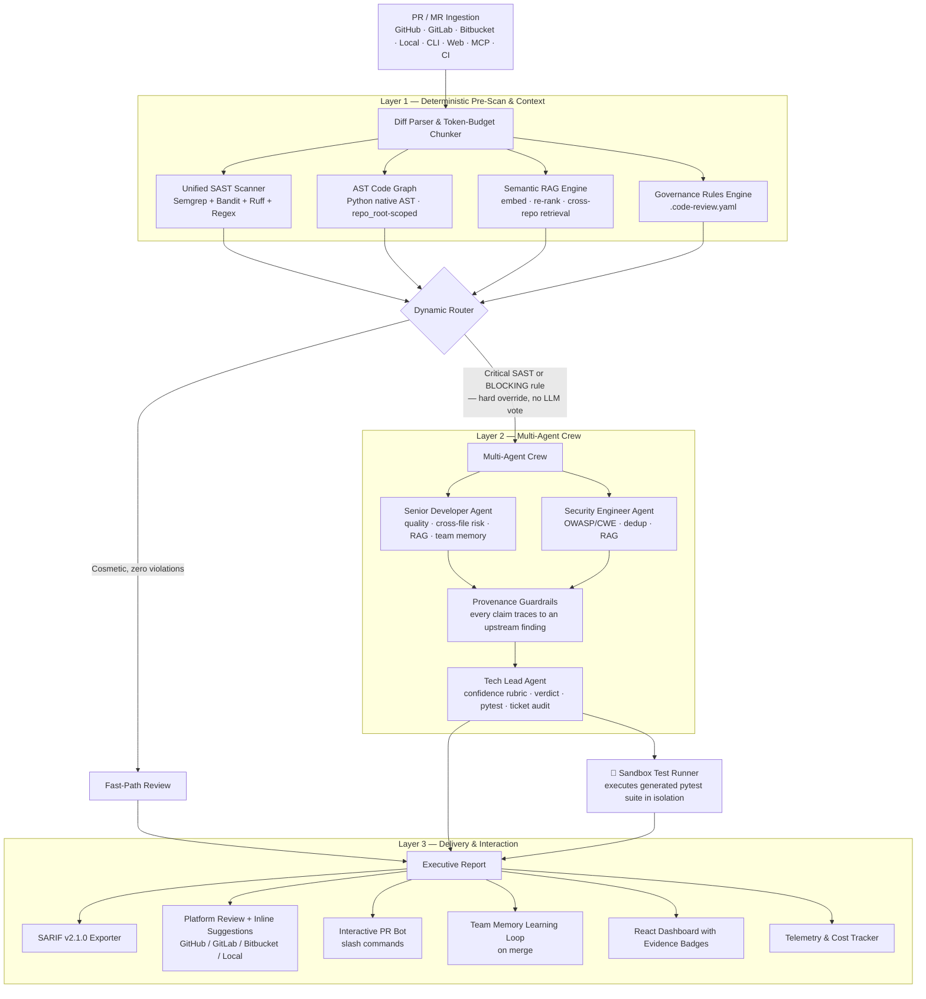
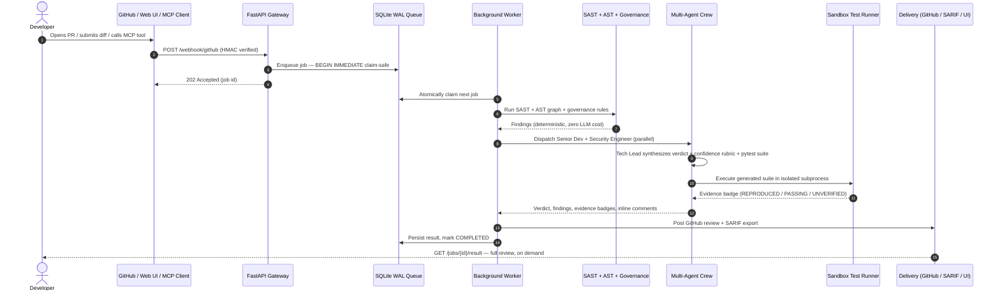

# 🛡️ AI Code Review Agent

### Autonomous Multi-Agent Pull Request Review & Code Intelligence Platform

<div align="center">

[](https://www.python.org/)
[](https://crewai.com)
[](https://deepmind.google/technologies/gemini/)
[](https://semgrep.dev)
[](https://fastapi.tiangolo.com/)
[](https://vitejs.dev/)
[](https://docs.oasis-open.org/sarif/sarif/v2.1.0/sarif-v2.1.0.html)
[](https://modelcontextprotocol.io)
[](docker-compose.yml)
[](LICENSE)

**A multi-agent code intelligence platform that combines deterministic static analysis, semantic repository-wide retrieval (RAG), codified team governance, and collaborative LLM agent reasoning — and then *proves* its findings by executing generated regression tests in a sandbox before reporting them. It talks to developers directly in the PR via slash commands, learns your team's accepted conventions over time, checks each PR against its linked ticket, and runs on GitHub, GitLab, Bitbucket, or fully offline on a local repo.**

[Key Capabilities](#-key-capabilities) • [Architecture](#-architecture) • [Empirical Evidence](#-empirical-test-evidence-the-differentiator) • [Semantic RAG](#-semantic-codebase-context-rag) • [PR Bot](#-interactive-pr-bot--slash-commands) • [Team Memory](#-team-memory--learning-loop) • [Ticket Compliance](#-ticket--intent-compliance) • [Multi-Platform](#-multi-platform-support) • [MCP Server](#-mcp-server-use-it-from-your-editor) • [Quickstart](#-quickstart) • [Governance](#-team-governance-engine-code-reviewyaml) • [Benchmarks](#-evaluation--benchmarks) • [Future Updates](#-future-updates)

</div>

---

## 📌 The Problem

Code review is the highest-friction step in the modern SDLC, and the tools built to fix it introduced a new failure mode of their own:

```
┌──────────────────────────────────────────────────────────────────────────────────────────────────┐
│                                 THE CODE REVIEW CRISIS IN MODERN SDLC                              │
├───────────────────────────────┬──────────────────────────────────┬───────────────────────────────┤
│ ⏳ Review Lag                  │ 😴 Reviewer Fatigue               │ 🙈 Context Blindness          │
│ PRs sit idle for days awaiting │ Senior engineers spend a large    │ Reviewing an isolated diff    │
│ human attention, stalling      │ share of their week on routine    │ misses downstream ripple      │
│ releases and context-switching │ diffs — leading to superficial    │ effects in files the diff     │
│ costs across the team.         │ "LGTM" approvals.                 │ never touches.                │
├───────────────────────────────┼──────────────────────────────────┼───────────────────────────────┤
│ 📢 AI Reviewer Noise           │ 📉 Governance Drift               │ 💸 Unverified LLM Output      │
│ Industry data puts typical AI  │ Coding standards live in wikis,   │ A general-purpose LLM handed  │
│ code-review false-positive     │ ignored, drifting, unenforced —   │ a raw diff will confidently   │
│ rates at 5–15%; teams learn to │ no automated, deterministic       │ assert vulnerabilities that   │
│ skim past every comment.       │ policy check runs on every PR.    │ don't exist. Nothing verifies │
│                                │                                    │ the claim before it's posted. │
└───────────────────────────────┴──────────────────────────────────┴───────────────────────────────┘
```

Most "AI code review" tools solve the first problem (speed) by making the second and third worse: an LLM narrates plausible-sounding findings, and the team has no way to tell a real defect from a hallucinated one until a human re-checks it by hand — which is the exact cost the tool was supposed to remove.

## 💡 The Solution: Deterministic-First, Then Prove It

This system is built on two ideas most reviewers skip:

1. **Deterministic analysis runs before the LLM, and can override it.** Static tools decide what's provably true; the LLM only reasons about what's left. A confirmed CRITICAL/HIGH finding or a `BLOCKING` governance violation routes straight to the full multi-agent crew — the model never gets a chance to talk the system out of escalating a real vulnerability.
2. **Findings get executed, not just asserted.** For every review, the Tech Lead agent generates a `pytest` regression suite targeting the reported defects. That suite runs in an isolated sandbox subprocess against the actual PR code, and the result — not the model's confidence — decides the evidence badge attached to the finding: `REPRODUCED`, `PASSING`, `UNVERIFIED`, or `HEURISTIC`. A finding that ships with a failing test that actually fails isn't a false positive by construction.

```
1. ⚡ Fast Pre-Scan (zero token cost)     Semgrep + Bandit + Ruff + regex heuristics catch structural
                                          flaws in milliseconds before any LLM call.
2. 🕸️ AST Call-Graph Context             Fully-qualified symbol graph (Python native AST; JS/TS/Go/
                                          Java via lighter tokenization) surfaces cross-file callers.
3. 🧠 Semantic RAG Retrieval             AST-boundary chunks embedded (Gemini or offline hashing),
                                          re-ranked and injected — the crew reasons about code the
                                          diff never touches, across repos.
4. 🧑‍🏫 Team Memory & Ticket Context      Learned conventions and the PR's linked-ticket acceptance
                                          criteria are injected as grounding for the review.
5. 📜 Codified Governance                .code-review.yaml rules evaluate deterministically — no
                                          prompt drift, no LLM call, sub-millisecond.
6. 🤖 Multi-Agent Crew                   Senior Developer + Security Engineer run in parallel; Tech
                                          Lead synthesizes a grounded verdict with a mathematical
                                          confidence rubric — every claim traces to an upstream finding.
7. 🧪 Empirical Verification (sandbox)   Generated regression tests execute against the PR code in
                                          an isolated subprocess. The badge reflects what actually ran.
8. 🧮 Deterministic Reconciliation       A final deterministic stage dedups findings, assigns one
                                          severity per defect, corrects CWEs, labels test badges
                                          honestly, and computes a bounded, non-saturating score.
```

---

## 🌟 Key Capabilities

```
┌──────────────────────────────────────────────────────────────────────────────────────────────────┐
│                                    CAPABILITY MATRIX                                               │
├───────────────────────────────┬──────────────────────────────────┬───────────────────────────────┤
│ 🛡️ Multi-Engine SAST Scanner  │ 🕸️ AST Call-Graph Memory          │ 🧪 Empirical Test Evidence    │
│ • Semgrep semantic analyzer   │ • Native Python AST indexer       │ • Generated pytest suite runs │
│ • Bandit Python AST security  │   (fully-qualified symbols)       │   in an isolated sandbox      │
│ • Ruff ultra-fast linter      │ • Cross-file caller impact map    │ • REPRODUCED/PASSING/         │
│ • 7-rule regex fallback       │ • Per-target repo_root scoping    │   UNVERIFIED/HEURISTIC badge  │
├───────────────────────────────┼──────────────────────────────────┼───────────────────────────────┤
│ 🧠 Semantic Codebase RAG      │ 💬 Interactive PR Bot             │ 🧑‍🏫 Team Memory Learning Loop │
│ • AST-boundary chunk embedding│ • /describe /ask /improve         │ • Learns accepted suggestions │
│ • Gemini 3072-dim OR offline  │   /compliance /ticket /review     │   verified against merged diff│
│   zero-dep hashing embedder   │ • /memory /learn /benchmark /help │ • Injected as few-shot context│
│ • Re-rank + noise filter +    │ • Author-association authz +      │ • Per-repo best-practices wiki│
│   cross-repo retrieval        │   feedback-loop guards            │   (.cache/team_memory)        │
├───────────────────────────────┼──────────────────────────────────┼───────────────────────────────┤
│ 🎯 Ticket & Intent Compliance │ 🌐 Multi-Platform Git Engine      │ 🤖 MCP Server (8 Tools)       │
│ • Parses GitHub/Jira/Linear   │ • GitHub · GitLab · Bitbucket     │ • review_diff, scan_sast_...  │
│   keys (security-token safe)  │ • Local air-gapped (local://)     │ • check_governance_rules      │
│ • Acceptance-criteria audit   │ • Unified adapter interface +     │ • find_impacted_callers       │
│ • COMPLIANT / PARTIAL / NON   │   webhooks (GH/GL/BB)             │ • query_semantic_context,     │
│   compliance card             │                                    │   get_team_memory, verify_...  │
├───────────────────────────────┼──────────────────────────────────┼───────────────────────────────┤
│ 📜 Codified Governance Engine │ 🧪 Empirical Test Evidence        │ 💬 Live PR Integration        │
│ • YAML-defined team policies  │ • Generated pytest runs in sandbox│ • Real-time diff ingestion    │
│ • BLOCKING/WARNING/INFO       │ • REPRODUCED/PASSING/UNVERIFIED/  │ • Line-level inline comments  │
│ • Deterministic, zero LLM cost│   HEURISTIC evidence badge        │ • 1-click GitHub suggestions  │
├───────────────────────────────┼──────────────────────────────────┼───────────────────────────────┤
│ 📥 Durable Task Queue         │ 📊 SARIF v2.1.0 Export            │ ⚡ Cost & Latency Telemetry   │
│ • SQLite WAL, ACID, BEGIN     │ • GitHub Code Scanning ready      │ • Per-review token + USD cost │
│   IMMEDIATE (multi-process    │ • Reviews persisted & queryable   │ • SHA-256 memoization cache   │
│   claim-safe), platform-      │   via GET /jobs/{id}/result       │ • Hierarchical decision trace │
│   agnostic worker             │                                    │                               │
├───────────────────────────────┼──────────────────────────────────┼───────────────────────────────┤
│ 🎓 Skill-Based Agent System   │ 🔒 Output Guardrails              │ 🐳 One-Command Deployment     │
│ • Reasoning protocols per     │ • Provenance-grounded findings    │ • Multi-stage Docker build    │
│   agent, injected at build    │ • Risk-level consistency check    │   (frontend + backend)        │
│   time from agents.yaml       │ • Deduplication enforcement       │ • docker compose up --build   │
└───────────────────────────────┴──────────────────────────────────┴───────────────────────────────┘
```

---

## 📐 Architecture



---

## 🧪 Empirical Test Evidence: the differentiator

Every AI code reviewer on the market in 2026 has the same weakness: a finding is only as trustworthy as the model's confidence in it, and there's no way to tell them apart from the comment alone. This system closes that gap with one extra step most reviewers skip entirely.

When the Tech Lead agent proposes a fix, it also writes a `pytest` suite that asserts the defect's *current* behavior (using `pytest.raises` where the bug manifests as an exception, plain assertions where it manifests as wrong output). That suite is handed to `SandboxTestRunner`, which:

1. Runs `ast.parse()` on the generated code first — a syntax error short-circuits straight to `UNVERIFIED`, no wasted subprocess.
2. Materializes the PR's added lines into a throwaway temp directory and executes the suite as an isolated subprocess with a **process-environment allowlist** (only `PATH`, `TEMP`, and OS-essential variables pass through — every key containing `KEY`, `TOKEN`, `SECRET`, `PASSWORD`, `AUTH`, or `CREDENTIAL` is stripped before the subprocess ever starts) and a hard timeout.
3. Reads the actual exit code and maps it to an evidence badge:

| Badge | What it means | How it's earned |
|---|---|---|
| 🟢 `REPRODUCED` | The defect is real — the test failed exactly as predicted | pytest exit code 1: an assertion actually failed against the PR's code |
| 🔵 `PASSING` | The generated test ran and passed | Used for regression tests validating a proposed fix |
| 🟡 `UNVERIFIED` | Could not be proven either way | Syntax error, missing dependency, or the sandbox timed out |
| ⚪ `HEURISTIC` | No test was generated for this finding | Static-analysis-only signal (still shown, just labeled honestly) |

A finding tagged `REPRODUCED` isn't a model's opinion — it's a test that failed on your actual code, in a process that ran two seconds ago. That's the artifact you hand a skeptical senior engineer instead of asking them to trust the AI.

---

## 🤖 MCP Server: use it from your editor

The same review engine is exposed as a [Model Context Protocol](https://modelcontextprotocol.io) server, so Claude Code, Cursor, Windsurf, and any other MCP-compatible client can call it directly while you're writing code — not just after you open a PR.

```bash
pip install -e .
code-review-mcp   # starts the MCP server over stdio
```

| Tool | What it does |
|---|---|
| `review_diff(diff, repo_root=None)` | Full pipeline review — verdict, confidence, findings, evidence badges |
| `scan_sast_patterns(diff)` | Fast deterministic SAST scan only (Semgrep + Bandit + regex) |
| `check_governance_rules(diff, repo_root=None)` | Validate a diff against `.code-review.yaml` |
| `find_impacted_callers(target_identifiers, repo_root=None)` | AST call-graph query — who calls this function? |
| `generate_unit_tests(function_signature, module_path)` | Generate a pytest suite for a function signature |
| `query_semantic_context(diff, repo_root=None)` | Semantic RAG retrieval — related code across the repo for a change |
| `get_team_memory(repo_id)` | The repository's learned team conventions (best-practices wiki) |
| `verify_ticket_compliance(pr_diff, ticket_id, ticket_description, …)` | Audit a diff against a ticket's acceptance criteria |

Add it to your client's MCP config (e.g. Claude Code's `.mcp.json`):

```json
{
  "mcpServers": {
    "ai-code-reviewer": { "command": "code-review-mcp" }
  }
}
```

---

## 🧠 Semantic Codebase Context (RAG)

The reviewer doesn't just see the diff — it retrieves the code the diff *doesn't* touch. The repository (and, optionally, sibling repos) is chunked along **AST symbol boundaries** using the existing call-graph indexer, embedded, and stored in a cosine-similarity index. For each PR, the changed code becomes a query; the engine retrieves the most relevant definitions, **re-ranks** them with a lexical overlap bonus, filters noise (drops the PR's own changed lines, off-language chunks) and diversifies across files, then injects the result into the Senior Developer and Security Engineer prompts.

- **Pluggable, degrades gracefully.** `RAG_EMBEDDER=hashing` (default) is a zero-dependency, offline, deterministic feature-hashing embedder — the whole pipeline indexes and retrieves with no model download. `RAG_EMBEDDER=gemini` uses `gemini-embedding-001` (3072-dim); `sentence-transformers` runs a local neural model. A missing model falls back to hashing with a warning — a review is never blocked.
- **Provenance-safe cache.** The persisted index records which embedder built it and re-indexes automatically if you switch, so a stale index never silently returns nothing.
- **Cross-repo.** Set `RAG_REPO_ROOTS` to index sibling services, so a change in one service is reviewed against callers and patterns in another.

```bash
RAG_ENABLED=true
RAG_EMBEDDER=hashing        # or: gemini | sentence-transformers
# RAG_REPO_ROOTS=/path/to/service-b,/path/to/shared-libs
```

---

## 💬 Interactive PR Bot & Slash Commands

Talk to the reviewer directly in a PR/MR comment. Commands run **off the request path** (the webhook is acknowledged in milliseconds, so the platform never times out and re-delivers) and repo-aware commands clone the PR into an **isolated checkout** so RAG/AST/governance index the real codebase — never the server's working directory.

| Command | What it does |
|---|---|
| `/describe` | Generates a PR summary + walkthrough table + Mermaid diagram; **merges** into the description non-destructively (keeps the author's text, idempotent on re-run) |
| `/ask <question>` | RAG + AST-grounded Q&A about the PR and codebase |
| `/improve` | 1-click GitHub `suggestion` blocks for detected issues |
| `/compliance` | Deterministic `.code-review.yaml` check — zero token cost |
| `/ticket` | Audits the PR against its linked ticket's acceptance criteria |
| `/memory` · `/learn <rule>` | Show / teach repository conventions (team memory) |
| `/benchmark` | Runs the ground-truth benchmark and posts the scorecard |
| `/review` · `/help` | Full multi-agent review · command catalog |

**Security by default:** non-`/help` commands are gated by author association (`OWNER`/`MEMBER`/`COLLABORATOR` on GitHub, a `BOT_ALLOWED_USERS` allowlist on GitLab/Bitbucket — **fail closed** when unset), and the bot ignores its own comments to prevent feedback loops. GitHub webhooks are HMAC-verified; GitLab uses a secret token; Bitbucket authenticates via a secret in the webhook URL.

---

## 🧑‍🏫 Team Memory & Learning Loop

The reviewer gets better at *your* codebase over time. When a PR merges, the platform fetches its review comments and promotes a suggestion into the repository's best-practices wiki **only if that suggestion's code actually landed in the merged diff** — merging is not treated as blanket acceptance, so the memory never fills with ignored suggestions. Learned conventions are injected as few-shot grounding into future reviews, and reinforced (with a counter) each time they recur. Developers can also teach rules directly with `/learn`.

Stored per-repo under `.cache/team_memory/{repo}.json`. Works on GitHub today; GitLab/Bitbucket use the same verified-acceptance path via their adapters.

---

## 🎯 Ticket & Intent Compliance

Beyond "is the code good?", the platform checks "does this PR do what it was asked to?". It parses the linked ticket from the PR (GitHub `Fixes #123`, Jira `PROJ-101`, Linear `ENG-45`, or the branch name — with security identifiers like `CWE-89`/`CVE-2023-…` explicitly excluded from misdetection), fetches the issue's acceptance criteria, and audits the diff against each one — flagging unmet requirements and scope creep in a 🟢 COMPLIANT / 🟡 PARTIAL / 🔴 NON-COMPLIANT card. The LLM audit runs **only on the COMPLEX path** (never taxing the sub-second fast-path) and through the flow's bounded timeout wrapper. GitHub issues are fetched live; Jira/Linear are detected (fetching those APIs is on the roadmap).

---

## 🌐 Multi-Platform Support

One unified `GitPlatformClient` interface, four adapters — the bot, review flow, and durable queue worker are all **platform-agnostic**:

| Platform | PR/MR review | Slash commands | Merge learning | Webhook |
|---|:--:|:--:|:--:|:--:|
| **GitHub** (cloud + Enterprise) | ✅ | ✅ | ✅ full | HMAC-verified |
| **GitLab** (cloud + self-hosted) | ✅ | ✅ | ✅ | token |
| **Bitbucket** Cloud | ✅ | ✅ | ⚠️ merge hook on roadmap | URL secret |
| **Local** (air-gapped, `local://.`) | ✅ | ✅ | n/a | writes `REVIEW.md` |

The **local air-gapped adapter** runs the full review on a local repo with no tokens, no network, and no hosting platform — it reads the working-tree diff via the git CLI and writes `REVIEW.md` / `REVIEW_NOTES.md`. Useful for regulated or offline environments.

---

## 🔄 End-to-End Data Flow



---

## 👥 Multi-Agent Roster & Skills

Three specialized agents, each with **assigned skills** (reasoning protocols, injected into the LLM's context at crew build time) and **assigned tools** (executable actions). Full catalog: [`docs/SKILLS.md`](docs/SKILLS.md).

| Agent | Skills | Tools | Task Output |
|---|---|---|---|
| **Senior Developer** | senior-dev-quality-reviewer · ast-callgraph-context-indexer · api-breaking-change-detector · performance-and-concurrency-auditor | `CodebaseContextTool`, `RuffTool` | `CodeQualityJSON` |
| **Security Engineer** | sast-vulnerability-auditor · git-diff-and-patch-analyzer | `QuickPatternScannerTool`, `SerperDevTool`*, `ScrapeWebsiteTool`* | `ReviewSecurityJSON` + output guardrail |
| **Tech Lead** | tech-lead-verdict-synthesizer · automated-unit-test-generator · governance-policy-enforcer | `CustomRulesTool`, `TestGeneratorTool` | `SummarizedFindingsJSON` |

<sub>* optional, requires `SERPER_API_KEY` for live CVE/OWASP lookups</sub>

Senior Developer and Security Engineer tasks run **async in parallel**; Tech Lead runs sequentially afterward with both outputs as grounding context. Every claim in the final report must trace back to a specific upstream finding — if the Tech Lead believes something was missed, it goes under `coverage_gaps`, never stated as a finding.

**Confidence rubric** (deterministic, not free-form model judgment): start at 100, subtract 30 per unresolved CRITICAL vulnerability, 15 per HIGH, 10 per code-quality critical issue or BLOCKING governance rule, 5 per minor/medium/low finding or WARNING rule. Floor at 0.

---

## 🧮 Deterministic Final Synthesis (reconciliation)

The last stage is not the LLM — it's a **deterministic reconciler** ([`synthesis/reconciler.py`](src/code_review_agent/synthesis/reconciler.py)) that takes the raw analyzer output (regex + Bandit/SAST + governance) plus the sandbox test result and produces one internally consistent report. It owns the report's headline verdict, score, and counts; the agent crew's narrative is shown as *advisory*. It enforces a fixed contract:

1. **Deduplicate before counting.** Findings sharing a root cause (same file + CWE within an adjacency window — so a Bandit import warning + the call-site hit + a custom rule collapse to one defect) merge into a single finding with a `sources[]` list. Every count equals the length of the deduplicated list — no invented totals.
2. **One severity per defect,** assigned from a documented impact/exploitability rubric (keyed on the corrected CWE), never copied from whichever analyzer fired. The same defect never appears as CRITICAL in one place and LOW in another.
3. **Honest test-evidence semantics.** A generated test that asserts a vulnerability *is present* is `confirms_vulnerability` — a **pass on it confirms the defect** (🔴 VULNERABILITY CONFIRMED), never a reassuring green. Only a `confirms_fix` (POST-FIX) test that passes earns 🟢 FIX VERIFIED.
4. **Governance scoped to production.** Production-only style rules (`print`, `sleep`, wildcard imports) are downgraded to INFO inside test files, examples, scripts, and `if __name__ == "__main__":` guards, and a WARNING is never relabeled CRITICAL. Low-severity items never drive the top-line verdict.
5. **A bounded, non-saturating score.** Instead of an additive model that underflows to 0 for anything moderately bad, the score is a **worst-severity ceiling minus diminishing per-defect penalties**, floored so typical PRs stay informative — 1 vs 2 criticals are distinguishable (e.g. 35 vs 22), and the terms trace to listed findings.
6. **CWEs corrected** to match the actual defect (`eval()` on input is CWE-95, not the firing rule's CWE-78).
7. **An explicit limitations note** — pattern/Bandit static analysis has no dataflow/taint tracking; it plainly states the classes it can't reliably catch (second-order injection, SSRF, disabled TLS verification, many path-traversal variants, auth-logic flaws, races). Absence of a finding is not proof of safety.

Deterministic analysis can **override** the LLM: a confirmed CRITICAL or a BLOCKING rule escalates regardless of what the crew concluded (the final verdict is the stricter of the two).

---

## 📁 Repository Structure

```
AI-Code-Review-Agent/
├── .github/workflows/
│   ├── ci.yml                          # Test matrix (Python 3.10–3.12)
│   └── ai-code-review.yml              # Dogfoods action.yml on this repo's own PRs
├── .code-review.yaml                   # This repo's own governance rules
├── .pre-commit-hooks.yaml              # `pre-commit` integration — blocks commits on ESCALATE
├── .dockerignore
├── .env.example
├── action.yml                          # Reusable GitHub Action (published distribution)
├── Dockerfile                          # Multi-stage: frontend build → Python runtime
├── docker-compose.yml
├── LICENSE                             # Apache 2.0
├── pyproject.toml
├── run.py                              # Root CLI launcher
│
├── scripts/                            # Cross-platform dev launchers
│   ├── dev-backend.sh / .bat           # FastAPI gateway on :8000
│   └── dev-frontend.sh / .bat          # Vite dev server on :3000
│
├── docs/
│   ├── ARCHITECTURE_AND_STRUCTURE.md   # Full layered architecture reference
│   └── SKILLS.md                       # Agent skill catalog — protocols, triggers, guardrails
│
├── samples/
│   ├── sql_injection_pr.txt / simple_formatting_pr.txt
│   └── benchmarks/                     # 14-case ground-truth suite
│       ├── manifest.json               # Category, expected verdict, CWEs
│       └── *.diff                      # SQLi, secrets, command injection, path traversal,
│                                        #   weak crypto, deserialization, N+1, wildcard imports…
│
├── notebooks/
│   └── finetune_code_review_peft.ipynb # QLoRA/PEFT experimentation (research track)
│
├── frontend/                           # React 19 + Vite + TypeScript dashboard
│   └── src/components/
│       ├── AnnotatedCodeViewer.tsx     # Pulsing gutter markers, in-flow suggestion cards
│       ├── ReviewInput.tsx             # Diff / File / ZIP / GitHub PR input
│       ├── ReviewDashboard.tsx         # Verdict, findings, evidence badges, trace
│       └── JobsQueueMonitor.tsx        # Live webhook queue + persisted results
│
├── tests/                              # pytest suite — parsers, engines, queue, MCP, sandbox
│   └── eval/                           # Deterministic + LLM-as-judge evaluators
│
└── src/code_review_agent/
    ├── main.py                         # PRCodeReviewFlow — CrewAI Flow orchestrator + CLI
    ├── models.py                       # Pydantic schemas (Diff, Findings, SARIF, Telemetry)
    ├── review_service.py               # Sync review API — rate limiting, zip/file/PR ingestion
    ├── webhook_server.py               # FastAPI gateway — HMAC, SSE streaming, job persistence
    ├── webhook_queue.py                # SQLite WAL queue — BEGIN IMMEDIATE, crash recovery
    ├── mcp_server.py                   # MCP tool exposure (review_diff, scan_sast_patterns, …)
    ├── llm_factory.py                  # Multi-provider LLM factory (Gemini/OpenAI/Anthropic/Groq)
    ├── github_client.py                # GitHub REST API — diffs, inline reviews
    ├── sarif_exporter.py               # OASIS SARIF v2.1.0 generator
    ├── cache.py                        # SHA-256 content-hash memoization
    ├── benchmarks.py                   # Precision/Recall/F1 ground-truth harness
    │
    ├── sandbox/
    │   └── test_runner.py              # Isolated subprocess execution → evidence badges
    │
    ├── context_engine/
    │   ├── code_graph.py               # Qualified-symbol AST indexer & caller resolver
    │   ├── tree_sitter_indexer.py      # Multi-language indexer (JS/TS/Go/Java)
    │   ├── context_tool.py             # CodebaseContextTool — repo_root-scoped, lazy-indexed
    │   └── semantic/                   # 🧠 Semantic RAG engine
    │       ├── embeddings.py           #   Gemini / hashing / sentence-transformers embedders
    │       ├── vector_store.py         #   Cosine index + provenance-stamped persistence
    │       ├── engine.py               #   AST-chunk → embed → re-rank → noise-filter → inject
    │       └── semantic_tool.py        #   SemanticContextTool (CrewAI)
    │
    ├── bot/                            # 💬 Interactive PR bot
    │   ├── command_router.py           #   Slash-command parsing & dispatch (platform-agnostic)
    │   └── checkout.py                 #   Isolated per-platform PR checkout for RAG/AST
    │
    ├── learning/                       # 🧑‍🏫 Team memory & learning loop
    │   ├── team_memory.py              #   Best-practices wiki store (per-repo)
    │   └── suggestion_tracker.py       #   Verified-acceptance learning on merge
    │
    ├── compliance/                     # 🎯 Ticket & intent compliance
    │   ├── ticket_parser.py            #   GitHub/Jira/Linear key extraction
    │   ├── ticket_fetcher.py           #   Acceptance-criteria retrieval
    │   └── intent_engine.py            #   PR-vs-criteria audit + compliance card
    │
    ├── platform/                       # 🌐 Multi-platform Git engine
    │   ├── base.py                     #   GitPlatformClient interface + normalized DTOs
    │   ├── factory.py                  #   URL/identifier → adapter resolution
    │   └── {github,gitlab,bitbucket,local_git}_adapter.py
    │
    ├── synthesis/                      # 🧮 Deterministic final synthesis
    │   └── reconciler.py               #   dedup · one-severity · honest badges · bounded score
    │
    ├── governance/rules_engine.py      # .code-review.yaml evaluator
    ├── observability/                  # Telemetry, cost tracking, hierarchical trace tree
    │
    ├── crews/code_review_crew/
    │   ├── crew.py                     # Agent/task assembly, repo_root threading
    │   ├── tool_registry.py            # Declarative tool resolution from agents.yaml
    │   └── config/{agents,tasks}.yaml  # Roles, skills, prompt contracts, JSON schemas
    │
    ├── eval/                           # Deterministic + G-Eval evaluators, EvalRunner
    └── tools/                          # sast_scanner, semgrep_runner, bandit_runner, ruff_tool,
                                         #   test_generator
```

---

## 🚀 Quickstart

### Option A — Docker Compose (recommended)

```bash
git clone https://github.com/hamza1713/AI-Code-Review-Agent.git
cd AI-Code-Review-Agent
cp .env.example .env   # add your GEMINI_API_KEY
docker compose up --build -d
```

Open **`http://localhost:8000`**. The multi-stage build compiles the React dashboard and serves it from the same container as the API — one command, one port.

### Option B — Local Python + Node

**Prerequisites:** Python 3.10–3.13 (3.12 recommended) · Node.js 18+ (frontend dev mode only) · a [Gemini API key](https://aistudio.google.com/) · Semgrep (`pip install semgrep`, optional — enhances SAST coverage)

```bash
pip install -e .
cp .env.example .env   # add your GEMINI_API_KEY

# Terminal 1 — backend + dashboard
scripts/dev-backend.sh      # or scripts\dev-backend.bat on Windows

# Terminal 2 — frontend hot-reload (optional)
scripts/dev-frontend.sh     # or scripts\dev-frontend.bat
```

### Other modes

```bash
# Review a local diff file, export SARIF
python run.py --file samples/sql_injection_pr.txt --sarif results.sarif

# Review a live GitHub PR
python run.py --pr "owner/repository/pull/42"

# Pre-commit integration — reviews staged files, exits non-zero to block the commit
python run.py path/to/staged_file.py

# Visualize the flow execution graph
python run.py --plot
```

| CLI entrypoint | Description |
|---|---|
| `code-review-agent --file <diff>` \| `--pr <url>` \| `--server` | Review a diff / live PR / start the API server |
| `code-review-mcp` | Start the MCP server over stdio |
| `review-server` | Webhook/API server only |
| `eval-benchmarks` | Run the ground-truth benchmark suite |
| `kickoff` / `plot` | Resume from `flow_state.json` / render the flow graph |

---

## 🤖 GitHub Actions CI/CD Integration

Add automated multi-agent reviews to any repository via [`action.yml`](action.yml) — this repo dogfoods the identical action on its own pull requests through [`.github/workflows/ai-code-review.yml`](.github/workflows/ai-code-review.yml):

```yaml
on:
  pull_request:
    types: [opened, synchronize, reopened]

jobs:
  review:
    runs-on: ubuntu-latest
    permissions:
      contents: read
      pull-requests: write
      security-events: write
    steps:
      - uses: actions/checkout@v4
      - uses: hamza1713/AI-Code-Review-Agent@main
        with:
          github_token: ${{ secrets.GITHUB_TOKEN }}
          gemini_api_key: ${{ secrets.GEMINI_API_KEY }}
          sarif_output: results.sarif
      - uses: github/codeql-action/upload-sarif@v3
        if: always()
        with:
          sarif_file: results.sarif
```

### Pre-commit hook

```yaml
# .pre-commit-config.yaml, in a consuming repo
repos:
  - repo: https://github.com/hamza1713/AI-Code-Review-Agent
    rev: main
    hooks:
      - id: ai-code-review
```

Staged files are converted to a synthetic diff and reviewed locally; the commit is blocked (non-zero exit) on an `ESCALATE` or `REQUEST CHANGES` verdict.

---

## 📜 Team Governance Engine (`.code-review.yaml`)

Codify engineering standards in the repository root. Rules are validated against a Pydantic schema and evaluated deterministically — **zero LLM token cost, sub-millisecond per PR**:

```yaml
version: "1.0"

rules:
  - id: "gov-no-raw-sql"
    name: "Forbid Raw SQL String Interpolation"
    severity: "BLOCKING"                                   # → contributes to ESCALATE
    pattern: "db\\.(?:query|execute)\\s*\\(\\s*f[\"']"
    description: "Raw f-string SQL is vulnerable to injection (CWE-89)."
    suggested_fix: "db.query('SELECT * FROM users WHERE id = %s', (user_id,))"

  - id: "gov-no-print-statements"
    name: "Forbid Direct Print Statements"
    severity: "WARNING"                                    # → contributes to REQUEST CHANGES
    pattern: "(?<!#)\\bprint\\s*\\("
    description: "print() bypasses structured logging in production code."
    suggested_fix: "Use logger.info(...) or logger.debug(...)"
```

Test files, scripts, benchmarks, and `__main__` blocks are automatically exempted from non-security quality rules (print/sleep) — governance flags real drift, not your test fixtures.

| Severity | Confidence Deduction | Verdict Impact |
|---|---|---|
| `BLOCKING` | −10 per violation | Contributes to `ESCALATE` |
| `WARNING` | −5 per violation | Contributes to `REQUEST CHANGES` |
| `INFO` | none | Surfaced in `recommendations` only |

---

## 🧪 Evaluation & Benchmarks

Two independent measurement layers, both zero-cost to run in CI:

**Deterministic evaluators** (`src/code_review_agent/eval/`) verify the *pipeline's own arithmetic and output*, not model judgment: `ConfidenceMathEvaluator` re-derives the confidence score from the reported deduction breakdown; `CodeCompilationEvaluator` runs `ast.parse()` on every suggested fix and every generated test; `SarifComplianceEvaluator` checks OASIS SARIF v2.1.0 schema conformance; `GuardrailConsistencyEvaluator` and `DiffLineScopeEvaluator` catch inconsistent risk levels and out-of-range line numbers before they ship.

**Ground-truth benchmark suite** — 14 hand-authored cases with known expected findings, spanning SQL injection, hardcoded secrets, command injection, path traversal, weak cryptography, insecure deserialization, plaintext password comparison, N+1 queries, swallowed exceptions, print statements, wildcard imports, and breaking API signatures:

```bash
pip install -e ".[eval]"
eval-benchmarks                 # or: python -m code_review_agent.benchmarks
```

**Latest measured results** (deterministic layer only — SAST + governance, no LLM call):

| Category | Cases | Precision | Recall | F1 | Verdict Accuracy |
|---|---|---|---|---|---|
| SECURITY | 7 | 75.0% | 100% | 85.7% | 100% |
| GOVERNANCE | 2 | 100% | 100% | 100% | 100% |
| COMPLEX | 1 | 100% | 100% | 100% | 100% |
| QUALITY | 3 | 100% | 0%¹ | 0%¹ | 100% |
| ARCHITECTURE | 1 | 100% | 0%¹ | 0%¹ | 100% |
| **Overall** | **14** | **84.2%** | **84.2%** | **84.2%** | **100%** |

<sub>¹ N+1 ORM loops, swallowed exceptions, and breaking API signatures require reasoning the static layer can't do by design — that's exactly what the LLM crew exists for. Verdict accuracy stays 100% end-to-end because the crew correctly catches these; the recall gap here is scoped to the deterministic pre-scan only, and is reported rather than hidden.</sub>

Run this suite after any prompt or regex-rule change — it's the regression gate that catches a "quick tweak" that silently breaks detection on a known case.

---

## 🎨 Dashboard

- 🔴 **Pulsing gutter markers** by severity — `CRITICAL` / `WARNING` / `INFO`, with staggered mount animation
- 📂 **In-flow expandable cards** — click a flagged line for the causal explanation and a 1-click GitHub suggestion diff
- 🧪 **Evidence badges** inline with every finding — `REPRODUCED` / `PASSING` / `UNVERIFIED` / `HEURISTIC`
- 📥 **Jobs Queue Monitor** — live webhook queue status, with full persisted review results on completion
- 🛡️ **Non-dismissible scope note** — every response states plainly what was and wasn't checked

---

## 🧪 Testing

The suite is split into two tiers so the everyday dev loop stays fast:

```bash
pytest -v tests/            # default — excludes `slow`, runs in-process only, seconds not minutes
pytest -v -m slow tests/    # subprocess-backed: bandit/ruff CLI calls, sandbox test execution
ruff check src/
```

**Why the split exists:** a handful of tests spawn a real OS subprocess — `BanditRunner`/`RuffRunner` shell out to their CLI per scan, and the sandbox runner (`sandbox/test_runner.py`) launches a nested `pytest` process to verify generated fixes. Subprocess cold-start time is host-load dependent: fast and reliable in isolation or on a clean CI runner, but progressively slower the more of them get stacked back-to-back in one run — on a loaded dev machine, that can push an individual test's timeout past what's fine when run alone. Rather than chase an ever-larger timeout number for the whole suite, these tests carry `@pytest.mark.slow` and run in their own pass (both tiers still gate CI — see [`ci.yml`](.github/workflows/ci.yml) — they're just no longer entangled with each other's timing).

The default (fast) tier covers diff parsing, the SAST/governance engines, the AST call graph, the **semantic RAG engine** (embedders, vector store, retrieval), the **interactive bot** (command routing, cross-platform authz), the **team-memory learning loop** (verified-acceptance learning), **ticket compliance** (parsing, intent audit), the **platform adapters** (GitHub/GitLab/Bitbucket/local + the platform-agnostic queue worker), the durable webhook queue (including concurrent-claim safety), and the MCP tool surface. The `slow` tier covers actual Bandit/Ruff CLI detection accuracy, the ground-truth benchmark suite, and the sandbox's real test execution — including a check that its environment allowlist strips credential-shaped variables (`GEMINI_API_KEY`, `GITHUB_TOKEN`, etc.) before a generated test ever runs.

```bash
pytest tests/eval/ -m eval    # LLM-as-judge evaluation tests (requires GEMINI_API_KEY)
```

---

## 🔭 Future Updates

The roadmap below is grouped by theme. Several items are about running comfortably on **multi-replica production infrastructure** rather than a single machine — the current defaults (local SQLite, local `.cache/` files, in-process rate limiter) are deliberately simple and portable, and the work is to make each one pluggable behind a shared backend without changing the developer experience.

### Scale-out & shared state (highest priority for production)
- **Shared job queue** — make the durable queue backend pluggable (Postgres / Redis) so multiple worker replicas can process reviews concurrently. Today's SQLite WAL queue is single-node.
- **Shared team memory & RAG index** — move `TeamMemoryStore` and the semantic index off local `.cache/*.json` to a shared store (object storage / DB / managed vector DB), so every replica sees the same learned conventions and index instead of diverging per node.
- **Shared rate limiter** — replace the in-process per-IP limiter with a distributed one (Redis) so limits hold across replicas.
- **Durable slash commands** — route bot commands through the durable queue (not FastAPI `BackgroundTasks`) so an in-flight `/review` survives a restart and scales horizontally.

### Managed vector search & embeddings
- **Managed vector DB backend** (Qdrant / LanceDB / pgvector) behind the existing `VectorStore` interface, for large mono-repos where the in-memory cosine store is no longer ideal.
- **Default to a strong code-embedding model** — the pluggable embedder already supports Gemini and sentence-transformers; ship a benchmarked code-aware default while keeping the offline hashing fallback.

### Deeper platform & learning parity
- **Bitbucket merge-learning hook** — add the `pullrequest:fulfilled` webhook branch (GitHub & GitLab already learn on merge).
- **Jira / Linear fetchers** — ticket keys are already parsed; add authenticated API clients so their acceptance criteria are fetched, not just detected.
- **Stronger acceptance signal** — augment the "suggested code landed in the merged diff" heuristic with GraphQL resolved-thread / reaction state for higher-precision learning.
- **Platform-native inline comments** — post true line-anchored review comments on GitLab/Bitbucket (currently summarized as a discussion note).

### Reviewer intelligence
- **Incremental review** — review only what changed since the last push, not the whole diff each time.
- **Confidence calibration from outcomes** — feed merged-vs-reverted signals back into the confidence rubric.
- **Expanded language depth** — richer native AST (beyond Python) for the call-graph and chunker.

> These are intended directions, not commitments or dates. Contributions toward any of them are welcome — see below.

---

## 🤝 Contributing

1. Fork the repository and create a feature branch.
2. `pytest -v tests/`, `pytest -v -m slow tests/`, and `ruff check src/` before opening a PR — CI runs both tiers.
3. Open the PR — the agent will review its own diff automatically via the dogfooded Action.

## 📄 License

Apache 2.0 — see [`LICENSE`](LICENSE).

---

<div align="center">

Built with [CrewAI Flows](https://crewai.com) · [Google Gemini](https://deepmind.google/technologies/gemini/) · [FastAPI](https://fastapi.tiangolo.com/) · [React 19](https://react.dev/) · [Model Context Protocol](https://modelcontextprotocol.io)

</div>
