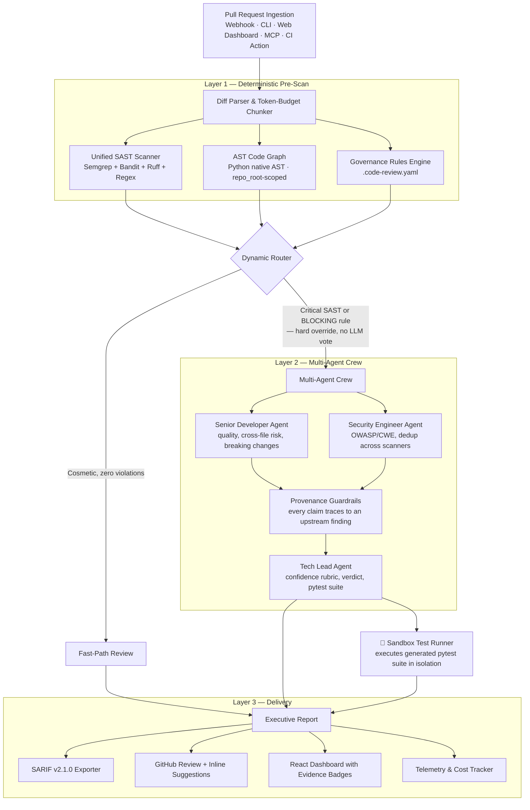
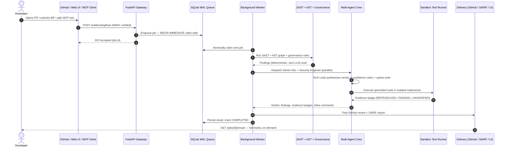

# 🛡️ AI Code Review Agent

### Autonomous Multi-Agent Pull Request Review & Code Intelligence Platform

<div align="center">

[](https://www.python.org/)
[](https://crewai.com)
[](https://deepmind.google/technologies/gemini/)
[](https://semgrep.dev)
[](https://fastapi.tiangolo.com/)
[](https://vitejs.dev/)
[](https://docs.oasis-open.org/sarif/sarif/v2.1.0/sarif-v2.1.0.html)
[](https://modelcontextprotocol.io)
[](docker-compose.yml)
[](LICENSE)

**A multi-agent code intelligence platform that combines deterministic static analysis, repository-wide AST call-graph memory, codified team governance, and collaborative LLM agent reasoning — and then *proves* its findings by executing generated regression tests in a sandbox before reporting them.**

[Key Capabilities](#-key-capabilities) • [Architecture](#-architecture) • [Empirical Evidence](#-empirical-test-evidence-the-differentiator) • [MCP Server](#-mcp-server-use-it-from-your-editor) • [Quickstart](#-quickstart) • [Governance](#-team-governance-engine-code-reviewyaml) • [Evaluation & Benchmarks](#-evaluation--benchmarks) • [Repository Structure](#-repository-structure)

</div>

---

## 📌 The Problem

Code review is the highest-friction step in the modern SDLC, and the tools built to fix it introduced a new failure mode of their own:

```
┌──────────────────────────────────────────────────────────────────────────────────────────────────┐
│                                 THE CODE REVIEW CRISIS IN MODERN SDLC                              │
├───────────────────────────────┬──────────────────────────────────┬───────────────────────────────┤
│ ⏳ Review Lag                  │ 😴 Reviewer Fatigue               │ 🙈 Context Blindness          │
│ PRs sit idle for days awaiting │ Senior engineers spend a large    │ Reviewing an isolated diff    │
│ human attention, stalling      │ share of their week on routine    │ misses downstream ripple      │
│ releases and context-switching │ diffs — leading to superficial    │ effects in files the diff     │
│ costs across the team.         │ "LGTM" approvals.                 │ never touches.                │
├───────────────────────────────┼──────────────────────────────────┼───────────────────────────────┤
│ 📢 AI Reviewer Noise           │ 📉 Governance Drift               │ 💸 Unverified LLM Output      │
│ Industry data puts typical AI  │ Coding standards live in wikis,   │ A general-purpose LLM handed  │
│ code-review false-positive     │ ignored, drifting, unenforced —   │ a raw diff will confidently   │
│ rates at 5–15%; teams learn to │ no automated, deterministic       │ assert vulnerabilities that   │
│ skim past every comment.       │ policy check runs on every PR.    │ don't exist. Nothing verifies │
│                                │                                    │ the claim before it's posted. │
└───────────────────────────────┴──────────────────────────────────┴───────────────────────────────┘
```

Most "AI code review" tools solve the first problem (speed) by making the second and third worse: an LLM narrates plausible-sounding findings, and the team has no way to tell a real defect from a hallucinated one until a human re-checks it by hand — which is the exact cost the tool was supposed to remove.

## 💡 The Solution: Deterministic-First, Then Prove It

This system is built on two ideas most reviewers skip:

1. **Deterministic analysis runs before the LLM, and can override it.** Static tools decide what's provably true; the LLM only reasons about what's left. A confirmed CRITICAL/HIGH finding or a `BLOCKING` governance violation routes straight to the full multi-agent crew — the model never gets a chance to talk the system out of escalating a real vulnerability.
2. **Findings get executed, not just asserted.** For every review, the Tech Lead agent generates a `pytest` regression suite targeting the reported defects. That suite runs in an isolated sandbox subprocess against the actual PR code, and the result — not the model's confidence — decides the evidence badge attached to the finding: `REPRODUCED`, `PASSING`, `UNVERIFIED`, or `HEURISTIC`. A finding that ships with a failing test that actually fails isn't a false positive by construction.

```
1. ⚡ Fast Pre-Scan (zero token cost)     Semgrep + Bandit + Ruff + regex heuristics catch structural
                                          flaws in milliseconds before any LLM call.
2. 🕸️ AST Call-Graph Context             Fully-qualified symbol graph (Python native AST; JS/TS/Go/
                                          Java via lighter tokenization) surfaces cross-file callers.
3. 📜 Codified Governance                .code-review.yaml rules evaluate deterministically — no
                                          prompt drift, no LLM call, sub-millisecond.
4. 🤖 Multi-Agent Crew                   Senior Developer + Security Engineer run in parallel; Tech
                                          Lead synthesizes a grounded verdict with a mathematical
                                          confidence rubric — every claim traces to an upstream finding.
5. 🧪 Empirical Verification (sandbox)   Generated regression tests execute against the PR code in
                                          an isolated subprocess. The badge reflects what actually ran.
```

---

## 🌟 Key Capabilities

```
┌──────────────────────────────────────────────────────────────────────────────────────────────────┐
│                                    CAPABILITY MATRIX                                               │
├───────────────────────────────┬──────────────────────────────────┬───────────────────────────────┤
│ 🛡️ Multi-Engine SAST Scanner  │ 🕸️ AST Call-Graph Memory          │ 🧪 Empirical Test Evidence    │
│ • Semgrep semantic analyzer   │ • Native Python AST indexer       │ • Generated pytest suite runs │
│ • Bandit Python AST security  │   (fully-qualified symbols)       │   in an isolated sandbox      │
│ • Ruff ultra-fast linter      │ • Cross-file caller impact map    │ • REPRODUCED/PASSING/         │
│ • 7-rule regex fallback       │ • Per-target repo_root scoping    │   UNVERIFIED/HEURISTIC badge  │
├───────────────────────────────┼──────────────────────────────────┼───────────────────────────────┤
│ 📜 Codified Governance Engine │ 🤖 MCP Server (5 Tools)           │ 💬 Live GitHub Integration    │
│ • YAML-defined team policies  │ • review_diff, scan_sast_patterns │ • Real-time diff ingestion    │
│ • BLOCKING/WARNING/INFO       │ • check_governance_rules          │ • Line-level inline comments  │
│ • Deterministic, zero LLM cost│ • find_impacted_callers           │ • 1-click GitHub suggestions  │
│                               │ • generate_unit_tests             │ • Reusable CI/CD GitHub Action│
├───────────────────────────────┼──────────────────────────────────┼───────────────────────────────┤
│ 📥 Durable Task Queue         │ 📊 SARIF v2.1.0 Export            │ ⚡ Cost & Latency Telemetry   │
│ • SQLite WAL, ACID, BEGIN     │ • GitHub Code Scanning ready      │ • Per-review token + USD cost │
│   IMMEDIATE (multi-process    │ • Reviews persisted & queryable   │ • SHA-256 memoization cache   │
│   claim-safe)                 │   via GET /jobs/{id}/result       │ • Hierarchical decision trace │
│ • Crash/orphan-job recovery   │                                    │                               │
├───────────────────────────────┼──────────────────────────────────┼───────────────────────────────┤
│ 🎓 12-Skill Agent System      │ 🔒 Output Guardrails              │ 🐳 One-Command Deployment     │
│ • Reasoning protocols per     │ • Provenance-grounded findings    │ • Multi-stage Docker build    │
│   agent, injected at build    │ • Risk-level consistency check    │   (frontend + backend)        │
│   time from agents.yaml       │ • Deduplication enforcement       │ • docker compose up --build   │
└───────────────────────────────┴──────────────────────────────────┴───────────────────────────────┘
```

---

## 📐 Architecture



---

## 🧪 Empirical Test Evidence: the differentiator

Every AI code reviewer on the market in 2026 has the same weakness: a finding is only as trustworthy as the model's confidence in it, and there's no way to tell them apart from the comment alone. This system closes that gap with one extra step most reviewers skip entirely.

When the Tech Lead agent proposes a fix, it also writes a `pytest` suite that asserts the defect's *current* behavior (using `pytest.raises` where the bug manifests as an exception, plain assertions where it manifests as wrong output). That suite is handed to `SandboxTestRunner`, which:

1. Runs `ast.parse()` on the generated code first — a syntax error short-circuits straight to `UNVERIFIED`, no wasted subprocess.
2. Materializes the PR's added lines into a throwaway temp directory and executes the suite as an isolated subprocess with a **process-environment allowlist** (only `PATH`, `TEMP`, and OS-essential variables pass through — every key containing `KEY`, `TOKEN`, `SECRET`, `PASSWORD`, `AUTH`, or `CREDENTIAL` is stripped before the subprocess ever starts) and a hard timeout.
3. Reads the actual exit code and maps it to an evidence badge:

| Badge | What it means | How it's earned |
|---|---|---|
| 🟢 `REPRODUCED` | The defect is real — the test failed exactly as predicted | pytest exit code 1: an assertion actually failed against the PR's code |
| 🔵 `PASSING` | The generated test ran and passed | Used for regression tests validating a proposed fix |
| 🟡 `UNVERIFIED` | Could not be proven either way | Syntax error, missing dependency, or the sandbox timed out |
| ⚪ `HEURISTIC` | No test was generated for this finding | Static-analysis-only signal (still shown, just labeled honestly) |

A finding tagged `REPRODUCED` isn't a model's opinion — it's a test that failed on your actual code, in a process that ran two seconds ago. That's the artifact you hand a skeptical senior engineer instead of asking them to trust the AI.

---

## 🤖 MCP Server: use it from your editor

The same review engine is exposed as a [Model Context Protocol](https://modelcontextprotocol.io) server, so Claude Code, Cursor, Windsurf, and any other MCP-compatible client can call it directly while you're writing code — not just after you open a PR.

```bash
pip install -e .
code-review-mcp   # starts the MCP server over stdio
```

| Tool | What it does |
|---|---|
| `review_diff(diff, repo_root=None)` | Full pipeline review — verdict, confidence, findings, evidence badges |
| `scan_sast_patterns(diff)` | Fast deterministic SAST scan only (Semgrep + Bandit + regex) |
| `check_governance_rules(diff, repo_root=None)` | Validate a diff against `.code-review.yaml` |
| `find_impacted_callers(target_identifiers, repo_root=None)` | AST call-graph query — who calls this function? |
| `generate_unit_tests(function_signature, module_path)` | Generate a pytest suite for a function signature |

Add it to your client's MCP config (e.g. Claude Code's `.mcp.json`):

```json
{
  "mcpServers": {
    "ai-code-reviewer": { "command": "code-review-mcp" }
  }
}
```

---

## 🔄 End-to-End Data Flow



---

## 👥 Multi-Agent Roster & Skills

Three specialized agents, each with **assigned skills** (reasoning protocols, injected into the LLM's context at crew build time) and **assigned tools** (executable actions). Full catalog: [`docs/SKILLS.md`](docs/SKILLS.md).

| Agent | Skills | Tools | Task Output |
|---|---|---|---|
| **Senior Developer** | senior-dev-quality-reviewer · ast-callgraph-context-indexer · api-breaking-change-detector · performance-and-concurrency-auditor | `CodebaseContextTool`, `RuffTool` | `CodeQualityJSON` |
| **Security Engineer** | sast-vulnerability-auditor · git-diff-and-patch-analyzer | `QuickPatternScannerTool`, `SerperDevTool`*, `ScrapeWebsiteTool`* | `ReviewSecurityJSON` + output guardrail |
| **Tech Lead** | tech-lead-verdict-synthesizer · automated-unit-test-generator · governance-policy-enforcer | `CustomRulesTool`, `TestGeneratorTool` | `SummarizedFindingsJSON` |

<sub>* optional, requires `SERPER_API_KEY` for live CVE/OWASP lookups</sub>

Senior Developer and Security Engineer tasks run **async in parallel**; Tech Lead runs sequentially afterward with both outputs as grounding context. Every claim in the final report must trace back to a specific upstream finding — if the Tech Lead believes something was missed, it goes under `coverage_gaps`, never stated as a finding.

**Confidence rubric** (deterministic, not free-form model judgment): start at 100, subtract 30 per unresolved CRITICAL vulnerability, 15 per HIGH, 10 per code-quality critical issue or BLOCKING governance rule, 5 per minor/medium/low finding or WARNING rule. Floor at 0.

---

## 📁 Repository Structure

```
AI-Code-Review-Agent/
├── .github/workflows/
│   ├── ci.yml                          # Test matrix (Python 3.10–3.12)
│   └── ai-code-review.yml              # Dogfoods action.yml on this repo's own PRs
├── .code-review.yaml                   # This repo's own governance rules
├── .pre-commit-hooks.yaml              # `pre-commit` integration — blocks commits on ESCALATE
├── .dockerignore
├── .env.example
├── action.yml                          # Reusable GitHub Action (published distribution)
├── Dockerfile                          # Multi-stage: frontend build → Python runtime
├── docker-compose.yml
├── LICENSE                             # Apache 2.0
├── pyproject.toml
├── run.py                              # Root CLI launcher
│
├── scripts/                            # Cross-platform dev launchers
│   ├── dev-backend.sh / .bat           # FastAPI gateway on :8000
│   └── dev-frontend.sh / .bat          # Vite dev server on :3000
│
├── docs/
│   ├── ARCHITECTURE_AND_STRUCTURE.md   # Full layered architecture reference
│   └── SKILLS.md                       # Agent skill catalog — protocols, triggers, guardrails
│
├── samples/
│   ├── sql_injection_pr.txt / simple_formatting_pr.txt
│   └── benchmarks/                     # 14-case ground-truth suite
│       ├── manifest.json               # Category, expected verdict, CWEs
│       └── *.diff                      # SQLi, secrets, command injection, path traversal,
│                                        #   weak crypto, deserialization, N+1, wildcard imports…
│
├── notebooks/
│   └── finetune_code_review_peft.ipynb # QLoRA/PEFT experimentation (research track)
│
├── frontend/                           # React 19 + Vite + TypeScript dashboard
│   └── src/components/
│       ├── AnnotatedCodeViewer.tsx     # Pulsing gutter markers, in-flow suggestion cards
│       ├── ReviewInput.tsx             # Diff / File / ZIP / GitHub PR input
│       ├── ReviewDashboard.tsx         # Verdict, findings, evidence badges, trace
│       └── JobsQueueMonitor.tsx        # Live webhook queue + persisted results
│
├── tests/                              # pytest suite — parsers, engines, queue, MCP, sandbox
│   └── eval/                           # Deterministic + LLM-as-judge evaluators
│
└── src/code_review_agent/
    ├── main.py                         # PRCodeReviewFlow — CrewAI Flow orchestrator + CLI
    ├── models.py                       # Pydantic schemas (Diff, Findings, SARIF, Telemetry)
    ├── review_service.py               # Sync review API — rate limiting, zip/file/PR ingestion
    ├── webhook_server.py               # FastAPI gateway — HMAC, SSE streaming, job persistence
    ├── webhook_queue.py                # SQLite WAL queue — BEGIN IMMEDIATE, crash recovery
    ├── mcp_server.py                   # MCP tool exposure (review_diff, scan_sast_patterns, …)
    ├── llm_factory.py                  # Multi-provider LLM factory (Gemini/OpenAI/Anthropic/Groq)
    ├── github_client.py                # GitHub REST API — diffs, inline reviews
    ├── sarif_exporter.py               # OASIS SARIF v2.1.0 generator
    ├── cache.py                        # SHA-256 content-hash memoization
    ├── benchmarks.py                   # Precision/Recall/F1 ground-truth harness
    │
    ├── sandbox/
    │   └── test_runner.py              # Isolated subprocess execution → evidence badges
    │
    ├── context_engine/
    │   ├── code_graph.py               # Qualified-symbol AST indexer & caller resolver
    │   ├── tree_sitter_indexer.py      # Multi-language indexer (JS/TS/Go/Java)
    │   └── context_tool.py             # CodebaseContextTool — repo_root-scoped, lazy-indexed
    │
    ├── governance/rules_engine.py      # .code-review.yaml evaluator
    ├── observability/                  # Telemetry, cost tracking, hierarchical trace tree
    │
    ├── crews/code_review_crew/
    │   ├── crew.py                     # Agent/task assembly, repo_root threading
    │   ├── tool_registry.py            # Declarative tool resolution from agents.yaml
    │   └── config/{agents,tasks}.yaml  # Roles, skills, prompt contracts, JSON schemas
    │
    ├── eval/                           # Deterministic + G-Eval evaluators, EvalRunner
    └── tools/                          # sast_scanner, semgrep_runner, bandit_runner, ruff_tool,
                                         #   test_generator
```

---

## 🚀 Quickstart

### Option A — Docker Compose (recommended)

```bash
git clone https://github.com/hamza1713/AI-Code-Review-Agent.git
cd AI-Code-Review-Agent
cp .env.example .env   # add your GEMINI_API_KEY
docker compose up --build -d
```

Open **`http://localhost:8000`**. The multi-stage build compiles the React dashboard and serves it from the same container as the API — one command, one port.

### Option B — Local Python + Node

**Prerequisites:** Python 3.10–3.13 (3.12 recommended) · Node.js 18+ (frontend dev mode only) · a [Gemini API key](https://aistudio.google.com/) · Semgrep (`pip install semgrep`, optional — enhances SAST coverage)

```bash
pip install -e .
cp .env.example .env   # add your GEMINI_API_KEY

# Terminal 1 — backend + dashboard
scripts/dev-backend.sh      # or scripts\dev-backend.bat on Windows

# Terminal 2 — frontend hot-reload (optional)
scripts/dev-frontend.sh     # or scripts\dev-frontend.bat
```

### Other modes

```bash
# Review a local diff file, export SARIF
python run.py --file samples/sql_injection_pr.txt --sarif results.sarif

# Review a live GitHub PR
python run.py --pr "owner/repository/pull/42"

# Pre-commit integration — reviews staged files, exits non-zero to block the commit
python run.py path/to/staged_file.py

# Visualize the flow execution graph
python run.py --plot
```

| CLI entrypoint | Description |
|---|---|
| `code-review-agent --file <diff>` \| `--pr <url>` \| `--server` | Review a diff / live PR / start the API server |
| `code-review-mcp` | Start the MCP server over stdio |
| `review-server` | Webhook/API server only |
| `eval-benchmarks` | Run the ground-truth benchmark suite |
| `kickoff` / `plot` | Resume from `flow_state.json` / render the flow graph |

---

## 🤖 GitHub Actions CI/CD Integration

Add automated multi-agent reviews to any repository via [`action.yml`](action.yml) — this repo dogfoods the identical action on its own pull requests through [`.github/workflows/ai-code-review.yml`](.github/workflows/ai-code-review.yml):

```yaml
on:
  pull_request:
    types: [opened, synchronize, reopened]

jobs:
  review:
    runs-on: ubuntu-latest
    permissions:
      contents: read
      pull-requests: write
      security-events: write
    steps:
      - uses: actions/checkout@v4
      - uses: hamza1713/AI-Code-Review-Agent@main
        with:
          github_token: ${{ secrets.GITHUB_TOKEN }}
          gemini_api_key: ${{ secrets.GEMINI_API_KEY }}
          sarif_output: results.sarif
      - uses: github/codeql-action/upload-sarif@v3
        if: always()
        with:
          sarif_file: results.sarif
```

### Pre-commit hook

```yaml
# .pre-commit-config.yaml, in a consuming repo
repos:
  - repo: https://github.com/hamza1713/AI-Code-Review-Agent
    rev: main
    hooks:
      - id: ai-code-review
```

Staged files are converted to a synthetic diff and reviewed locally; the commit is blocked (non-zero exit) on an `ESCALATE` or `REQUEST CHANGES` verdict.

---

## 📜 Team Governance Engine (`.code-review.yaml`)

Codify engineering standards in the repository root. Rules are validated against a Pydantic schema and evaluated deterministically — **zero LLM token cost, sub-millisecond per PR**:

```yaml
version: "1.0"

rules:
  - id: "gov-no-raw-sql"
    name: "Forbid Raw SQL String Interpolation"
    severity: "BLOCKING"                                   # → contributes to ESCALATE
    pattern: "db\\.(?:query|execute)\\s*\\(\\s*f[\"']"
    description: "Raw f-string SQL is vulnerable to injection (CWE-89)."
    suggested_fix: "db.query('SELECT * FROM users WHERE id = %s', (user_id,))"

  - id: "gov-no-print-statements"
    name: "Forbid Direct Print Statements"
    severity: "WARNING"                                    # → contributes to REQUEST CHANGES
    pattern: "(?<!#)\\bprint\\s*\\("
    description: "print() bypasses structured logging in production code."
    suggested_fix: "Use logger.info(...) or logger.debug(...)"
```

Test files, scripts, benchmarks, and `__main__` blocks are automatically exempted from non-security quality rules (print/sleep) — governance flags real drift, not your test fixtures.

| Severity | Confidence Deduction | Verdict Impact |
|---|---|---|
| `BLOCKING` | −10 per violation | Contributes to `ESCALATE` |
| `WARNING` | −5 per violation | Contributes to `REQUEST CHANGES` |
| `INFO` | none | Surfaced in `recommendations` only |

---

## 🧪 Evaluation & Benchmarks

Two independent measurement layers, both zero-cost to run in CI:

**Deterministic evaluators** (`src/code_review_agent/eval/`) verify the *pipeline's own arithmetic and output*, not model judgment: `ConfidenceMathEvaluator` re-derives the confidence score from the reported deduction breakdown; `CodeCompilationEvaluator` runs `ast.parse()` on every suggested fix and every generated test; `SarifComplianceEvaluator` checks OASIS SARIF v2.1.0 schema conformance; `GuardrailConsistencyEvaluator` and `DiffLineScopeEvaluator` catch inconsistent risk levels and out-of-range line numbers before they ship.

**Ground-truth benchmark suite** — 14 hand-authored cases with known expected findings, spanning SQL injection, hardcoded secrets, command injection, path traversal, weak cryptography, insecure deserialization, plaintext password comparison, N+1 queries, swallowed exceptions, print statements, wildcard imports, and breaking API signatures:

```bash
pip install -e ".[eval]"
eval-benchmarks                 # or: python -m code_review_agent.benchmarks
```

**Latest measured results** (deterministic layer only — SAST + governance, no LLM call):

| Category | Cases | Precision | Recall | F1 | Verdict Accuracy |
|---|---|---|---|---|---|
| SECURITY | 7 | 75.0% | 100% | 85.7% | 100% |
| GOVERNANCE | 2 | 100% | 100% | 100% | 100% |
| COMPLEX | 1 | 100% | 100% | 100% | 100% |
| QUALITY | 3 | 100% | 0%¹ | 0%¹ | 100% |
| ARCHITECTURE | 1 | 100% | 0%¹ | 0%¹ | 100% |
| **Overall** | **14** | **84.2%** | **84.2%** | **84.2%** | **100%** |

<sub>¹ N+1 ORM loops, swallowed exceptions, and breaking API signatures require reasoning the static layer can't do by design — that's exactly what the LLM crew exists for. Verdict accuracy stays 100% end-to-end because the crew correctly catches these; the recall gap here is scoped to the deterministic pre-scan only, and is reported rather than hidden.</sub>

Run this suite after any prompt or regex-rule change — it's the regression gate that catches a "quick tweak" that silently breaks detection on a known case.

---

## 🎨 Dashboard

- 🔴 **Pulsing gutter markers** by severity — `CRITICAL` / `WARNING` / `INFO`, with staggered mount animation
- 📂 **In-flow expandable cards** — click a flagged line for the causal explanation and a 1-click GitHub suggestion diff
- 🧪 **Evidence badges** inline with every finding — `REPRODUCED` / `PASSING` / `UNVERIFIED` / `HEURISTIC`
- 📥 **Jobs Queue Monitor** — live webhook queue status, with full persisted review results on completion
- 🛡️ **Non-dismissible scope note** — every response states plainly what was and wasn't checked

---

## 🧪 Testing

```bash
pytest -v tests/                              # full suite: parsers, engines, queue, sandbox, MCP
pytest tests/eval/ tests/test_benchmarks.py    # evaluation + ground-truth benchmark only
ruff check src/
```

The suite covers diff parsing, the SAST/governance engines, the AST call graph, the durable webhook queue (including concurrent-claim safety), the MCP tool surface, and the sandbox test-execution runner — including a check that the sandbox's environment allowlist actually strips credential-shaped variables before a generated test ever runs. Note: `BanditRunner`/`RuffRunner` shell out to their CLI per scan; on hosts where subprocess cold-start is slow (heavy `site-packages`, AV process scanning), the full suite runs in several minutes rather than seconds — this doesn't affect correctness, only wall-clock time in CI logs.

---

## 🤝 Contributing

1. Fork the repository and create a feature branch.
2. `pytest -v tests/` and `ruff check src/` before opening a PR.
3. Open the PR — the agent will review its own diff automatically via the dogfooded Action.

## 📄 License

Apache 2.0 — see [`LICENSE`](LICENSE).

---

<div align="center">

Built with [CrewAI Flows](https://crewai.com) · [Google Gemini](https://deepmind.google/technologies/gemini/) · [FastAPI](https://fastapi.tiangolo.com/) · [React 19](https://react.dev/) · [Model Context Protocol](https://modelcontextprotocol.io)

</div>
