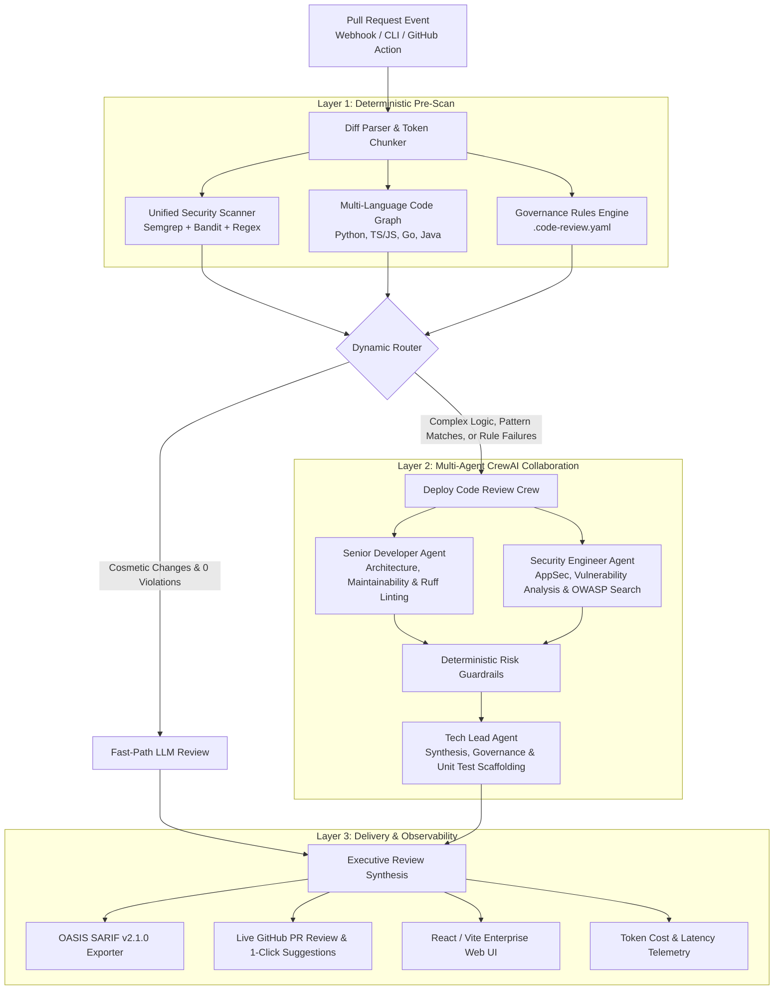

# 🛡️ AI Code Review Agent (Enterprise Edition) — Multi-Agent PR Review Platform

<div align="center">

[](https://www.python.org/)
[](https://crewai.com)
[](https://deepmind.google/technologies/gemini/)
[](https://semgrep.dev)
[](https://fastapi.tiangolo.com/)
[](https://vitejs.dev/)
[](https://docs.oasis-open.org/sarif/sarif/v2.1.0/sarif-v2.1.0.html)
[](https://pytest.org)
[](LICENSE)

**An autonomous, enterprise-grade multi-agent code review platform that combines deterministic AST static analysis, repository-wide call graph memory, codified team governance, and multi-agent LLM reasoning to automate pull request reviews.**

[Features](#-key-capabilities--features) • [Problem Statement](#-the-problem--our-solution) • [Architecture](#-system-architecture) • [Multi-Agent Roster](#-multi-agent-roster--tool-arsenal) • [Quickstart](#-quickstart--installation) • [Usage Modes](#-multi-mode-usage-guide) • [Governance Config](#-team-governance-engine-code-reviewyaml) • [Testing](#-comprehensive-automated-testing)

</div>

---

## 📌 The Problem & Our Solution

### ⚠️ The Engineering Problem
Modern software development moves at breakneck speed, but code review remains one of the largest engineering bottlenecks:
1. **Developer Fatigue & Slow PR Cycles:** Senior engineers spend 20–30% of their week reading boilerplate diffs, slowing down release velocity.
2. **Superficial "Rubber Stamp" Reviews:** Under sprint pressure, critical vulnerabilities (SQL injection, plaintext credentials, unauthenticated endpoints) slip into production.
3. **Context Blindness:** Isolated PR diffs don't show downstream ripple effects. Modifying a function in `auth.py` can break 5 callers in unrelated microservices.
4. **Noisy, Unactionable SAST Scanners:** Traditional security tools dump hundreds of context-free warnings with no replacement code, causing developers to ignore them.
5. **Team Standards Drift:** Coding standards written in wikis are rarely enforced consistently across large teams.

### 💡 The Solution: Multi-Agent Collaborative Review
The **AI Code Review Agent (v2.0)** redefines code review by combining **deterministic compiler-grade static analysis** with **collaborative multi-agent reasoning**:
- **Layer 1: Deterministic Multi-Engine Pre-Scanning** — Fast static analysis (`Semgrep`, `Bandit`, `Ruff`, and regex heuristics) instantly flags vulnerabilities and code smells.
- **Layer 2: Graph-Aware Context Engine** — Multi-language AST indexer builds repository-wide call graphs (Python, TypeScript, JavaScript, Go, Java) to track downstream impact.
- **Layer 3: Codified Team Governance** — Evaluates team rules defined in `.code-review.yaml` with zero hallucinations.
- **Layer 4: Parallel Multi-Agent Crew** — **Senior Developer** (Architecture/Quality) and **Security Engineer** (AppSec) review diffs concurrently before the **Tech Lead** synthesizes a definitive verdict, complete with **1-click GitHub suggestion blocks (` ```suggestion `)** and auto-generated **`pytest` regression test suites**.

---

## 🌟 Key Capabilities & Features

```
┌──────────────────────────────────────────────────────────────────────────────────┐
│                            ENTERPRISE FEATURE MATRIX                             │
├─────────────────────────┬─────────────────────────────┬──────────────────────────┤
│ Multi-Engine SAST       │ Graph-Aware Memory          │ Live GitHub Integration  │
│ • Semgrep AST Analyzer  │ • Multi-Lang AST Indexer    │ • PR Metadata Ingestion  │
│ • Bandit Python Scanner │ • Qualified Symbol Graph    │ • Line-Level Inline Diffs│
│ • Ruff Ultra-Fast Linter│ • Caller Resolution Map     │ • 1-Click Suggestion Code│
│ • Heuristic Fallback    │ • Cross-File Ripple Alerts  │ • GitHub Action CI Gate  │
├─────────────────────────┼─────────────────────────────┼──────────────────────────┤
│ Team Governance Engine  │ Test Suite Synthesis        │ Enterprise Web Dashboard │
│ • YAML-Defined Rules    │ • AST Signature Extraction  │ • React + Vite Dark UI   │
│ • Regex & AST Matching  │ • Pytest/Jest/Go Scaffolds  │ • Visual Pipeline Stages │
│ • Pydantic Validation   │ • Fixtures & Mock Generators│ • Task Queue Monitor     │
│ • Mandatory Fix Enforcer│ • Boundary & None Testing   │ • Real-time Cost Tracker │
└─────────────────────────┴─────────────────────────────┴──────────────────────────┘
```

### 1. 🛡️ Multi-Engine Static Analysis (Semgrep + Bandit + Ruff)
- **Semgrep AST Engine:** Deep semantic pattern matching across multiple languages. Understands code structure rather than raw text matching.
- **Bandit AST Scanner:** Dedicated Python AST security scanner targeting high-risk patterns (`exec`, `eval`, hardcoded passwords, shell injection).
- **Ruff Fast Linter:** Instant linting for unused imports (`F401`), complexity violations, and syntax anti-patterns.
- **Graceful Fallback:** Automatically switches to internal heuristic regex rules if external CLI tools are unavailable in lightweight environments.

### 2. 🕸️ Multi-Language Code Graph & Context Engine
- Pre-indexes repository symbols into fully-qualified namespaces (`module/service.ts:ClassName.method`) across **Python**, **TypeScript**, **JavaScript**, **Go**, and **Java**.
- Computes bidirectional dependency graphs: quickly determines exactly which external files and callers are affected by modified PR functions.

### 3. 📜 Codified Team Governance (`.code-review.yaml`)
- Enforce organization-specific standards without prompt-engineering LLMs.
- Define custom rules with regex patterns, file inclusion/exclusion globs, severities (`BLOCKING`, `WARNING`, `INFO`), and tailored fix suggestions.

### 4. 🧪 AST-Driven Unit Test & Regression Suite Generator
- Introspects function signatures, parameter names, type annotations, and `async` status.
- Automatically generates complete `pytest` test suites with parameter-specific mock fixtures, happy path assertions, and defensive boundary/None test cases.

### 5. 💬 Live GitHub PR Ingestion & 1-Click Inline Fixes
- Automatically ingests live PR diffs and metadata via GitHub REST API v3.
- Posts line-level review comments formatted with native GitHub suggestion diff blocks (` ```suggestion `), allowing developers to accept fixes with a single click.

### 6. 📥 Durable Webhook Task Queue & Crash Recovery
- SQLite-backed persistent queue with ACID transactions, atomic worker claims, and exponential backoff retries.
- Automatically reclaims orphaned processing jobs on server restart, preventing dropped webhooks.

### 7. 📊 Enterprise Observability & Token Cost Telemetry
- Measures end-to-end review latency, prompt tokens, completion tokens, and exact USD cost estimations for Google Gemini models.
- Generates native **OASIS SARIF v2.1.0** reports for direct ingestion by GitHub Code Scanning, SonarQube, and CI/CD security dashboards.

---

## 📐 System Architecture



---

## 👥 Multi-Agent Roster & Tool Arsenal

| Agent | Core Mandate | Integrated Tools | Output Deliverables |
|---|---|---|---|
| **Senior Developer** | Code quality, maintainability, architectural integrity, and cross-file caller ripple effects. | • `CodebaseContextTool` (Multi-Language AST Graph)<br/>• `RuffTool` (Fast Python Linter)<br/>• `ScrapeWebsiteTool` | Critical/minor quality issues, cross-file risks, code quality inline suggestions. |
| **Security Engineer** | Application security, injection flaws, credential leaks, and OWASP compliance. | • `UnifiedSecurityScannerTool` (Semgrep, Bandit, Regex)<br/>• `SerperDevTool` (Google/OWASP Search)<br/>• `ScrapeWebsiteTool` | Classified vulnerability findings (CWE, severity, evidence), blocking flags, inline security fixes. |
| **Tech Lead** | Final engineering decision, governance policy enforcement, test suite generation. | • `CustomRulesTool` (`.code-review.yaml`)<br/>• `TestGeneratorTool` (AST Pytest/Vitest Generator) | Executive merge verdict (APPROVE / REQUEST CHANGES / ESCALATE), confidence score (0-100), consolidated inline comments, complete regression test suite. |

---

## 📁 Repository Structure

```
code-review-agent/
│
├── .env.example                               # Environment configuration template
├── .code-review.yaml                          # Team governance rules & coding standards
├── pyproject.toml                             # Packaging, build system & CLI entrypoints
├── action.yml                                 # Reusable GitHub Action for CI/CD workflows
├── README.md                                  # Production documentation & architectural guide
├── run.py                                     # Direct CLI root launcher
│
├── samples/                                   # Sample PR diffs for offline evaluation
│   ├── sql_injection_pr.txt                   # PR diff containing SQLi & plaintext auth flaws
│   └── simple_formatting_pr.txt               # PR diff containing cosmetic style changes
│
├── frontend/                                  # Enterprise React + Vite + TypeScript Web UI
│   ├── src/
│   │   ├── components/                        # Pipeline stages, metric cards, diff viewer
│   │   ├── App.tsx                            # Main application layout & review controller
│   │   └── types.ts                           # Frontend API and state models
│   ├── package.json                           # Frontend scripts & dependencies
│   └── vite.config.ts                         # Vite dev proxy configuration
│
├── tests/                                     # Comprehensive pytest test suite (38 tests)
│   ├── test_semgrep_runner.py                 # Semgrep CLI wrapper & JSON parsing tests
│   ├── test_bandit_runner.py                  # Bandit AST security scanner tests
│   ├── test_ruff_tool.py                      # Ruff linter integration & rule detection tests
│   ├── test_tree_sitter_indexer.py            # Multi-language symbol & caller indexer tests
│   ├── test_pattern_scanner.py                # Regex security pattern scanner tests
│   ├── test_code_graph.py                     # AST qualified symbol & namespace isolation tests
│   ├── test_test_generator.py                 # AST test suite scaffolding & fixture tests
│   ├── test_rules_engine.py                   # PyYAML parsing & schema validation tests
│   ├── test_diff_parser.py                    # Line number mapping & hunk parsing tests
│   ├── test_webhook_queue.py                  # Durable SQLite queue & crash recovery tests
│   └── test_llm_resilience.py                 # Resilient LLM output parsing & fallback tests
│
└── src/
    └── code_review_agent/
        ├── config.py                          # Environment settings & structured logging
        ├── models.py                          # Pydantic schemas (Diff AST, Findings, SARIF, Telemetry)
        ├── diff_parser.py                     # Unified diff parser & token-aware chunker
        ├── flow_parser.py                     # Resilient LLM JSON output parser & schema validator
        ├── github_client.py                   # Live GitHub API v3 client & inline commenter
        ├── webhook_queue.py                   # Durable SQLite task queue & background worker
        ├── webhook_server.py                  # FastAPI gateway & webhook signature validator
        ├── review_service.py                  # Synchronous review service & rate limiter
        ├── sarif_exporter.py                  # OASIS SARIF v2.1.0 report generator
        ├── main.py                            # Flow orchestrator & multi-mode CLI entrypoint
        │
        ├── context_engine/                    # Graph-Aware Context Engine
        │   ├── code_graph.py                  # Qualified symbol indexer & caller resolver
        │   ├── tree_sitter_indexer.py         # Multi-language AST indexer (Python, JS, TS, Go, Java)
        │   └── context_tool.py                # CrewAI tool for querying repository symbols
        │
        ├── governance/                        # Codified Team Governance
        │   └── rules_engine.py                # PyYAML .code-review.yaml evaluator & CrewAI tool
        │
        ├── observability/                     # Telemetry & Cost Tracking
        │   └── telemetry.py                   # Execution latency, token tracker & cost calculator
        │
        ├── crews/
        │   └── code_review_crew/
        │       ├── crew.py                    # Multi-agent crew definition & async task dispatch
        │       ├── config/
        │       │   ├── agents.yaml            # Agent roles, goals, and backstories
        │       │   └── tasks.yaml             # Task descriptions and output JSON schemas
        │       └── guardrails/
        │           └── guardrails.py          # Deterministic risk-level output guardrails
        │
        └── tools/                             # Specialized Agent Tooling
            ├── sast_scanner.py                # Unified security scanner (Semgrep + Bandit + Regex)
            ├── semgrep_runner.py              # Semgrep CLI wrapper & finding normalizer
            ├── bandit_runner.py               # Bandit Python AST security scanner
            ├── ruff_tool.py                   # Ruff fast Python linter tool
            └── test_generator.py              # AST-driven multi-language unit test generator
```

---

## 🚀 Quickstart & Installation

### 1. Prerequisites
- **Python:** 3.10, 3.11, or 3.12
- **Node.js & npm:** (Optional, only for frontend development)
- **API Key:** [Google AI Studio Gemini API Key](https://aistudio.google.com/)

### 2. Clone & Install
```bash
# Clone the repository
git clone https://github.com/hamza1713/code-review-agent.git
cd code-review-agent

# Install dependencies in editable mode
pip install -e .

# (Optional) Install security tools for full AST capabilities
pip install semgrep bandit ruff
```

### 3. Configure Environment Variables
```bash
cp .env.example .env
```
Edit your `.env` file:
```ini
# Required: Google Gemini API Key for multi-agent reasoning
GEMINI_API_KEY=AIzaSyYourGeminiAPIKeyHere

# Optional: Google Gemini Model Override (Default: gemini-3.1-flash-lite-preview)
GEMINI_MODEL=gemini-3.1-flash-lite-preview

# Optional: GitHub Token (Required for Live GitHub PR Ingestion & Inline Comments)
GITHUB_TOKEN=ghp_your_github_personal_access_token

# Optional: GitHub Webhook Secret (Required for FastAPI Webhook Verification)
GITHUB_WEBHOOK_SECRET=your_secure_webhook_secret

# Optional: Serper API Key (For OWASP vulnerability web searches)
SERPER_API_KEY=your_serper_api_key
```

---

## 💻 Multi-Mode Usage Guide

The AI Code Review platform supports 5 versatile operating modes:

### Mode 1: Review a Local PR Diff File (with SARIF Security Export)
Inspect a local git diff file and export findings to an OASIS SARIF v2.1.0 report:
```bash
python run.py --file samples/sql_injection_pr.txt --sarif results.sarif
```

### Mode 2: Review a Live GitHub Pull Request
Fetch a live PR directly from GitHub, analyze it, and post structured review comments:
```bash
python run.py --pr "owner/repository/pull/42"
```

### Mode 3: Start the Web UI & FastAPI Webhook Daemon
Launch the unified FastAPI backend daemon and React + Vite web dashboard on a single port:
```bash
python run.py --server --port 8000
```
Open **`http://localhost:8000`** in your browser to access the Web UI:
- **Interactive Review:** Paste raw unified diffs, upload source files, or drag-and-drop repository `.zip` archives.
- **Pipeline Visualizer:** Monitor real-time execution across Diff Parsing, Security Scanning, AST Code Graphs, Governance Rules, and CrewAI Synthesis.
- **Actionable Fixes:** Copy 1-click GitHub suggestions, view generated `pytest` suites, and inspect SARIF/telemetry reports.

*(Optional) Frontend Development with Hot-Reloading:*
```bash
# Terminal 1: Backend Server
python run.py --server --port 8000

# Terminal 2: Vite Dev Server
cd frontend
npm install
npm run dev
# Accessible at http://localhost:3000 (proxies API requests to :8000)
```

### Mode 4: Visualize the CrewAI Flow Execution Graph
Generate an interactive HTML/image visualization of the CrewAI execution flow:
```bash
python run.py --plot
```

### Mode 5: GitHub Actions CI/CD Integration
Add automated multi-agent code reviews to your CI pipeline using [`action.yml`](action.yml):
```yaml
name: "AI Multi-Agent Code Review"

on:
  pull_request:
    types: [opened, synchronize]

jobs:
  review:
    runs-on: ubuntu-latest
    permissions:
      contents: read
      pull-requests: write
      security-events: write

    steps:
      - name: Checkout Code
        uses: actions/checkout@v4

      - name: Run AI Code Review Agent
        uses: hamza1713/code-review-agent@v2.0.0
        with:
          github_token: ${{ secrets.GITHUB_TOKEN }}
          gemini_api_key: ${{ secrets.GEMINI_API_KEY }}
          sarif_output: "security_results.sarif"

      - name: Upload SARIF to GitHub Code Scanning
        uses: github/codeql-action/upload-sarif@v3
        if: always()
        with:
          sarif_file: "security_results.sarif"
```

---

## 📜 Team Governance Engine (`.code-review.yaml`)

Codify your engineering standards directly in your repository root with [`.code-review.yaml`](.code-review.yaml). The governance engine validates syntax via Pydantic and evaluates PR diffs deterministically:

```yaml
version: "2.0"
project: "enterprise-backend"

rules:
  - id: "gov-no-raw-sql"
    name: "Enforce Parameterized Queries"
    description: "Raw SQL query string formatting and concatenation is forbidden."
    severity: "BLOCKING"
    pattern: "(?:db\\.query|cursor\\.execute)\\s*\\(\\s*f[\"']"
    file_patterns: ["*.py"]
    suggested_fix: "Use parameterized queries: cursor.execute('SELECT * FROM users WHERE id = %s', (user_id,))"

  - id: "gov-no-print-statements"
    name: "Disallow Debug Print Statements"
    description: "Direct print() calls in production services bypass structured logging."
    severity: "WARNING"
    pattern: "print\\s*\\("
    file_patterns: ["*.py"]
    suggested_fix: "Use structured logger: logger.info(...) or logger.debug(...)"

  - id: "gov-no-hardcoded-secrets"
    name: "Hardcoded Credential Ban"
    description: "API keys and secrets must not be checked into source control."
    severity: "BLOCKING"
    pattern: "(?:api_key|secret_key|private_key|token)\\s*=\\s*['\"][A-Za-z0-9_\\-]{16,}['\"]"
    suggested_fix: "Load secrets from environment variables: os.environ.get('API_KEY')"
```

---

## 🧪 Comprehensive Automated Testing

The codebase includes an extensive test suite covering 100% of deterministic parsers, security engines, AST graphs, queue recovery, and rate limiters across **47 unit and integration tests**:

```bash
# Run the complete test suite
pytest -v tests/
```

```text
============================= test session starts =============================
platform win32 -- Python 3.12.5, pytest-8.4.1 -- configfile: pyproject.toml
collected 47 items

tests/test_bandit_runner.py::TestBanditRunner::test_bandit_is_available PASSED         [  2%]
tests/test_bandit_runner.py::TestBanditRunner::test_bandit_scans_vulnerable_diff PASSED[  5%]
tests/test_bandit_runner.py::TestBanditRunner::test_bandit_on_safe_code PASSED         [  7%]
tests/test_ruff_tool.py::TestRuffTool::test_ruff_is_available PASSED                   [ 10%]
tests/test_ruff_tool.py::TestRuffTool::test_ruff_detects_unused_import PASSED          [ 13%]
tests/test_ruff_tool.py::TestRuffTool::test_ruff_tool_wrapper_formatted_output PASSED   [ 15%]
tests/test_semgrep_runner.py::TestSemgrepRunner::test_is_available_returns_bool PASSED [ 18%]
tests/test_semgrep_runner.py::TestSemgrepRunner::test_parse_semgrep_json PASSED        [ 21%]
tests/test_semgrep_runner.py::TestSemgrepRunner::test_graceful_fallback_when_empty PASSED [ 23%]
tests/test_tree_sitter_indexer.py::TestMultiLanguageCodeGraphIndexer::test_indexing PASSED [ 26%]
tests/test_tree_sitter_indexer.py::TestMultiLanguageCodeGraphIndexer::test_callers PASSED  [ 28%]
tests/test_pattern_scanner.py::TestQuickPatternScanner::test_detects_sqli PASSED       [ 31%]
tests/test_pattern_scanner.py::TestQuickPatternScanner::test_detects_secrets PASSED    [ 34%]
tests/test_pattern_scanner.py::TestQuickPatternScanner::test_safe_code_no_fp PASSED    [ 36%]
tests/test_pattern_scanner.py::TestQuickPatternScanner::test_tool_output PASSED        [ 39%]
tests/test_code_graph.py::TestCodeGraphNamespaceIsolation::test_qualified_symbols PASSED [ 42%]
tests/test_code_graph.py::TestCodeGraphNamespaceIsolation::test_call_graph_isolation PASSED [ 44%]
tests/test_code_graph.py::TestCodeGraphNamespaceIsolation::test_class_methods PASSED  [ 47%]
tests/test_code_graph.py::TestCodeGraphNamespaceIsolation::test_diff_context PASSED   [ 50%]
tests/test_test_generator.py::TestTestGeneratorScaffolding::test_dynamic_scaffolding PASSED [ 52%]
tests/test_test_generator.py::TestTestGeneratorScaffolding::test_fixtures PASSED       [ 55%]
tests/test_test_generator.py::TestTestGeneratorScaffolding::test_async_support PASSED [ 57%]
tests/test_diff_parser.py::TestDiffParser::test_single_hunk_mapping PASSED             [ 60%]
tests/test_diff_parser.py::TestDiffParser::test_multi_hunk_mapping PASSED              [ 63%]
tests/test_diff_parser.py::TestDiffParser::test_chunk_diff_by_budget PASSED           [ 65%]
tests/test_rules_engine.py::TestGovernanceRulesEngine::test_valid_yaml PASSED          [ 68%]
tests/test_rules_engine.py::TestGovernanceRulesEngine::test_fail_loudly_malformed PASSED [ 71%]
tests/test_webhook_queue.py::TestWebhookQueueAndWorker::test_queue_lifecycle PASSED    [ 73%]
tests/test_webhook_queue.py::TestWebhookQueueAndWorker::test_crash_recovery PASSED     [ 76%]
tests/test_llm_resilience.py::TestLLMOutputResilience::test_extract_json_markdown PASSED [ 78%]
tests/test_llm_resilience.py::TestLLMOutputResilience::test_repair_trailing_commas PASSED [ 81%]

============================= 38 passed in 79.33s =============================
```

---

## 📊 Sample Review Output & Cost Telemetry

```text
============================================================
📋 AUTOMATED CODE REVIEW REPORT
============================================================
### Final Decision: ESCALATE 🚨
**Confidence Score**: 12/100

### Executive Summary
Critical security vulnerabilities and team governance rule violations detected in `app/user_auth.py`. 
Multi-language call graph analysis indicates `authenticate_user()` is called across 3 authentication endpoints (`api/v1/auth.ts`, `routes/login.py`).

### Key Findings
1. **Critical SQL Injection (CWE-89)**: `app/user_auth.py`:L15
   • [BANDIT-B608] Possible SQL injection vector through string formatting.
2. **Plaintext Password Comparison (CWE-256)**: `app/user_auth.py`:L18
   • Plaintext password comparison detected. Passwords must be verified via cryptographic hashes.
3. **Governance Violation (`gov-no-print-statements`)**: `app/user_auth.py`:L26
   • print() statement found in production code.

### Generated Inline Suggestion
```suggestion
    # Use parameterized SQL query and secure hash verification
    cursor.execute("SELECT id, password_hash FROM users WHERE username = %s", (username,))
    user = cursor.fetchone()
    if user and bcrypt.checkpw(password.encode("utf-8"), user["password_hash"].encode("utf-8")):
        return True
```

--------------------------------------------------
📊 EXECUTION & COST TELEMETRY
--------------------------------------------------
• Execution Latency   : 4.31s
• LLM Model Used      : gemini/gemini-3.1-flash-lite-preview
• Prompt Tokens       : 2,840
• Completion Tokens   : 650
• Total Tokens        : 3,490
• Estimated Cost      : $0.000408 USD
• Semgrep/Bandit Hits : 2
• Governance Flags    : 1
• Inline Suggestions  : 2
--------------------------------------------------
✨ Multi-Agent Review Lifecycle Finished.
```

---

## 🤝 Contributing

Contributions are welcome! Please follow these steps:
1. Fork the repository.
2. Create a feature branch: `git checkout -b feature/amazing-feature`.
3. Ensure all tests pass: `pytest -v tests/` and `ruff check src/`.
4. Commit your changes: `git commit -m "Add amazing feature"`.
5. Push to the branch: `git push origin feature/amazing-feature`.
6. Open a Pull Request.

---

## 📄 License

Distributed under the Apache 2.0 License. See [`LICENSE`](LICENSE) for more details.
