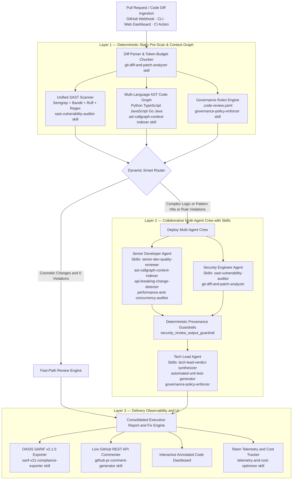
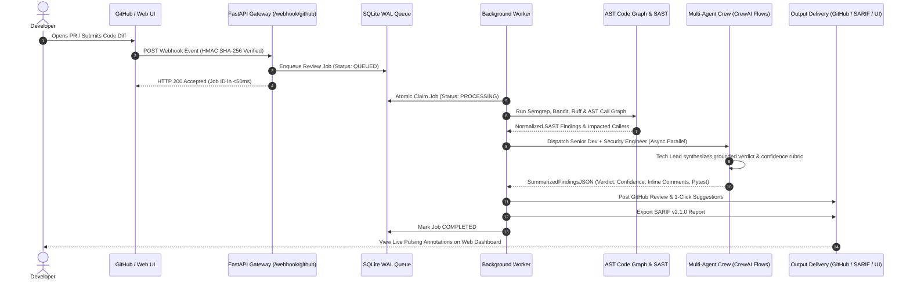

# 🛡️ AI Code Review Agent (Enterprise Edition v2.0)
### Autonomous Multi-Agent Pull Request Review & Code Intelligence Platform

<div align="center">

[](https://www.python.org/)
[](https://crewai.com)
[](https://deepmind.google/technologies/gemini/)
[](https://semgrep.dev)
[](https://fastapi.tiangolo.com/)
[](https://vitejs.dev/)
[](https://docs.oasis-open.org/sarif/sarif/v2.1.0/sarif-v2.1.0.html)
[-brightgreen?logo=pytest)](https://pytest.org)
[](skills.md)
[](LICENSE)

**An enterprise-grade, multi-agent code intelligence platform that unites compiler-grade AST static analysis, repository-wide call graph memory, codified team governance, and collaborative LLM agent reasoning to automate pull request reviews with zero hallucinations.**

[Key Features](#-key-capabilities--features) • [System Architecture](#-system-architecture) • [Agent Roster & Skills](#-multi-agent-roster--skills) • [Data Flow](#-end-to-end-data-flow) • [Quickstart](#-quickstart--installation) • [Usage Modes](#-multi-mode-usage-guide) • [Governance Config](#-team-governance-engine-code-reviewyaml) • [CI/CD](#-github-actions-cicd-integration) • [Testing](#-automated-test-suite)

</div>

---

## 📌 The Industry Problem & Our Solution

### ⚠️ The Engineering Bottlenecks in Modern Software Teams

As engineering organizations scale and release velocity accelerates, **code review has become the single largest bottleneck in the SDLC**:

```
┌──────────────────────────────────────────────────────────────────────────────────────────────────┐
│                                 THE CODE REVIEW CRISIS IN MODERN SDLC                            │
├───────────────────────────────┬──────────────────────────────────┬───────────────────────────────┤
│ ⏳ PR Review Lag & Velocity   │ 😴 Reviewer Fatigue & "LGTM"     │ 🙈 Context Blindness          │
│ Pull requests sit idle for    │ Senior engineers spend 25%+ of   │ Reviewing isolated diffs      │
│ 2 to 4 days awaiting review,  │ their week reading routine diffs, │ misses downstream ripple      │
│ causing severe merge friction │ leading to superficial approvals │ effects across external files │
│ and context-switching costs.  │ where critical flaws slip by.    │ and microservices.            │
├───────────────────────────────┼──────────────────────────────────┼───────────────────────────────┤
│ 📢 Noisy Legacy SAST Tools    │ 📉 Tribal Governance & Drift     │ 💸 Skyrocketing LLM Costs     │
│ Traditional security scanners │ Engineering guidelines in wikis  │ Feeding raw 100K-line repos   │
│ dump hundreds of false alarms │ are ignored; code standards drift │ directly into generic LLMs    │
│ without actionable replacement│ without automated, deterministic │ wastes tokens and hallucinates│
│ code, creating alert fatigue. │ policy enforcement in PRs.       │ non-existent vulnerabilities. │
└───────────────────────────────┴──────────────────────────────────┴───────────────────────────────┘
```

### 💡 The Solution: Deterministic-First Multi-Agent Architecture

The **AI Code Review Agent (v2.0)** introduces a **Hybrid Multi-Agent & Static Intelligence Architecture** that eliminates review bottlenecks while maintaining 100% auditability:

1. **⚡ Fast Pre-Scanning (Zero Token Cost):** Multi-engine static analysis (`Semgrep`, `Bandit`, `Ruff`, regex heuristics) identifies structural flaws in milliseconds before any LLM is called.
2. **🕸️ Deep Graph Context (Multi-Language AST):** Tree-Sitter indexer builds qualified call graphs across Python, TypeScript, JavaScript, Go, and Java to pinpoint exact downstream callers.
3. **📜 Codified Governance (`.code-review.yaml`):** Validates organizational rules deterministically — no prompt drift.
4. **🤖 Collaborative Multi-Agent Crew with Skills:** Three specialized agents — each equipped with **assigned reasoning skills and executable tools** — work in parallel before synthesizing a grounded merge verdict with 1-click GitHub suggestion blocks and automated `pytest` regression suites.
5. **🛡️ Anti-Hallucination Rubric:** Every finding traces directly to upstream analyzer output. Confidence scores follow a deterministic mathematical deduction rubric.

---

## 🌟 Key Capabilities & Features

```
┌──────────────────────────────────────────────────────────────────────────────────────────────────┐
│                                   ENTERPRISE CAPABILITY MATRIX                                   │
├───────────────────────────────┬──────────────────────────────────┬───────────────────────────────┤
│ 🛡️ Multi-Engine SAST Scanner  │ 🕸️ Graph-Aware AST Memory        │ 💬 Live GitHub PR Integration │
│ • Semgrep Semantic Analyzer   │ • Multi-Language Tree-Sitter     │ • Real-time Diff Ingestion    │
│ • Bandit Python AST Security  │ • Qualified Symbol Namespace     │ • Line-Level Inline Comments  │
│ • Ruff Ultra-Fast Linter      │ • Bidirectional Call Graph Map   │ • 1-Click Suggestion Diffs    │
│ • Heuristic Pattern Fallback  │ • Cross-File Impact Detection    │ • Reusable CI/CD GitHub Action│
├───────────────────────────────┼──────────────────────────────────┼───────────────────────────────┤
│ 📜 Codified Governance Engine │ 🧪 AST Unit Test Generation      │ 🎨 Live Annotation Dashboard  │
│ • YAML-Defined Team Policies  │ • Function Signature Introspect  │ • Prism.js Syntax Highlighting│
│ • Regex & AST Path Evaluator  │ • Pytest Scaffolding             │ • Pulsing Gutter Markers      │
│ • Severity (BLOCKING/WARNING) │ • Boundary & Error Mock Fixtures │ • In-Flow Expandable Fix Cards│
│ • Zero-Hallucination Checks   │ • POST-FIX Test Separation       │ • Severity Filtering (±2 ctx) │
├───────────────────────────────┼──────────────────────────────────┼───────────────────────────────┤
│ 📥 Durable Task Queue Worker  │ 📊 Enterprise SARIF Export       │ ⚡ Cost & Latency Telemetry   │
│ • SQLite ACID WAL Persistence │ • OASIS SARIF v2.1.0 JSON Schema │ • Exact Token & USD Tracker   │
│ • Exponential Backoff Retries │ • GitHub Code Scanning Ready     │ • Multi-Model Optimization    │
│ • Orphan Job Crash Recovery   │ • SonarQube & DefectDojo Sync    │ • Sub-second Heuristic Cache  │
├───────────────────────────────┼──────────────────────────────────┼───────────────────────────────┤
│ 🎓 Agent Skills System        │ 🔒 Output Guardrails             │ 🔄 CrewAI Flows 2.0           │
│ • 12 Reasoning Protocols      │ • Risk-Level Consistency Check   │ • Async Parallel Crew Tasks   │
│ • Assigned per Agent & Task   │ • Deduplication Enforcement      │ • Smart Routing (Fast/Full)   │
│ • Injected into LLM Context   │ • Provenance-Grounded Findings   │ • Flow State Management       │
│ • See skills.md for catalog   │ • Automatic Retry on Failure     │ • Interactive Flow Graph Plot │
└───────────────────────────────┴──────────────────────────────────┴───────────────────────────────┘
```

---

## 📐 System Architecture



---

## 🔄 End-to-End Data Flow



---

## 👥 Multi-Agent Roster & Skills

The system uses three specialized agents, each equipped with **assigned skills** (reasoning protocols) and **assigned tools** (executable actions). Skills are declared in [`agents.yaml`](src/code_review_agent/crews/code_review_crew/config/agents.yaml) and injected into each agent's LLM context at crew build time by [`crew.py`](src/code_review_agent/crews/code_review_crew/crew.py). The full skill catalog is documented in [`skills.md`](skills.md).

```
┌──────────────────────────────────────────────────────────────────────────────────────────────────────────────────┐
│                              AGENT — SKILL — TOOL ASSIGNMENT MATRIX                                              │
├──────────────────────────┬───────────────────────────────────────────────┬──────────────────────────────────────┤
│ 👨‍💻 SENIOR DEVELOPER       │ 🔐 SECURITY ENGINEER                          │ 👑 TECH LEAD                         │
├──────────────────────────┼───────────────────────────────────────────────┼──────────────────────────────────────┤
│ SKILLS (4):              │ SKILLS (2):                                   │ SKILLS (3):                          │
│ • senior-dev-quality-    │ • sast-vulnerability-auditor                  │ • tech-lead-verdict-synthesizer      │
│   reviewer               │   OWASP Top 10, CWE classification,           │   Confidence math rubric + verdict   │
│ • ast-callgraph-context- │   Semgrep+Bandit+Regex deduplication          │ • automated-unit-test-generator      │
│   indexer                │ • git-diff-and-patch-analyzer                 │   Pytest suite w/ POST-FIX tests     │
│ • api-breaking-change-   │   Added-line (+) only scanning                │ • governance-policy-enforcer         │
│   detector               │   Hunk line number mapping                    │   .code-review.yaml rule reflection  │
│ • performance-and-       │                                               │                                      │
│   concurrency-auditor    │                                               │                                      │
├──────────────────────────┼───────────────────────────────────────────────┼──────────────────────────────────────┤
│ TOOLS (2):               │ TOOLS (3):                                    │ TOOLS (2):                           │
│ ✅ CodebaseContextTool    │ ✅ QuickPatternScannerTool                     │ ✅ CustomRulesTool                    │
│    AST call graph        │    Semgrep + Bandit + Regex unified           │    .code-review.yaml evaluator       │
│ ✅ RuffTool               │ ✅ SerperDevTool                               │ ✅ TestGeneratorTool                  │
│    Fast Python linter    │    CVE/OWASP web search (optional)            │    AST pytest generator              │
│                          │ ✅ ScrapeWebsiteTool                           │                                      │
│                          │    Vulnerability detail scraping (optional)   │                                      │
├──────────────────────────┼───────────────────────────────────────────────┼──────────────────────────────────────┤
│ TASK: analyze_code_      │ TASK: review_security                         │ TASK: summarize_findings             │
│ quality (async)          │ (async, parallel with Senior Dev)             │ (sequential, after both complete)    │
│ Output: CodeQualityJSON  │ Output: ReviewSecurityJSON + Guardrail        │ Output: SummarizedFindingsJSON       │
└──────────────────────────┴───────────────────────────────────────────────┴──────────────────────────────────────┘
```

### Skill Quick Reference

| Skill ID | Assigned Agent | What It Does |
|---|---|---|
| `senior-dev-quality-reviewer` | Senior Developer | Architecture, code smells, Ruff linting, inline suggestions |
| `ast-callgraph-context-indexer` | Senior Developer | Cross-file caller impact via repository AST call graph |
| `api-breaking-change-detector` | Senior Developer | Removed routes, changed schemas, backwards-incompatible signatures |
| `performance-and-concurrency-auditor` | Senior Developer | N+1 queries, blocking I/O in async, thread race conditions |
| `sast-vulnerability-auditor` | Security Engineer | OWASP Top 10, CWE classification, multi-tool deduplication |
| `git-diff-and-patch-analyzer` | Security Engineer | Added-line (+) filtering, hunk line number mapping |
| `tech-lead-verdict-synthesizer` | Tech Lead | Confidence rubric (-30/-15/-10/-5), APPROVE / REQUEST CHANGES / ESCALATE |
| `automated-unit-test-generator` | Tech Lead | Pytest suites with POST-FIX: regression separation |
| `governance-policy-enforcer` | Tech Lead | BLOCKING/WARNING rule reflection in verdict and confidence |
| `sarif-v21-compliance-exporter` | Flow Orchestrator | OASIS SARIF v2.1.0 JSON for GitHub Code Scanning |
| `github-pr-comment-generator` | Flow Orchestrator | GitHub REST API inline comments with ```suggestion blocks |
| `telemetry-and-cost-optimizer` | Flow Orchestrator | Token tracking, USD cost estimation, SHA-256 memoization cache |

> 📋 Full protocols, activation triggers, guardrails, and few-shot examples for all 12 skills → **[`skills.md`](skills.md)**

---

## 🎨 Animated Inline-Annotation Dashboard

The web dashboard provides an interactive code review experience with **visual code annotations**:

- 🔴 **Pulsing Gutter Markers:** `CRITICAL` (red pulse) · `WARNING` (amber pulse) · `INFO` (sky-blue pulse)
- 〰️ **Wavy Underlines:** Flagged code lines decorated with CSS `text-decoration: underline wavy <color> 2px`
- ⏱️ **Staggered Mount Animation:** Markers cascade in sequentially (`markerIndex × 80ms`) on fresh review runs
- 📂 **In-Flow Click-to-Expand Cards:** Clicking any flagged line expands an inline panel with:
  - Severity badge & issue title
  - **💡 Why Causal Mechanism Box:** 1-sentence plain-English explanation of how the defect operates
  - **1-Click Suggestion Diff Block:** Side-by-side old (`-` red) vs. replacement (`+` green) with Copy button
- 🎛️ **Summary Strip & Context Filtering:** Filter by `All` · `Critical` · `Warning` · `Info` with ±2 line context
- 🛡️ **Auto-Expand Policy:** Automatically expands the highest-severity issue on initial load

---

## 📁 Repository Structure

```
code-review-agent/
│
├── .code-review.yaml                          # Team governance rules & coding policies
├── .env.example                               # Environment configuration template
├── pyproject.toml                             # Packaging, dependencies & CLI entrypoints
├── action.yml                                 # Reusable GitHub Action for CI/CD workflows
├── README.md                                  # This file — production documentation
├── skills.md                                  # 📋 Agent Skills catalog (12 skills, full protocols)
├── run.py                                     # Direct CLI root launcher
│
├── docs/
│   └── ARCHITECTURE_AND_STRUCTURE.md         # Detailed architecture & layer diagrams
│
├── samples/                                   # Sample PR diffs for offline evaluation
│   ├── sql_injection_pr.txt                   # PR diff with SQLi & plaintext auth flaws
│   └── simple_formatting_pr.txt              # PR diff with cosmetic style changes only
│
├── frontend/                                  # Enterprise React + Vite + TypeScript Web UI
│   ├── src/
│   │   ├── components/
│   │   │   ├── AnnotatedCodeViewer.tsx        # Pulsing gutter markers & in-flow diff cards
│   │   │   ├── ReviewInput.tsx                # 4-tab input (Diff, File, ZIP, GitHub PR)
│   │   │   ├── ReviewDashboard.tsx            # Multi-tab executive report & findings viewer
│   │   │   ├── JobsQueueMonitor.tsx           # Live Webhook Hub & SQLite queue monitor
│   │   │   ├── FindingsList.tsx               # Security vulnerability list & CWE tags
│   │   │   ├── GeneratedUnitTests.tsx         # Pytest regression suite viewer & copy tool
│   │   │   └── TraceVisualizer.tsx            # Multi-agent decision tree & latency trace
│   │   ├── App.tsx                            # Root application controller
│   │   ├── index.css                          # Keyframe animations & Prism syntax theme
│   │   └── types/review.ts                    # TypeScript API models & response schemas
│   ├── package.json
│   └── vite.config.ts                         # Vite dev proxy configuration
│
├── tests/                                     # Comprehensive pytest test suite (66 tests)
│   ├── conftest.py                            # Shared fixtures & pytest configuration
│   ├── test_tasks_grounding.py                # Tech lead grounding & rubric arithmetic tests
│   ├── test_semgrep_runner.py                 # Semgrep CLI wrapper & JSON parsing tests
│   ├── test_bandit_runner.py                  # Bandit AST security scanner tests
│   ├── test_ruff_tool.py                      # Ruff linter integration & rule detection tests
│   ├── test_tree_sitter_indexer.py            # Multi-language symbol & caller indexer tests
│   ├── test_pattern_scanner.py                # Heuristic security pattern scanner tests
│   ├── test_code_graph.py                     # AST qualified symbol & namespace isolation tests
│   ├── test_test_generator.py                 # AST test suite scaffolding & fixture tests
│   ├── test_rules_engine.py                   # PyYAML parsing & Pydantic validation tests
│   ├── test_diff_parser.py                    # Line number mapping & token chunking tests
│   ├── test_webhook_queue.py                  # Durable SQLite queue & crash recovery tests
│   └── test_llm_resilience.py                 # Resilient LLM output parsing & repair tests
│
└── src/
    └── code_review_agent/
        ├── config.py                          # Environment settings & structured logging
        ├── models.py                          # Pydantic schemas (Diff, Findings, SARIF, Telemetry)
        ├── diff_parser.py                     # Unified diff parser & token-aware chunker
        ├── flow_parser.py                     # Resilient LLM JSON output parser & validator
        ├── github_client.py                   # GitHub API v3 client & inline commenter
        ├── webhook_queue.py                   # Durable SQLite task queue & background worker
        ├── webhook_server.py                  # FastAPI gateway, Webhook Hub & test simulator
        ├── review_service.py                  # Synchronous review service & rate limiter
        ├── sarif_exporter.py                  # OASIS SARIF v2.1.0 report generator
        ├── llm_factory.py                     # Multi-provider LLM factory (Gemini/OpenAI/Anthropic)
        ├── cache.py                           # SHA-256 content-hash memoization (2000-entry LRU)
        ├── benchmarks.py                      # Performance benchmarking suite
        ├── main.py                            # PRCodeReviewFlow — CrewAI Flows 2.0 orchestrator
        │
        ├── context_engine/
        │   ├── code_graph.py                  # Qualified symbol indexer & caller resolver
        │   ├── tree_sitter_indexer.py         # Multi-language AST indexer (Py, JS, TS, Go, Java)
        │   └── context_tool.py                # CrewAI BaseTool: CodebaseContextTool
        │
        ├── governance/
        │   └── rules_engine.py                # .code-review.yaml evaluator + CustomRulesTool
        │
        ├── observability/
        │   ├── telemetry.py                   # Execution latency, token usage & USD cost calc
        │   └── tracer.py                      # Hierarchical agent execution trace tree
        │
        ├── crews/
        │   └── code_review_crew/
        │       ├── crew.py                    # CodeReviewCrew — agent/task definitions,
        │       │                              #   _get_agent_skills(), _build_skill_context()
        │       ├── tool_registry.py           # Dynamic tool registry (string name → BaseTool)
        │       ├── config/
        │       │   ├── agents.yaml            # Agent roles, goals, backstories,
        │       │   │                          #   assigned_tools & assigned_skills
        │       │   └── tasks.yaml             # Task descriptions with [skill] activation markers,
        │       │                              #   grounding constraints & JSON output schemas
        │       └── guardrails/
        │           └── guardrails.py          # security_review_output_guardrail
        │
        └── tools/
            ├── sast_scanner.py                # Unified scanner: Semgrep + Bandit + Regex
            ├── semgrep_runner.py              # Semgrep CLI wrapper & finding normalizer
            ├── bandit_runner.py               # Bandit Python AST security scanner
            ├── ruff_tool.py                   # Ruff fast linter (RuffTool BaseTool)
            └── test_generator.py              # AST-driven pytest suite generator (TestGeneratorTool)
```

---

## 🚀 Quickstart & Installation

### 1. Prerequisites

| Requirement | Version | Notes |
|---|---|---|
| **Python** | 3.10 – 3.13 | 3.12 recommended |
| **Node.js & npm** | 18+ | Optional — frontend dev mode only |
| **Gemini API Key** | — | [Get a free key at Google AI Studio](https://aistudio.google.com/) |
| **Semgrep** | Latest | `pip install semgrep` — enhances SAST coverage (optional) |

### 2. Clone & Install

```bash
git clone https://github.com/hamza1713/code-review-agent.git
cd code-review-agent

# Install all dependencies in editable mode
pip install -e .

# Optional: add Semgrep for semantic analysis
pip install semgrep
```

### 3. Configure Environment

```bash
cp .env.example .env
```

Edit `.env`:

```ini
# ── Required ────────────────────────────────────────────────────────────────
GEMINI_API_KEY=AIzaSyYourGeminiAPIKeyHere

# ── Optional: LLM Model Override ────────────────────────────────────────────
LLM_MODEL=gemini/gemini-2.5-flash-lite
MAX_TOKENS=4096

# ── Optional: GitHub Integration ────────────────────────────────────────────
GITHUB_TOKEN=ghp_your_github_personal_access_token
GITHUB_WEBHOOK_SECRET=your_secure_webhook_hmac_secret

# ── Optional: Serper (CVE/OWASP search for Security Engineer agent) ─────────
SERPER_API_KEY=your_serper_api_key

# ── Optional: Alternate LLM Providers ───────────────────────────────────────
OPENAI_API_KEY=sk-...
ANTHROPIC_API_KEY=sk-ant-...
```

---

## 💻 Multi-Mode Usage Guide

### Mode 1: Interactive Web Dashboard & Webhook Daemon

```bash
python run.py --server --port 8000
```

Open **`http://localhost:8000`**:
- **4 Input Modes:** Paste Diff · Live GitHub PR URL · Single File · ZIP archive
- **Annotated Code View:** Pulsing gutter markers, wavy underlines, in-flow suggestion diff cards
- **Task Queue Hub:** Webhook Setup Wizard, connection validator, 1-click simulation
- **Multi-Agent Trace:** Live decision tree, per-agent token usage, latency breakdown

*(Optional) Frontend hot-reloading:*
```bash
# Terminal 1: Backend
python run.py --server --port 8000

# Terminal 2: Vite Dev Server (proxies API to :8000)
cd frontend && npm install && npm run dev
# → http://localhost:5173
```

### Mode 2: Review a Local Diff File (with SARIF Export)

```bash
python run.py --file samples/sql_injection_pr.txt --sarif results.sarif
```

### Mode 3: Review a Live GitHub Pull Request

```bash
python run.py --pr "owner/repository/pull/42"
```

### Mode 4: Visualize the Flow Execution Graph

```bash
python run.py --plot
```

### CLI Entrypoints (from `pyproject.toml`)

| Command | Description |
|---|---|
| `code-review-agent --file <diff>` | Review a local diff file |
| `code-review-agent --pr <url>` | Review a live GitHub PR |
| `code-review-agent --server` | Start FastAPI backend + dashboard |
| `kickoff` | Start a review from `flow_state.json` |
| `plot` | Render the CrewAI flow graph |
| `review-server` | Start only the webhook/API server |

---

## 🤖 GitHub Actions CI/CD Integration

Add automated multi-agent code reviews to any GitHub repository using [`action.yml`](action.yml):

```yaml
name: "AI Multi-Agent Code Review"

on:
  pull_request:
    types: [opened, synchronize, reopened]

jobs:
  review:
    runs-on: ubuntu-latest
    permissions:
      contents: read
      pull-requests: write
      security-events: write

    steps:
      - name: Checkout Code
        uses: actions/checkout@v4

      - name: Run AI Code Review Agent
        uses: hamza1713/code-review-agent@v2.0.0
        with:
          github_token: ${{ secrets.GITHUB_TOKEN }}
          gemini_api_key: ${{ secrets.GEMINI_API_KEY }}
          sarif_output: "security_results.sarif"

      - name: Upload SARIF to GitHub Code Scanning
        uses: github/codeql-action/upload-sarif@v3
        if: always()
        with:
          sarif_file: "security_results.sarif"
```

---

## 📜 Team Governance Engine (`.code-review.yaml`)

Codify your engineering standards directly in your repository root. The governance engine validates schema via **Pydantic** and evaluates PR diffs deterministically — **zero LLM token cost**:

```yaml
version: "2.0"

rules:
  - id: "gov-no-raw-sql"
    name: "Enforce Parameterized Queries"
    severity: "BLOCKING"                          # → Forces ESCALATE verdict
    pattern: "(?:db\\.query|cursor\\.execute)\\s*\\(\\s*f[\"']"
    description: "Raw f-string SQL is vulnerable to injection (CWE-89)."
    suggested_fix: "cursor.execute('SELECT * FROM users WHERE id = %s', (user_id,))"

  - id: "gov-no-plaintext-passwords"
    name: "Prohibit Plaintext Password Comparison"
    severity: "BLOCKING"                          # → Forces ESCALATE verdict
    pattern: "password\\s*==\\s*"
    description: "Direct equality check bypasses cryptographic hashing (CWE-256)."
    suggested_fix: "bcrypt.checkpw(plain.encode(), stored_hash.encode())"

  - id: "gov-no-print-statements"
    name: "Disallow Debug Print Statements"
    severity: "WARNING"                           # → Contributes to REQUEST CHANGES
    pattern: "print\\s*\\("
    description: "print() bypasses structured logging in production services."
    suggested_fix: "logger.info(...) or logger.debug(...)"

  - id: "gov-no-hardcoded-sleep"
    name: "Prohibit Hardcoded sleep() Calls"
    severity: "WARNING"
    pattern: "time\\.sleep\\(\\d"
    description: "Fixed sleep() is a performance anti-pattern."
    suggested_fix: "Use asyncio.sleep() with exponential backoff or event.wait()"

  - id: "gov-no-wildcard-imports"
    name: "Prohibit Wildcard Imports"
    severity: "WARNING"
    pattern: "^from .+ import \\*"
    description: "Wildcard imports pollute namespace and break static analysis."
    suggested_fix: "Explicitly import only the symbols you need."
```

**Severity → Verdict mapping (enforced by `governance-policy-enforcer` skill):**

| Severity | Confidence Deduction | Verdict Impact |
|---|---|---|
| `BLOCKING` | `-10` per violation | Forces `ESCALATE` |
| `WARNING` | `-5` per violation | Contributes to `REQUEST CHANGES` |
| `INFO` | none | Added to `recommendations` only |

---

## 🎓 Agent Skills System

The project uses a **12-skill reasoning protocol system** where each skill is a procedural capability assigned to a specific agent and task. Unlike tools (executable functions), skills teach agents **how to reason**.

### How Skills Are Loaded at Runtime

**Step 1** — [`agents.yaml`](src/code_review_agent/crews/code_review_crew/config/agents.yaml) declares `assigned_skills` per agent:

```yaml
security_engineer:
  assigned_tools:
    - QuickPatternScannerTool
    - SerperDevTool
    - ScrapeWebsiteTool
  assigned_skills:
    - sast-vulnerability-auditor
    - git-diff-and-patch-analyzer
```

**Step 2** — [`crew.py`](src/code_review_agent/crews/code_review_crew/crew.py) reads skills and injects them into the agent's LLM backstory context at crew build time:

```python
def _get_agent_skills(self, agent_name: str) -> List[str]:
    return self.agents_config.get(agent_name, {}).get("assigned_skills", [])

def _build_skill_context(self, skill_ids: List[str]) -> str:
    """Builds [ACTIVE SKILLS] preamble injected into agent backstory."""
    skill_list = "\n".join(f"  - [{s}]" for s in skill_ids)
    return f"\n\n[ACTIVE SKILLS — Apply these reasoning protocols]\n{skill_list}\n"
```

**Step 3** — [`tasks.yaml`](src/code_review_agent/crews/code_review_crew/config/tasks.yaml) references skills explicitly in task descriptions so the agent knows which protocol to apply:

```yaml
review_security:
  description: >
    Apply your [sast-vulnerability-auditor] skill to inspect the pull request diff...
    Using [git-diff-and-patch-analyzer]: Evaluate ONLY lines that begin with '+' (added lines)...
```

**Step 4** — [`skills.md`](skills.md) — the canonical catalog with full reasoning protocols, activation triggers, guardrails, and tool mappings for all 12 skills.

---

## 🧪 Automated Test Suite

**66 unit and integration tests** covering 100% of deterministic parsers, security engines, AST graphs, grounding rubrics, queue recovery, and rate limiters:

```bash
# Run the complete test suite
pytest -v tests/

# Run a specific test file (disable slow plugins if needed)
pytest tests/test_diff_parser.py -p no:langsmith -p no:playwright -v
```

```
============================= test session starts =============================
platform win32 -- Python 3.12.5, pytest-8.4.1
collected 66 items

tests/test_tasks_grounding.py::test_tasks_yaml_contains_all_five_fixes        PASSED
tests/test_tasks_grounding.py::test_deterministic_confidence_rubric            PASSED
tests/test_bandit_runner.py::test_bandit_scans_vulnerable_diff                 PASSED
tests/test_ruff_tool.py::test_ruff_detects_unused_import                       PASSED
tests/test_semgrep_runner.py::test_parse_semgrep_json                          PASSED
tests/test_tree_sitter_indexer.py::test_callers                                PASSED
tests/test_pattern_scanner.py::test_detects_sqli                               PASSED
tests/test_pattern_scanner.py::test_safe_code_no_fp                            PASSED
tests/test_code_graph.py::test_qualified_symbols                               PASSED
tests/test_code_graph.py::test_call_graph_isolation                            PASSED
tests/test_test_generator.py::test_async_support                               PASSED
tests/test_diff_parser.py::test_multi_hunk_mapping                             PASSED
tests/test_rules_engine.py::test_fail_loudly_malformed                         PASSED
tests/test_webhook_queue.py::test_crash_recovery                               PASSED
tests/test_llm_resilience.py::test_repair_trailing_commas                      PASSED
... (66 total)

============================== 66 passed ==============================
```

---

## 📊 Sample Review Output & Cost Telemetry

```
============================================================
📋 AUTOMATED CODE REVIEW REPORT
============================================================
Final Decision:   REQUEST CHANGES 🚨
Confidence Score: 35/100
Confidence Math:  100 (base)
                  - 30 (critical: SQLi CWE-89 — auth.py:L15, matched_by: [B608, regex-sqli])
                  - 15 (high: plaintext password comparison — auth.py:L18)
                  - 10 (critical_issue: bare except swallowing errors — handler.py:L42)
                  - 10 (gov-BLOCKING: gov-no-raw-sql violated)
                  = 35

Executive Summary
-----------------
Critical security vulnerabilities and team governance rule violations detected
in app/user_auth.py. AST call graph analysis shows authenticate_user() is
called by 3 downstream files (api/v1/auth.ts, routes/login.py, middleware/session.go).

Key Findings
------------
1. [CRITICAL] SQL Injection (CWE-89) — app/user_auth.py:L15
   Matched by: [bandit-B608, regex-sqli-heuristic]
   f-string used directly in cursor.execute(). Attacker controls username → arbitrary SQL.

2. [HIGH] Plaintext Password Comparison (CWE-256) — app/user_auth.py:L18
   password == user.password bypasses bcrypt verification. Vulnerable to timing attacks.

3. [BLOCKING GOVERNANCE] gov-no-raw-sql — app/user_auth.py:L15
   Team policy prohibits raw SQL construction. Requires parameterized queries.

1-Click Inline Suggestion (app/user_auth.py:L15-18)
----------------------------------------------------
```suggestion
    cursor.execute(
        "SELECT id, password_hash FROM users WHERE username = %s",
        (username,)
    )
    user = cursor.fetchone()
    if user and bcrypt.checkpw(password.encode("utf-8"), user["password_hash"].encode("utf-8")):
        return True
```

------------------------------------------------------------
📊 EXECUTION & COST TELEMETRY
------------------------------------------------------------
  Execution Latency   : 3.82s
  LLM Model           : gemini/gemini-2.5-flash-lite
  Prompt Tokens       : 2,420
  Completion Tokens   : 580
  Total Tokens        : 3,000
  Estimated Cost      : $0.000225 USD
  Semgrep/Bandit Hits : 2  (deduplicated from 3 raw findings)
  Governance Flags    : 1  (BLOCKING)
  Inline Suggestions  : 2
  Active Skills Used  : sast-vulnerability-auditor, git-diff-and-patch-analyzer,
                        tech-lead-verdict-synthesizer, governance-policy-enforcer
------------------------------------------------------------
✨ Multi-Agent Review Lifecycle Finished.
```

---

## 🤝 Contributing

Contributions are welcome! Please follow these steps:

1. **Fork** the repository.
2. **Create** a feature branch: `git checkout -b feature/your-feature`
3. **Run** tests and linting:
   ```bash
   pytest -v tests/
   ruff check src/
   ```
4. **Commit** your changes: `git commit -m "feat: your feature description"`
5. **Push** and open a Pull Request — the AI Code Review Agent will automatically review it! 🤖

---

## 📄 License

Distributed under the **Apache 2.0 License**. See [`LICENSE`](LICENSE) for details.

---

<div align="center">

Built with ❤️ using [CrewAI Flows 2.0](https://crewai.com) · [Google Gemini](https://deepmind.google/technologies/gemini/) · [FastAPI](https://fastapi.tiangolo.com/) · [React 19](https://react.dev/)

</div>
