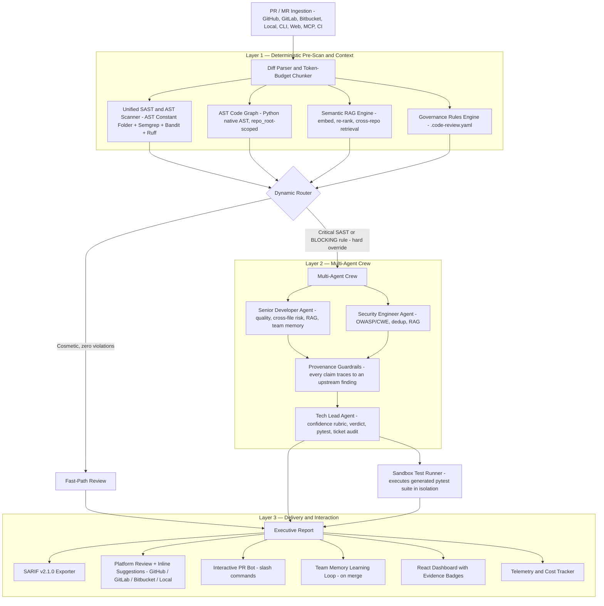
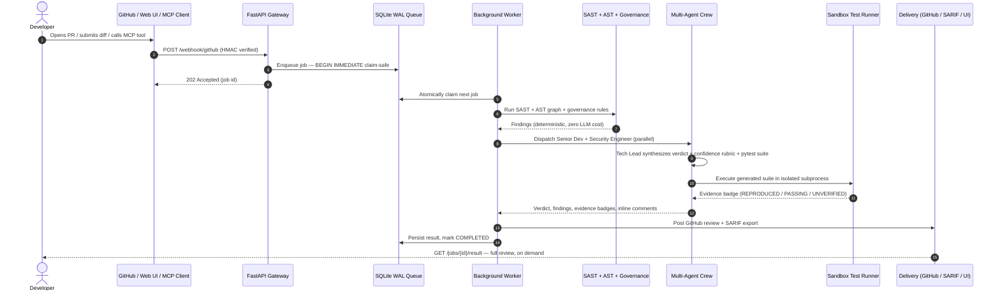

# 🛡️ AI Code Review Agent

### Autonomous Multi-Agent Pull Request Review & Code Intelligence Platform

<div align="center">

[](https://www.python.org/)
[](pyproject.toml)
[](https://crewai.com)
[](https://deepmind.google/technologies/gemini/)
[](https://fastapi.tiangolo.com/)
[](https://vitejs.dev/)
[](https://semgrep.dev)
[](tests/)
[](#-evaluation--benchmarks)
[](https://docs.oasis-open.org/sarif/sarif/v2.1.0/sarif-v2.1.0.html)
[](https://modelcontextprotocol.io)
[](docker-compose.yml)
[](LICENSE)

**A production-grade multi-agent code intelligence platform that combines deterministic static analysis, deep AST constant folding & variable indirection tracing, semantic repository-wide retrieval (RAG), codified team governance, and collaborative LLM agent reasoning — and then *proves* its findings by executing generated regression tests in a sandboxed subprocess before reporting them.**

It talks to developers directly in PRs via slash commands, learns your team's accepted conventions over time, checks each PR against its linked ticket, and runs on GitHub, GitLab, Bitbucket, or fully offline on a local repo.

[Key Capabilities](#-key-capabilities) • [Architecture](#-architecture) • [AST Constant Folding](#-ast-constant-folding--deep-variable-indirection) • [Empirical Evidence](#-empirical-test-evidence) • [Semantic RAG](#-semantic-codebase-context-rag) • [PR Bot](#-interactive-pr-bot--slash-commands) • [Team Memory](#-team-memory--learning-loop) • [Ticket Compliance](#-ticket--intent-compliance) • [Multi-Platform](#-multi-platform-support) • [MCP Server](#-mcp-server) • [Quickstart](#-quickstart) • [Governance](#-team-governance-engine) • [Benchmarks](#-evaluation--benchmarks) • [Roadmap](#-roadmap)

</div>

---

## 📌 The Problem

Code review is the highest-friction step in the modern SDLC, and today's AI reviewer tools introduced a new failure mode of their own:

| Problem | Description |
|---|---|
| ⏳ **Review Lag** | PRs sit idle for days awaiting human attention, stalling releases and causing context-switching costs across the team. |
| 😴 **Reviewer Fatigue** | Senior engineers spend a large share of their week on routine diffs, leading to superficial "LGTM" approvals. |
| 🙈 **Context Blindness** | Reviewing an isolated diff misses downstream ripple effects in files the diff never touches. |
| 📢 **AI Reviewer Noise** | Industry data puts typical AI code-review false-positive rates at 5–15%; teams learn to skim past every comment. |
| 📉 **Governance Drift** | Coding standards live in wikis, ignored and unenforced — no automated, deterministic policy check runs on every PR. |
| 💸 **Unverified LLM Output** | A general-purpose LLM handed a raw diff will confidently assert vulnerabilities that don't exist. Nothing verifies the claim before it's posted. |

Most "AI code review" tools solve speed by making noise and hallucinations worse. A confident-sounding finding and an invented one look identical in a comment — a human has to re-check either way, which is the exact cost the tool was supposed to remove.

---

## 💡 The Solution: Deterministic-First, Then Prove It

This system is built on two ideas most reviewers skip:

1. **Deterministic analysis runs before the LLM and can override it.** Static tools decide what's provably true; the LLM only reasons about what's left. A confirmed CRITICAL/HIGH finding or a `BLOCKING` governance violation routes straight to the full multi-agent crew — the model never gets a chance to talk the system out of escalating a real vulnerability.

2. **Findings get executed, not just asserted.** For every review, the Tech Lead agent generates a `pytest` regression suite targeting the reported defects. That suite runs in an isolated sandboxed subprocess against the actual PR code, and the result — not the model's confidence — decides the evidence badge attached to the finding.

```
1. Fast Pre-Scan (zero token cost)     AST Constant Folder + Semgrep + Bandit + Ruff + quote-aware
                                        regex heuristics catch structural flaws in milliseconds.
2. AST Call-Graph Context              Fully-qualified symbol graph (Python native AST; JS/TS/Go/
                                        Java via lighter tokenization) surfaces cross-file callers.
3. Semantic RAG Retrieval              AST-boundary chunks embedded (Gemini or offline hashing),
                                        re-ranked and injected — the crew reasons about code the
                                        diff never touches, across repos.
4. Team Memory & Ticket Context        Learned conventions and the PR's linked-ticket acceptance
                                        criteria are injected as grounding for the review.
5. Codified Governance                 .code-review.yaml rules evaluate deterministically — no
                                        prompt drift, no LLM call, sub-millisecond.
6. Multi-Agent Crew                    Senior Developer + Security Engineer run in parallel; Tech
                                        Lead synthesizes a grounded verdict with a mathematical
                                        confidence rubric — every claim traces to an upstream finding.
7. Empirical Verification (sandbox)    Generated regression tests execute against the PR code in
                                        an isolated subprocess. The badge reflects what actually ran.
8. Deterministic Reconciliation        A final deterministic stage dedups findings, assigns one
                                        severity per defect, corrects CWEs, labels test badges
                                        honestly, and computes a bounded, non-saturating score.
```

---

## 🌟 Key Capabilities

| Category | Features |
|---|---|
| 🛡️ **Multi-Layer SAST & AST** | AST Constant Folding Engine (bitwise masks, stdlib), Variable Indirection Tracer, Semgrep + Bandit + Ruff, quote-aware comment filter |
| 🕸️ **AST Call-Graph Memory** | Native Python AST indexer (fully-qualified symbols), cross-file caller impact map, per-target `repo_root` scoping |
| 🧪 **Empirical Test Evidence** | Generated pytest suite runs in isolated sandbox, `REPRODUCED`/`PASSING`/`UNVERIFIED`/`HEURISTIC` evidence badges, 100% benchmark recall |
| 🧠 **Semantic Codebase RAG** | AST-boundary chunk embedding, Gemini 3072-dim OR offline zero-dep hashing embedder, re-rank + noise filter + cross-repo retrieval |
| 💬 **Interactive PR Bot** | `/describe /ask /improve /compliance /ticket /review /memory /learn /benchmark /help` slash commands |
| 🧑‍🏫 **Team Memory Loop** | Learns accepted suggestions verified against merged diff, injected as few-shot context, per-repo best-practices wiki |
| 🎯 **Ticket & Intent Compliance** | Parses GitHub/Jira/Linear keys, acceptance-criteria audit, COMPLIANT / PARTIAL / NON-COMPLIANT card |
| 🌐 **Multi-Platform Git Engine** | GitHub · GitLab · Bitbucket · Local air-gapped (`local://`), unified adapter interface + webhooks |
| 🤖 **MCP Server (8 Tools)** | `review_diff`, `scan_sast_patterns`, `check_governance_rules`, `find_impacted_callers`, `query_semantic_context`, `get_team_memory`, `verify_ticket_compliance`, `generate_unit_tests` |
| 📜 **Codified Governance Engine** | YAML-defined team policies, `BLOCKING`/`WARNING`/`INFO` severity tiers, deterministic zero-LLM-cost evaluation |
| ⚡ **Synchronous API & Web UI** | `POST /api/review`, SSE progress streaming (`/api/review/stream`), React 19 dashboard with evidence badges |
| 💬 **Live PR Integration** | Real-time diff ingestion, line-level inline comments, 1-click GitHub suggestion blocks |
| 📥 **Durable Task Queue** | SQLite WAL, ACID, `BEGIN IMMEDIATE` claim-safe multi-process worker |
| 📊 **SARIF v2.1.0 Export** | GitHub Code Scanning ready, reviews persisted and queryable via `GET /jobs/{id}/result` |
| ⚡ **Cost & Latency Telemetry** | Per-review token + USD cost tracking, SHA-256 memoization cache, hierarchical decision trace |
| 🎓 **Skill-Based Agent System** | Reasoning protocols per agent, injected at build time from `agents.yaml` |
| 🔒 **Output Guardrails** | Provenance-grounded findings, risk-level consistency check, deduplication enforcement |
| 🔐 **Gateway Security** | Operator-token gate, per-IP rate limiting (30 req/min), 2 MiB request-size bounds, production auth mode |
| 🐳 **One-Command Deployment** | Multi-stage Docker build (frontend + backend), `docker compose up --build` |

---

## 📐 Architecture



---

## 🔬 AST Constant Folding & Deep Variable Indirection

Most linters and regex engines only inspect single isolated lines, which leaves them vulnerable to two common failure modes:

1. **Variable indirection blind spots** — if a developer constructs a query across multiple statements (`base = "..."; query = base + param; cur.execute(query)`) naive scanners fail to detect the vulnerability.
2. **Comment & docstring false positives** — scanners that search for keywords like `eval(` or `check_hostname = False` frequently flag commented-out code or instructional docstrings.

The agent resolves both with a two-pass **AST Security Scanner** ([`ast_security_scanner.py`](src/code_review_agent/tools/ast_security_scanner.py)) and a quote-aware comment parser:

| Pass | What It Does |
|---|---|
| 🔢 **Pass 1: Symbol & Constant Resolution** | Bitwise OR/AND evaluation, cross-statement string concat, path join assignment tracking, dangerous function alias detection (`deser = pickle.loads`) |
| 🎯 **Pass 2: Security Sink Inspection** | Permissive chmod (`0o777`), disabled TLS verification, unparameterized SQL execute, subprocess with `shell=True`, dynamic `eval`/`exec` aliases, insecure pickle deserialization |
| 🛡️ **Comment & Docstring Shield** | Preserves `#` and `//` inside string literals, tracks multiline docstring toggles (`\"\"\"` and `'''`), zero false alarms on doc examples or dead code |

### Supported Variable Indirection Patterns

| Vulnerability Category | CWE | What the AST Engine Detects Across Statements |
|---|---|---|
| **Permissive Permissions** | CWE-732 | `MODE = 0o700 | 0o007; os.chmod(path, MODE)` (folded to `0o777`) |
| **Disabled TLS Verification** | CWE-295 | `flag = False; ctx.check_hostname = flag; ctx.verify_mode = ssl.CERT_NONE` |
| **SQL Injection** | CWE-89 | `base = "SELECT..."; q = base + uid; cur.execute(q)` |
| **Path Traversal** | CWE-22 | `target = os.path.join(DIR, user_file); open(target)` without canonicalization |
| **OS Command Injection** | CWE-78 | `cmd = "ping " + host; subprocess.run(cmd, shell=True)` |
| **Insecure Deserialization** | CWE-502 | `deser = pickle.loads; deser(untrusted_payload)` aliased function tracking |
| **Dynamic Code Execution** | CWE-95 | `eval_fn = eval; eval_fn(user_input)` aliased function tracking |

Safe controls (parameterized SQL, safe `chmod 0o600`, `subprocess.run` with `shell=False`) are deterministically verified as clean with **0 false positives**.

---

## 🧪 Empirical Test Evidence

Every AI code reviewer has the same weakness: a finding is only as trustworthy as the model's confidence — and there's no way to tell a real defect from a hallucinated one from the comment alone. This system closes that gap.

When the Tech Lead agent proposes a fix, it also writes a `pytest` suite that asserts the defect's *current* behavior. That suite is handed to [`SandboxTestRunner`](src/code_review_agent/sandbox/test_runner.py), which:

1. **Syntax-validates** the generated code first via `ast.parse()` — a syntax error short-circuits to `UNVERIFIED`, no wasted subprocess.
2. **Materializes** the PR's added lines into a throwaway temp directory and executes the suite as an isolated subprocess — every key containing `KEY`, `TOKEN`, `SECRET`, `PASSWORD`, `AUTH`, or `CREDENTIAL` is stripped before the subprocess starts.
3. **Maps** the actual exit code to an evidence badge:

| Badge | Meaning | How It Is Earned |
|---|---|---|
| 🟢 `REPRODUCED` | The defect is real — the test failed exactly as predicted | `pytest` exit code 1: an assertion actually failed against the PR's code |
| 🔵 `PASSING` | The generated test ran and passed | Used for regression tests validating a proposed fix |
| 🟡 `UNVERIFIED` | Could not be proven either way | Syntax error, missing dependency, or sandbox timeout |
| ⚪ `HEURISTIC` | No test was generated for this finding | Static-analysis-only signal — still shown, just labeled honestly |

> A finding tagged **`REPRODUCED`** isn't a model's opinion — it's a test that failed on your actual code, in a process that ran two seconds ago.

---

## 🤖 MCP Server

The same review engine is exposed as a [Model Context Protocol](https://modelcontextprotocol.io) server, so Claude Code, Cursor, Windsurf, and any MCP-compatible client can call it directly while writing code.

```bash
pip install -e .
code-review-mcp   # starts the MCP server over stdio
```

| Tool | What It Does |
|---|---|
| `review_diff(diff, repo_root=None)` | Full pipeline review — verdict, confidence, findings, evidence badges |
| `scan_sast_patterns(diff)` | Fast deterministic SAST scan only (Semgrep + Bandit + regex) |
| `check_governance_rules(diff, repo_root=None)` | Validate a diff against `.code-review.yaml` |
| `find_impacted_callers(target_identifiers, repo_root=None)` | AST call-graph query — who calls this function? |
| `generate_unit_tests(function_signature, module_path)` | Generate a pytest suite for a function signature |
| `query_semantic_context(diff, repo_root=None)` | Semantic RAG retrieval — related code across the repo for a change |
| `get_team_memory(repo_id)` | The repository's learned team conventions (best-practices wiki) |
| `verify_ticket_compliance(pr_diff, ticket_id, ticket_description)` | Audit a diff against a ticket's acceptance criteria |

Add to your MCP client config (e.g. Claude Code's `.mcp.json`):

```json
{
  "mcpServers": {
    "ai-code-reviewer": { "command": "code-review-mcp" }
  }
}
```

---

## 🧠 Semantic Codebase Context (RAG)

The reviewer retrieves code the diff doesn't touch. The repository is chunked along **AST symbol boundaries**, embedded, and stored in a cosine-similarity index. For each PR, the changed code becomes a query; the engine retrieves the most relevant definitions, **re-ranks** them with a lexical overlap bonus, filters noise, and injects the result into the Senior Developer and Security Engineer prompts.

- **Pluggable, degrades gracefully.** `RAG_EMBEDDER=hashing` (default) is a zero-dependency, offline, deterministic feature-hashing embedder. `RAG_EMBEDDER=gemini` uses `gemini-embedding-001` (3072-dim); `sentence-transformers` runs a local neural model. A missing model falls back to hashing — a review is never blocked.
- **Provenance-safe cache.** The persisted index records which embedder built it and re-indexes automatically if you switch.
- **Cross-repo.** Set `RAG_REPO_ROOTS` to index sibling services, so a change in one service is reviewed against callers and patterns in another.

```bash
RAG_ENABLED=true
RAG_EMBEDDER=hashing        # or: gemini | sentence-transformers
# RAG_REPO_ROOTS=/path/to/service-b,/path/to/shared-libs
```

---

## 💬 Interactive PR Bot & Slash Commands

Talk to the reviewer directly in a PR/MR comment. Commands run **off the request path** (the webhook is acknowledged in milliseconds) and repo-aware commands clone the PR into an **isolated checkout** so RAG/AST/governance index the real codebase.

| Command | What It Does |
|---|---|
| `/describe` | Generates a PR summary + walkthrough table + Mermaid diagram; merges into the description non-destructively (idempotent on re-run) |
| `/ask <question>` | RAG + AST-grounded Q&A about the PR and codebase |
| `/improve` | 1-click GitHub `suggestion` blocks for detected issues |
| `/compliance` | Deterministic `.code-review.yaml` check — zero token cost |
| `/ticket` | Audits the PR against its linked ticket's acceptance criteria |
| `/memory` · `/learn <rule>` | Show / teach repository conventions (team memory) |
| `/benchmark` | Runs the ground-truth benchmark and posts the scorecard |
| `/review` · `/help` | Full multi-agent review · command catalog |

**Security by default:** non-`/help` commands are gated by author association (`OWNER`/`MEMBER`/`COLLABORATOR` on GitHub, a `BOT_ALLOWED_USERS` allowlist on GitLab/Bitbucket — **fail closed** when unset). GitHub webhooks are HMAC-verified; GitLab uses a secret token; Bitbucket authenticates via a secret in the webhook URL.

---

## 🧑‍🏫 Team Memory & Learning Loop

The reviewer gets better at *your* codebase over time. When a PR merges, the platform fetches its review comments and promotes a suggestion into the repository's best-practices wiki **only if that suggestion's code actually landed in the merged diff** — merging is not treated as blanket acceptance, so the memory never fills with ignored suggestions.

Learned conventions are injected as few-shot grounding into future reviews, and reinforced (with a counter) each time they recur. Developers can also teach rules directly with `/learn`.

> Stored per-repo under `.cache/team_memory/{repo}.json`. Works on GitHub today; GitLab/Bitbucket use the same verified-acceptance path via their adapters.

---

## 🎯 Ticket & Intent Compliance

Beyond "is the code good?", the platform checks **"does this PR do what it was asked to?"**

It parses the linked ticket from the PR (GitHub `Fixes #123`, Jira `PROJ-101`, Linear `ENG-45`, or the branch name — with security identifiers like `CWE-89`/`CVE-2023-X` explicitly excluded from misdetection), fetches the issue's acceptance criteria, and audits the diff against each one:

- 🟢 **COMPLIANT** — all acceptance criteria met
- 🟡 **PARTIAL** — some criteria unmet or unclear
- 🔴 **NON-COMPLIANT** — significant criteria failures or out-of-scope changes

The LLM audit runs only on the COMPLEX path (never taxing the sub-second fast-path) and through the flow's bounded timeout wrapper. GitHub issues are fetched live; Jira/Linear are detected (fetching those APIs is on the roadmap).

---

## 🌐 Multi-Platform Support

One unified `GitPlatformClient` interface, four adapters — the bot, review flow, and durable queue worker are all **platform-agnostic**:

| Platform | PR/MR Review | Slash Commands | Merge Learning | Webhook Auth |
|---|:--:|:--:|:--:|:--:|
| **GitHub** (cloud + Enterprise) | ✅ | ✅ | ✅ Full | HMAC-verified |
| **GitLab** (cloud + self-hosted) | ✅ | ✅ | ✅ | Secret token |
| **Bitbucket** Cloud | ✅ | ✅ | ⚠️ Roadmap | URL secret |
| **Local** (air-gapped, `local://`) | ✅ | ✅ | n/a | Writes `REVIEW.md` |

The **local air-gapped adapter** runs the full review on a local repo with no tokens, no network, and no hosting platform — it reads the working-tree diff via the git CLI and writes `REVIEW.md` / `REVIEW_NOTES.md`. Ideal for regulated or offline environments.

---

## 🔄 End-to-End Data Flow



---

## 👥 Multi-Agent Roster & Skills

Three specialized agents, each with **assigned skills** (reasoning protocols injected into the LLM context at crew build time) and **assigned tools** (executable actions). Full catalog: [`docs/SKILLS.md`](docs/SKILLS.md).

| Agent | Skills | Tools | Task Output |
|---|---|---|---|
| **Senior Developer** | `senior-dev-quality-reviewer` · `ast-callgraph-context-indexer` · `api-breaking-change-detector` · `performance-and-concurrency-auditor` | `CodebaseContextTool`, `RuffTool` | `CodeQualityJSON` |
| **Security Engineer** | `sast-vulnerability-auditor` · `git-diff-and-patch-analyzer` | `QuickPatternScannerTool`, `SerperDevTool`*, `ScrapeWebsiteTool`* | `ReviewSecurityJSON` + output guardrail |
| **Tech Lead** | `tech-lead-verdict-synthesizer` · `automated-unit-test-generator` · `governance-policy-enforcer` | `CustomRulesTool`, `TestGeneratorTool` | `SummarizedFindingsJSON` |

<sub>* optional, requires `SERPER_API_KEY` for live CVE/OWASP lookups</sub>

Senior Developer and Security Engineer tasks run **async in parallel**; Tech Lead runs sequentially afterward with both outputs as grounding context. Every claim in the final report must trace back to a specific upstream finding.

**Confidence rubric** (deterministic, not free-form model judgment): start at 100, subtract 30 per unresolved CRITICAL vulnerability, 15 per HIGH, 10 per code-quality critical or BLOCKING governance rule, 5 per minor/medium/low finding or WARNING rule. Floor at 0.

---

## 🧮 Deterministic Final Synthesis

The last stage is not the LLM — it's a **deterministic reconciler** ([`reconciler.py`](src/code_review_agent/synthesis/reconciler.py)) that takes raw analyzer output plus the sandbox test result and produces one internally consistent report. It enforces a fixed contract:

1. **Deduplicate before counting.** Findings sharing a root cause (same file + CWE within an adjacency window) merge into a single finding with a `sources[]` list. Every count equals the length of the deduplicated list — no invented totals.
2. **One severity per defect**, assigned from a documented impact/exploitability rubric (keyed on the corrected CWE), never copied from whichever analyzer fired.
3. **Honest test-evidence semantics.** A generated test that asserts a vulnerability *is present* is `confirms_vulnerability` — a **pass on it confirms the defect** (VULNERABILITY CONFIRMED), never a reassuring green.
4. **Governance scoped to production.** Production-only style rules (`print`, `sleep`, wildcard imports) are downgraded to INFO inside test files, examples, scripts, and `if __name__ == "__main__":` guards.
5. **A bounded, non-saturating score.** The score is a worst-severity ceiling minus diminishing per-defect penalties — 1 vs 2 criticals are distinguishable (e.g. 35 vs 22), and the terms trace to listed findings.
6. **CWEs corrected** to match the actual defect (`eval()` on input is CWE-95, not the firing rule's CWE-78).
7. **An explicit limitations note** — pattern/Bandit static analysis has no dataflow/taint tracking; it plainly states the classes it can't reliably catch.

> Deterministic analysis can **override** the LLM: a confirmed CRITICAL or a BLOCKING rule escalates regardless of what the crew concluded.

---

## 📁 Repository Structure

```
AI-Code-Review-Agent/
├── .github/workflows/
│   ├── ci.yml                          # Test matrix (Python 3.10–3.12)
│   └── ai-code-review.yml              # Dogfoods action.yml on this repo's own PRs
├── .code-review.yaml                   # This repo's own governance rules
├── .pre-commit-hooks.yaml              # pre-commit integration — blocks commits on ESCALATE
├── .env.example                        # All env variables documented with defaults
├── action.yml                          # Reusable GitHub Action (published distribution)
├── Dockerfile                          # Multi-stage: frontend build to Python runtime
├── docker-compose.yml
├── pyproject.toml                      # Project v2.0.0 metadata + CLI entrypoints
├── run.py                              # Root CLI launcher
│
├── scripts/                            # Cross-platform dev launchers
│   ├── dev-backend.sh / .bat           # FastAPI gateway on :8000
│   └── dev-frontend.sh / .bat          # Vite dev server on :3000
│
├── docs/
│   ├── ARCHITECTURE_AND_STRUCTURE.md   # Full layered architecture reference
│   ├── SKILLS.md                       # Agent skill catalog — protocols, triggers, guardrails
│   ├── SECURE_OPERATION.md             # Production security, auth, sandbox, limits
│   └── PROJECT_REVIEW_REPORT.md        # Self-generated project review report
│
├── samples/
│   ├── sql_injection_pr.txt
│   ├── simple_formatting_pr.txt
│   └── benchmarks/                     # 14-case ground-truth suite
│       ├── manifest.json               # Category, expected verdict, CWEs
│       └── *.diff                      # SQLi, secrets, command injection, path traversal, etc.
│
├── notebooks/
│   └── finetune_code_review_peft.ipynb # QLoRA/PEFT experimentation (research track)
│
├── frontend/                           # React 19 + Vite + TypeScript dashboard
│   ├── e2e/                            # Playwright end-to-end browser tests
│   └── src/components/
│       ├── AnnotatedCodeViewer.tsx     # Pulsing gutter markers, in-flow suggestion cards
│       ├── ReviewInput.tsx             # Diff / File / ZIP / GitHub PR URL input
│       ├── ReviewDashboard.tsx         # Verdict, findings, evidence badges, trace
│       ├── FindingsList.tsx            # Findings with severity, CWE, and badge
│       ├── VerdictBanner.tsx           # Top-level verdict display
│       ├── GovernanceViolations.tsx    # Governance rule violation cards
│       ├── InlineCommentsList.tsx      # Line-level inline PR comments
│       ├── JobsQueueMonitor.tsx        # Live webhook queue + persisted results
│       ├── PipelineProgress.tsx        # Real-time SSE stage progress
│       ├── TraceVisualizer.tsx         # Hierarchical decision trace tree
│       ├── TelemetryCard.tsx           # Token cost, latency, model info
│       ├── GeneratedUnitTests.tsx      # Generated pytest suite viewer
│       ├── CrossFileImpact.tsx         # AST call-graph cross-file impact map
│       ├── CompleteExecutiveReport.tsx # Full executive summary card
│       ├── OperatorConnection.tsx      # Operator token connection form
│       ├── ScopeDisclaimer.tsx         # Non-dismissible scope/limitations note
│       └── Navbar.tsx                  # Top navigation bar
│
├── tests/                              # pytest suite — 254+ tests
│   └── eval/                           # Deterministic + LLM-as-judge evaluators
│
└── src/code_review_agent/
    ├── main.py                         # PRCodeReviewFlow — CrewAI Flow orchestrator + CLI
    ├── models.py                       # Pydantic schemas (Diff, Findings, SARIF, Telemetry)
    ├── review_service.py               # Sync review API — rate limiting, zip/file/PR ingestion
    ├── webhook_server.py               # FastAPI gateway — HMAC, SSE streaming, job persistence
    ├── webhook_queue.py                # SQLite WAL queue — BEGIN IMMEDIATE, crash recovery
    ├── mcp_server.py                   # MCP tool exposure (8 tools)
    ├── llm_factory.py                  # Multi-provider LLM factory (Gemini/OpenAI/Anthropic/Groq)
    ├── github_client.py                # GitHub REST API — diffs, inline reviews
    ├── sarif_exporter.py               # OASIS SARIF v2.1.0 generator
    ├── cache.py                        # SHA-256 content-hash memoization
    ├── config.py                       # Centralized config with env-var binding
    ├── benchmarks.py                   # Precision/Recall/F1 ground-truth harness
    ├── gateway_security.py             # Operator-token gate and per-IP rate limiter
    ├── remediator.py                   # Automated fix suggestion engine
    ├── suppression_store.py            # Finding suppression / allowlist store
    ├── comment_synchronizer.py         # Platform comment sync helper
    ├── diff_parser.py                  # Diff parsing and token-budget chunker
    ├── flow_parser.py                  # CrewAI flow state parser
    │
    ├── sandbox/
    │   └── test_runner.py              # Isolated subprocess execution — evidence badges
    │
    ├── context_engine/
    │   ├── code_graph.py               # Qualified-symbol indexer and caller resolver
    │   ├── context_tool.py             # CodebaseContextTool — repo_root-scoped, lazy-indexed
    │   └── semantic/                   # Semantic RAG engine
    │       ├── embeddings.py           #   Gemini / hashing / sentence-transformers embedders
    │       ├── vector_store.py         #   Cosine index + provenance-stamped persistence
    │       ├── engine.py               #   AST-chunk to embed to re-rank to noise-filter to inject
    │       └── semantic_tool.py        #   SemanticContextTool (CrewAI)
    │
    ├── bot/                            # Interactive PR bot
    │   ├── command_router.py           #   Slash-command parsing and dispatch (platform-agnostic)
    │   └── checkout.py                 #   Isolated per-platform PR checkout for RAG/AST
    │
    ├── learning/                       # Team memory and learning loop
    │   ├── team_memory.py              #   Best-practices wiki store (per-repo)
    │   └── suggestion_tracker.py       #   Verified-acceptance learning on merge
    │
    ├── compliance/                     # Ticket and intent compliance
    │   ├── ticket_parser.py            #   GitHub/Jira/Linear key extraction
    │   ├── ticket_fetcher.py           #   Acceptance-criteria retrieval
    │   └── intent_engine.py            #   PR-vs-criteria audit + compliance card
    │
    ├── platform/                       # Multi-platform Git engine
    │   ├── base.py                     #   GitPlatformClient interface + normalized DTOs
    │   ├── factory.py                  #   URL/identifier to adapter resolution
    │   └── {github,gitlab,bitbucket,local_git}_adapter.py
    │
    ├── synthesis/                      # Deterministic final synthesis
    │   └── reconciler.py               #   dedup, one-severity, honest badges, bounded score
    │
    ├── governance/rules_engine.py      # .code-review.yaml evaluator
    ├── observability/                  # Telemetry, cost tracking, hierarchical trace tree
    │
    ├── crews/code_review_crew/
    │   ├── crew.py                     # Agent/task assembly, repo_root threading
    │   ├── tool_registry.py            # Declarative tool resolution from agents.yaml
    │   └── config/{agents,tasks}.yaml  # Roles, skills, prompt contracts, JSON schemas
    │
    ├── eval/                           # Deterministic + G-Eval evaluators, EvalRunner
    └── tools/                          # ast_security_scanner, sast_scanner, semgrep_runner,
                                        #   bandit_runner, ruff_tool, test_generator
```

---

## 🚀 Quickstart

### Option A — Docker Compose (recommended)

```bash
git clone https://github.com/hamza1713/AI-Code-Review-Agent.git
cd AI-Code-Review-Agent
cp .env.example .env   # add your GEMINI_API_KEY
docker compose up --build -d
```

Open **`http://localhost:8000`**. The multi-stage build compiles the React dashboard and serves it from the same container as the API — one command, one port.

### Option B — Local Python + Node

**Prerequisites:** Python 3.10–3.13 (3.12 recommended) · Node.js 18+ · a [Gemini API key](https://aistudio.google.com/) · Semgrep (`pip install semgrep`, optional — enhances SAST coverage)

```bash
pip install -e .
cp .env.example .env   # add your GEMINI_API_KEY

# Terminal 1 — backend + dashboard
scripts/dev-backend.sh      # or scripts\dev-backend.bat on Windows

# Terminal 2 — frontend hot-reload (optional)
scripts/dev-frontend.sh     # or scripts\dev-frontend.bat
```

### Other Modes

```bash
# Review a local diff file, export SARIF
python run.py --file samples/sql_injection_pr.txt --sarif results.sarif

# Review a live GitHub PR
python run.py --pr "owner/repository/pull/42"

# Pre-commit integration — reviews staged files, exits non-zero to block the commit
python run.py path/to/staged_file.py

# Visualize the flow execution graph
python run.py --plot
```

### CLI Entrypoints

| Entrypoint | Description |
|---|---|
| `code-review-agent --file <diff>` / `--pr <url>` / `--server` | Review a diff / live PR / start the API server |
| `code-review-mcp` | Start the MCP server over stdio |
| `review-server` | Webhook/API server only |
| `eval-benchmarks` | Run the ground-truth benchmark suite |
| `kickoff` / `plot` | Resume from `flow_state.json` / render the flow graph |

---

## 🤖 GitHub Actions CI/CD Integration

Add automated multi-agent reviews to any repository via [`action.yml`](action.yml) — this repo dogfoods the identical action on its own pull requests:

```yaml
on:
  pull_request:
    types: [opened, synchronize, reopened]

jobs:
  review:
    runs-on: ubuntu-latest
    permissions:
      contents: read
      pull-requests: write
      security-events: write
    steps:
      - uses: actions/checkout@v4
      - uses: hamza1713/AI-Code-Review-Agent@main
        with:
          github_token: ${{ secrets.GITHUB_TOKEN }}
          gemini_api_key: ${{ secrets.GEMINI_API_KEY }}
          sarif_output: results.sarif
      - uses: github/codeql-action/upload-sarif@v3
        if: always()
        with:
          sarif_file: results.sarif
```

### Pre-commit Hook

```yaml
# .pre-commit-config.yaml
repos:
  - repo: https://github.com/hamza1713/AI-Code-Review-Agent
    rev: main
    hooks:
      - id: ai-code-review
```

Staged files are converted to a synthetic diff and reviewed locally; the commit is blocked (non-zero exit) on an `ESCALATE` or `REQUEST CHANGES` verdict.

---

## ⚙️ Configuration

Copy `.env.example` to `.env` and configure the variables below.

### Required

| Variable | Description |
|---|---|
| `GEMINI_API_KEY` | Google Gemini API key — [get one here](https://aistudio.google.com/) |
| `GITHUB_TOKEN` | Personal Access Token with `repo` + `pull_requests:write` scopes |
| `GITHUB_WEBHOOK_SECRET` | Webhook signature secret for HMAC validation |

### LLM & Model

| Variable | Default | Description |
|---|---|---|
| `LLM_MODEL` | `gemini/gemini-3.1-flash-lite-preview` | LLM model identifier |
| `MAX_TOKENS` | `4096` | Maximum tokens per LLM response |

### Semantic RAG

| Variable | Default | Description |
|---|---|---|
| `RAG_ENABLED` | `true` | Enable semantic RAG context retrieval |
| `RAG_EMBEDDER` | `hashing` | Provider: `hashing`, `gemini`, or `sentence-transformers` |
| `RAG_EMBEDDING_DIM` | `512` | Dimension for the hashing embedder |
| `RAG_REPO_ROOTS` | — | Comma-separated extra repo roots for cross-repo RAG |

### Interactive PR Bot

| Variable | Default | Description |
|---|---|---|
| `BOT_ALLOWED_ASSOCIATIONS` | `OWNER,MEMBER,COLLABORATOR` | GitHub author associations allowed for cost-bearing commands |
| `BOT_ALLOWED_USERS` | — | GitLab/Bitbucket usernames allowed (fail-closed if unset) |
| `BOT_CLONE_REPO` | `true` | Clone the PR repo into isolated temp dir for RAG/AST |
| `GITLAB_WEBHOOK_SECRET` | — | GitLab webhook secret token |
| `BITBUCKET_WEBHOOK_SECRET` | — | Bitbucket webhook secret |

### Optional Integrations

| Variable | Description |
|---|---|
| `SERPER_API_KEY` | Enables live CVE/OWASP web search in the Security Engineer agent |
| `LANGFUSE_PUBLIC_KEY` / `LANGFUSE_SECRET_KEY` | Optional Langfuse live production trace monitoring |
| `OPENAI_API_KEY` / `ANTHROPIC_API_KEY` | Alternate providers for LLM or evaluator |

### Production Security

| Variable | Default | Description |
|---|---|---|
| `APP_ENV` | `development` | Set to `production` to enable strict fail-closed security |
| `REVIEW_REQUIRE_AUTH` | `false` | Enable operator-token gate for all API + job access |
| `REVIEW_API_TOKEN` | — | Operator token (min 32 chars). Generate: `python -c "import secrets; print(secrets.token_urlsafe(32))"` |
| `REVIEW_PUBLIC_URL` | `http://localhost:8000` | Externally configured public origin |
| `REVIEW_ALLOW_API_POSTING` | `false` | Allow REST API to post reviews to platforms (explicit opt-in) |
| `REVIEW_SANDBOX_IMAGE` | — | Immutable Docker image SHA256 digest for sandboxed test execution |
| `QUEUE_DB_PATH` | `webhook_jobs.db` | SQLite queue database path |

> See [`docs/SECURE_OPERATION.md`](docs/SECURE_OPERATION.md) for production deployment, operator access model, sandbox container setup, and resource limits before enabling authentication.

---

## 📜 Team Governance Engine

Codify engineering standards in `.code-review.yaml` at the repository root. Rules are validated against a Pydantic schema and evaluated deterministically — zero token cost, sub-millisecond:

```yaml
version: "1.0"
rules:
  - id: "gov-no-raw-sql"
    name: "Forbid Raw SQL String Interpolation"
    severity: "BLOCKING"
    pattern: "db\\.(?:query|execute)\\s*\\(\\s*f[\"']"
    description: "Raw SQL queries using f-string interpolation are strictly prohibited."
    suggested_fix: "Use parameterized queries: db.query('SELECT * FROM users WHERE id = %s', (user_id,))"

  - id: "gov-no-plaintext-passwords"
    name: "Forbid Plaintext Password Equality Checks"
    severity: "BLOCKING"
    pattern: "password\\s*==\\s*user\\.password"
    description: "Passwords must never be stored or evaluated in plaintext."
    suggested_fix: "Use bcrypt.checkpw(password.encode(), user.password_hash.encode())"

  - id: "gov-no-print-statements"
    name: "Forbid Direct Print Statements"
    severity: "WARNING"
    pattern: "(?<!#)\\bprint\\s*\\("
    description: "print() bypasses structured logging in production code."
    suggested_fix: "Use logger.info(...) or logger.debug(...)"

  - id: "gov-no-wildcard-imports"
    name: "Forbid Wildcard Module Imports"
    severity: "WARNING"
    pattern: "from\\s+[A-Za-z0-9_.]+\\s+import\\s+\\*"
    description: "Wildcard imports pollute the namespace and obscure dependency origins."
    suggested_fix: "Import specific symbols explicitly: from module import specific_function"
```

Test files, scripts, benchmarks, and `__main__` blocks are automatically exempted from non-security quality rules.

| Severity | Confidence Deduction | Verdict Impact |
|---|---|---|
| `BLOCKING` | -10 per violation | Contributes to `ESCALATE` |
| `WARNING` | -5 per violation | Contributes to `REQUEST CHANGES` |
| `INFO` | none | Surfaced in `recommendations` only |

---

## 🧪 Evaluation & Benchmarks

Two independent measurement layers, both zero-cost to run in CI:

**Deterministic evaluators** (`src/code_review_agent/eval/`) verify the pipeline's own arithmetic and output: `ConfidenceMathEvaluator`, `CodeCompilationEvaluator`, `SarifComplianceEvaluator`, `GuardrailConsistencyEvaluator`, and `DiffLineScopeEvaluator`.

### OWASP & CWE Ground-Truth Vulnerability Benchmark

| # | Vulnerability Category | CWE | Detected? | Mechanism |
|---|---|---|:---:|---|
| 1 | Hardcoded Credentials | CWE-798 | ✅ 100% | High-entropy secret and token pattern matcher |
| 2 | SQL Injection (direct and indirect) | CWE-89 | ✅ 100% | AST concatenation tracking + regex string interpolation |
| 3 | OS Command Injection | CWE-78 | ✅ 100% | `shell=True` sink analysis + command concatenation tracking |
| 4 | Insecure Deserialization (pickle) | CWE-502 | ✅ 100% | Aliased call tracking (`deser = pickle.loads`) + direct calls |
| 5 | Weak Cryptographic Hash (MD5) | CWE-327 | ✅ 100% | Insecure hash algorithm call inspection |
| 6 | Dynamic Code Evaluation (eval) | CWE-95 | ✅ 100% | Aliased and direct dynamic evaluation detection |
| 7 | Disabled TLS Verification | CWE-295 | ✅ 100% | Variable indirection (`check_hostname = False`, `CERT_NONE`) |
| 8 | Insecure Randomness (random) | CWE-330 | ✅ 100% | Non-cryptographic pseudo-random generator audit |
| 9 | Unsafe YAML Load | CWE-502 | ✅ 100% | Unsafe YAML loader detection |
| 10 | Path Traversal / Arbitrary Read | CWE-22 | ✅ 100% | `os.path.join` to `open()` variable tracking |
| 11 | Permissive File Permissions | CWE-732 | ✅ 100% | AST constant folding on octal/bitwise masks (`0o777`) |
| 12 | Bare Exception Swallowing | CWE-390 | ✅ 100% | Bare `except:` and `pass` defect detection |
| — | **Clean Control Functions** | — | 🛡️ **0 FP** | Parameterized queries, safe chmod, safe subprocesses pass cleanly |

### 14-Case Comprehensive Ground-Truth Suite

```bash
pip install -e ".[eval]"
eval-benchmarks                 # or: python -m code_review_agent.benchmarks
```

| Category | Cases | Precision | Recall | F1 | Verdict Accuracy |
|---|---|---|---|---|---|
| SECURITY | 7 | 69.2% | 100% | 81.8% | 100% |
| QUALITY | 3 | 100% | 100% | 100% | 100% |
| GOVERNANCE | 2 | 100% | 100% | 100% | 100% |
| ARCHITECTURE | 1 | 100% | 100% | 100% | 100% |
| COMPLEX | 1 | 75.0% | 100% | 85.7% | 100% |
| **Overall** | **14** | **79.2%** | **100%** | **88.4%** | **100%** |

<sub>Quality and architectural flaws (N+1 queries, swallowed exceptions, breaking API signatures) are caught and synthesized by the LLM crew with full grounded reasoning.</sub>

> The full case-by-case audit with confusion matrix is in [`BENCHMARK_REPORT.md`](BENCHMARK_REPORT.md).

---

## 🎨 Web Dashboard

The React 19 + TypeScript dashboard provides:

- ⚡ **Synchronous Review** via `POST /api/review` — accepts raw git diff text, single files, `.zip` archives, or GitHub PR URLs
- 🔴 **Pulsing gutter markers** by severity — CRITICAL / WARNING / INFO with staggered mount animation
- 📂 **In-flow expandable cards** — click a flagged line for the causal explanation and a 1-click GitHub suggestion diff
- 🧪 **Evidence badges** inline with every finding — `REPRODUCED` / `PASSING` / `UNVERIFIED` / `HEURISTIC`
- 📊 **Live SSE progress streaming** — real-time agent steps and analyzer findings in the browser
- 🕸️ **Cross-file impact view** — AST call-graph callers and downstream effects
- 🗂️ **Trace visualizer** — hierarchical decision trace tree for every verdict
- 📥 **Jobs Queue Monitor** — live webhook queue status with full persisted review results on completion
- 💰 **Telemetry card** — per-review token count, USD cost estimate, latency, and model used
- 🔑 **Operator connection form** — in-UI token authentication for production deployments
- 🛡️ **Non-dismissible scope note** — every response states plainly what was and wasn't checked

---

## 🧪 Testing

The test suite contains over **254 automated tests** split into two tiers:

```bash
pytest -v tests/            # fast tier — excludes slow, runs in-process only
pytest -v -m slow tests/    # slow tier — subprocess-backed: bandit/ruff CLI, sandbox execution
ruff check src/             # linting

# LLM-as-judge evaluation tests (requires GEMINI_API_KEY)
pytest tests/eval/ -m eval
```

**Fast tier covers:** diff parsing, SAST/governance engines, AST call graph, semantic RAG engine (embedders, vector store, retrieval), interactive bot (command routing, cross-platform authz), team-memory learning loop, ticket compliance, platform adapters (GitHub/GitLab/Bitbucket/local + queue worker), durable webhook queue (including concurrent-claim safety), gateway security, and MCP tool surface.

**Slow tier covers:** actual Bandit/Ruff CLI detection accuracy, the ground-truth benchmark suite, and the sandbox's real test execution — including a check that its environment allowlist strips credential-shaped variables (`GEMINI_API_KEY`, `GITHUB_TOKEN`, etc.) before a generated test runs.

---

## 🔭 Roadmap

### Scale-out & Shared State
- **Shared job queue** — pluggable backend (Postgres / Redis) for multi-replica deployments; today's SQLite WAL queue is single-node
- **Shared team memory & RAG index** — move `TeamMemoryStore` and semantic index to shared store (object storage / DB / managed vector DB)
- **Shared rate limiter** — replace the in-process per-IP limiter with a distributed Redis-backed one
- **Durable slash commands** — route bot commands through the durable queue (not FastAPI `BackgroundTasks`) for horizontal scaling

### Managed Vector Search & Embeddings
- **Managed vector DB backend** (Qdrant / LanceDB / pgvector) for large mono-repos where the in-memory cosine store is no longer ideal
- **Default to a strong code-embedding model** — ship a benchmarked code-aware default while keeping the offline hashing fallback

### Deeper Platform & Learning Parity
- **Bitbucket merge-learning hook** — add the `pullrequest:fulfilled` webhook branch (GitHub & GitLab already learn on merge)
- **Jira / Linear fetchers** — ticket keys are already parsed; add authenticated API clients so acceptance criteria are fetched, not just detected
- **Platform-native inline comments** — post true line-anchored review comments on GitLab/Bitbucket

### Reviewer Intelligence
- **Incremental review** — review only what changed since the last push, not the whole diff each time
- **Confidence calibration from outcomes** — feed merged-vs-reverted signals back into the confidence rubric
- **Expanded language depth** — richer native AST (beyond Python) for the call-graph and chunker

> These are intended directions, not commitments or dates. Contributions toward any of them are welcome.

---

## 🤝 Contributing

1. Fork the repository and create a feature branch.
2. Run `pytest -v tests/`, `pytest -v -m slow tests/`, and `ruff check src/` before opening a PR — CI runs both tiers.
3. Open the PR — the agent will review its own diff automatically via the dogfooded Action.

---

## 📄 License

Apache 2.0 — see [`LICENSE`](LICENSE).

---

<div align="center">

Built with [CrewAI Flows](https://crewai.com) · [Google Gemini](https://deepmind.google/technologies/gemini/) · [FastAPI](https://fastapi.tiangolo.com/) · [React 19](https://react.dev/) · [Model Context Protocol](https://modelcontextprotocol.io)

</div>
