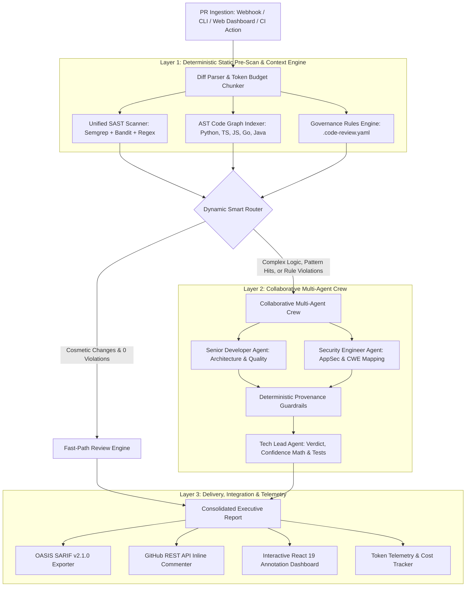

# 🏛️ AI Code Review Agent — System Architecture & Repository File Structure

> **Enterprise Multi-Agent Code Intelligence Platform (v2.0)**  
> **Framework:** CrewAI Flows 2.0 • Google Gemini 2.5 / Flash • FastAPI • React 19 • OASIS SARIF 2.1.0

---

## 📑 Table of Contents

1. [Architectural Overview](#-architectural-overview)
2. [Layered System Architecture](#-layered-system-architecture)
3. [Production Repository File Structure](#-production-repository-file-structure)
4. [Module Responsibilities & Component Breakdown](#-module-responsibilities--component-breakdown)
5. [End-to-End Execution Flow](#-end-to-end-execution-flow)
6. [Agent Collaboration & Skills Integration](#-agent-collaboration--skills-integration)
7. [Observability, Telemetry & Caching](#-observability-telemetry--caching)
8. [Deployment & CI/CD Pipeline](#-deployment--cicd-pipeline)

---

## 🌐 Architectural Overview

The **AI Code Review Agent (v2.0)** is structured on a **Deterministic-First, Multi-Agent Architecture**. It solves the core trade-off in modern AI engineering: **combining compiler-grade precision with the nuanced reasoning of LLM agents**, while guaranteeing zero hallucinations on code provenance and security classifications.



---

## 📂 Production Repository File Structure

Below is the optimized, enterprise-grade repository layout for the project:

```
AI-Code-Review-Agent/
├── .github/workflows/
│   ├── ci.yml                              # Test matrix (Python 3.10–3.12)
│   └── ai-code-review.yml                  # Dogfoods action.yml on this repo's own PRs
├── action.yml                              # Reusable GitHub Action definition
├── .code-review.yaml                       # Codified Team Governance & Architectural Rules
├── .pre-commit-hooks.yaml                  # pre-commit integration — blocks on ESCALATE
├── .dockerignore
├── .env.example                            # Template for API keys and environment variables
├── .gitignore                              # Comprehensive ignore rules (builds, caches, DBs)
├── Dockerfile                              # Multi-stage: frontend build → Python runtime
├── docker-compose.yml
├── LICENSE                                 # Apache 2.0
├── pyproject.toml                          # PEP 517/621 Build metadata, dependencies & scripts
├── README.md                               # Primary User & Enterprise Documentation
├── run.py                                  # Quick development launcher script
│
├── scripts/                                # Cross-platform dev launchers
│   ├── dev-backend.sh / .bat               # FastAPI gateway on :8000
│   └── dev-frontend.sh / .bat              # Vite dev server on :3000
│
├── docs/                                   # In-Depth System & Architecture Documentation
│   ├── ARCHITECTURE_AND_STRUCTURE.md       # This file
│   └── SKILLS.md                           # Standardized Agent Skills Catalog (12 Agent Skills)
│
├── samples/                                # Sample PR Diffs & Benchmark Data
│   ├── simple_formatting_pr.txt            # Sample Cosmetic PR Diff (Fast-Path)
│   ├── sql_injection_pr.txt                # Sample High-Risk PR Diff (Crew Review)
│   └── benchmarks/                         # 14-case Ground-Truth Benchmarking Suite
│       ├── manifest.json                   # Ground-truth labels, CWEs, and expected verdicts
│       ├── sql_injection.diff / hardcoded_secret.diff / command_injection.diff
│       ├── insecure_deserialization.diff / plaintext_password.diff / weak_crypto.diff
│       ├── path_traversal.diff / n_plus_one.diff / swallowed_exception.diff
│       ├── print_statements.diff / wildcard_import.diff / breaking_signature.diff
│       └── clean_code.diff / complex_multi_issue.diff
│
├── notebooks/                              # Fine-Tuning & Experimentation
│   └── finetune_code_review_peft.ipynb     # QLoRA / PEFT notebook for fine-tuning LLMs on PRs
│
├── src/                                    # Python Core Source Package (PEP 518)
│   └── code_review_agent/
│       ├── __init__.py                     # Package entry point
│       ├── main.py                         # Flow Orchestrator (PRCodeReviewFlow) & CLI
│       ├── models.py                       # Pydantic Schemas, State & Response DTOs
│       ├── config.py                       # Centralized Environment & Logger Configuration
│       ├── llm_factory.py                  # Multi-Provider LLM Factory (Gemini, OpenAI, Claude)
│       ├── cache.py                        # SHA-256 Content-Hash Memoization Cache
│       ├── diff_parser.py                  # Unified Git Diff Parser & Hunk Line Mapper
│       ├── flow_parser.py                  # Robust JSON/Markdown Output Parsers
│       ├── review_service.py               # Synchronous In-Browser & REST Review Service
│       ├── github_client.py                # GitHub REST API Client (Diffs & Inline Reviews)
│       ├── sarif_exporter.py               # OASIS SARIF v2.1.0 JSON Report Generator
│       ├── webhook_server.py               # FastAPI Gateway (HMAC verification, REST API)
│       ├── webhook_queue.py                # SQLite ACID WAL Task Queue, BEGIN IMMEDIATE claims
│       ├── mcp_server.py                   # Model Context Protocol server (5 tools)
│       ├── benchmarks.py                   # Deterministic Benchmark Test Harness
│       │
│       ├── sandbox/                        # Empirical test-execution verification
│       │   └── test_runner.py              # Isolated subprocess runner → evidence badges
│       │
│       ├── context_engine/                 # AST Code Graph & Repository Indexer
│       │   ├── __init__.py
│       │   ├── code_graph.py               # Call Graph Builder (Callers/Callees/Impact)
│       │   ├── tree_sitter_indexer.py      # Multi-Language Tree-Sitter AST Indexer
│       │   └── context_tool.py             # CrewAI BaseTool wrapper, repo_root-scoped & lazy
│       │
│       ├── governance/                     # Team Governance Rules Engine
│       │   ├── __init__.py
│       │   └── rules_engine.py             # Evaluator for .code-review.yaml policies
│       │
│       ├── crews/                          # Multi-Agent Crew Definitions
│       │   ├── __init__.py
│       │   └── code_review_crew/
│       │       ├── __init__.py
│       │       ├── crew.py                 # CodeReviewCrew definition (@CrewBase), repo_root threading
│       │       ├── tool_registry.py        # Declarative Dynamic Tool Registry
│       │       ├── config/
│       │       │   ├── agents.yaml         # Agent Roles, Goals, Backstories & Tools
│       │       │   └── tasks.yaml          # Task Specifications, Descriptions & Schemas
│       │       └── guardrails/
│       │           ├── __init__.py
│       │           └── guardrails.py       # Anti-hallucination Output Guardrails
│       │
│       ├── tools/                          # SAST & Code Review Tools
│       │   ├── __init__.py
│       │   ├── sast_scanner.py             # Unified Security Scanner (Semgrep+Bandit+Regex)
│       │   ├── semgrep_runner.py           # Multi-Language Semgrep AST Runner
│       │   ├── bandit_runner.py            # Python Bandit Security AST Runner (cached availability)
│       │   ├── ruff_tool.py                # Ultra-Fast Ruff Linter Tool (cached availability)
│       │   └── test_generator.py           # AST Unit Test Generator Tool
│       │
│       ├── eval/                           # Deterministic + G-Eval evaluators, EvalRunner
│       │
│       └── observability/                  # Telemetry, Cost & Tracing
│           ├── __init__.py
│           ├── telemetry.py                # Latency, Token & USD Cost Tracker
│           └── tracer.py                   # Hierarchical Decision Tree Tracer
│
├── frontend/                               # Interactive React 19 Web Dashboard
│   ├── index.html                          # Single-Page App HTML Entry
│   ├── package.json                        # Node dependencies (React 19, Tailwind, PrismJS)
│   ├── vite.config.ts                      # Vite build & backend proxy configuration
│   ├── tsconfig.json                       # TypeScript compiler options
│   ├── public/                             # Static brand assets & favicon
│   └── src/
│       ├── main.tsx                        # React application bootstrap
│       ├── App.tsx                         # Top-level view router & state manager
│       ├── App.css / index.css             # Tailwind styling & Prism syntax theme
│       ├── types/
│       │   └── review.ts                   # TypeScript interfaces matching Pydantic models
│       └── components/
│           ├── Navbar.tsx                  # Header navigation & system health badge
│           ├── ReviewInput.tsx             # Diff/File/Zip/URL input form
│           ├── PipelineProgress.tsx        # Multi-stage animated pipeline stepper
│           ├── ReviewDashboard.tsx         # Consolidated review dashboard container
│           ├── AnnotatedCodeViewer.tsx     # Syntax-highlighted code gutter with pulsing pins
│           ├── CompleteExecutiveReport.tsx # Synthesized Markdown report renderer
│           ├── CrossFileImpact.tsx         # AST Call Graph caller impact visualizer
│           ├── FindingsList.tsx            # Filterable SAST & Quality findings cards
│           ├── GovernanceViolations.tsx    # Team rule violation cards with suggested fixes
│           ├── GeneratedUnitTests.tsx      # Generated Pytest suite with 1-click copy
│           ├── InlineCommentsList.tsx      # Line-level comments with suggestion diffs
│           ├── JobsQueueMonitor.tsx        # SQLite durable webhook job queue monitor
│           ├── TelemetryCard.tsx           # Execution time, tokens & USD cost breakdown
│           ├── TraceVisualizer.tsx         # Hierarchical execution trace visualizer
│           ├── ScopeDisclaimer.tsx         # Honest non-dismissible review capability badge
│           └── VerdictBanner.tsx           # APPROVE / REQUEST CHANGES / ESCALATE banner
│
└── tests/                                  # Comprehensive Automated Test Suite (Pytest)
    ├── conftest.py                         # Fixtures — resets all process-lifetime caches per test
    ├── test_adaptive_chunking.py           # Token budgeting and chunking tests
    ├── test_api_review.py                  # Synchronous review API endpoint tests
    ├── test_bandit_runner.py               # Bandit static analysis tests
    ├── test_benchmarks.py                  # Ground-truth accuracy and recall benchmark tests
    ├── test_cache.py                       # Content-hash LRU caching tests
    ├── test_code_graph.py                  # AST symbol and call graph resolution tests
    ├── test_context_root.py                # repo_root scoping — tools never leak into the agent's own repo
    ├── test_diff_parser.py                 # Git diff parsing and line mapping tests
    ├── test_llm_factory.py                 # Multi-provider LLM creation tests
    ├── test_llm_resilience.py              # Timeout, retry, and graceful fallback tests
    ├── test_mcp_server.py                  # MCP tool surface tests
    ├── test_pattern_scanner.py             # Security pattern regex detection tests
    ├── test_ruff_tool.py                   # Ruff linter wrapper tests
    ├── test_rules_engine.py                # Governance YAML evaluation tests
    ├── test_sandbox_runner.py              # Isolated sandbox execution & evidence badge tests
    ├── test_semgrep_runner.py              # Semgrep integration tests
    ├── test_tasks_grounding.py             # Anti-hallucination prompt constraint tests
    ├── test_test_generator.py              # Unit test generation tests
    ├── test_tool_registry.py               # Declarative tool resolution tests
    ├── test_tracer.py                      # Decision tree execution tracer tests
    ├── test_tree_sitter_indexer.py         # Tree-Sitter multi-language indexer tests
    └── test_webhook_queue.py               # SQLite WAL queue, worker, retry & concurrency tests
```

---

## 🧩 Module Responsibilities & Component Breakdown

### 1. Core Flow Orchestrator (`src/code_review_agent/main.py`)
- Manages state across review lifecycles via `PRCodeReviewFlow(Flow[ReviewState])`.
- Pre-indexes AST call graph and evaluates governance rules before routing.
- **Smart Dynamic Router:** Directs simple PRs to sub-second fast-path; routes complex PRs, pattern hits, or rule violations to the multi-agent crew.
- Implements deterministic fallback reporting if LLM APIs encounter timeouts or network interruptions.

### 2. Context Engine (`src/code_review_agent/context_engine/`)
- Builds repository call graphs across Python, TypeScript, JavaScript, Go, and Java.
- Employs **fully-qualified naming** (`path/file.py:Class.method`) to prevent cross-file symbol collisions.
- Computes bidirectional dependency maps: forward callees and reverse callers.

### 3. Static Security Analysis (`src/code_review_agent/tools/sast_scanner.py`)
- Unifies Semgrep semantic analysis, Bandit AST analysis, and compiled regex patterns.
- Covers OWASP Top 10 vulnerabilities (SQLi, Auth bypass, Hardcoded Secrets, Command Injection, Insecure Deserialization, Weak Cryptography).
- De-duplicates findings across analyzers by `(file_path, line_number, rule_id)`.

### 4. Governance Engine (`src/code_review_agent/governance/rules_engine.py`)
- Reads project guidelines from `.code-review.yaml`.
- Enforces severity policies: `BLOCKING`, `WARNING`, `INFO`.
- Provides deterministic rule validation with zero hallucination.

### 5. Multi-Agent Crew (`src/code_review_agent/crews/code_review_crew/`)
- **Senior Developer:** Analyzes architecture, maintainability, Ruff linting, and cross-file risks.
- **Security Engineer:** Audits vulnerabilities, CWE mappings, and security recommendations.
- **Tech Lead:** Calculates mathematical confidence score, synthesizes merge verdict, and generates automated unit tests.
- **Guardrails:** Prevents hallucinated claims and enforces strict upstream provenance.

### 6. Webhook Gateway & Task Queue (`webhook_server.py` & `webhook_queue.py`)
- FastAPI server with HMAC SHA-256 signature verification for GitHub Webhooks.
- SQLite WAL-mode persistent task queue with exponential backoff retries and orphan job crash recovery.
- Synchronous POST `/api/review` endpoint with rate limiting and archive security validation.

### 7. Observability & SARIF Export (`observability/` & `sarif_exporter.py`)
- Telemetry tracker computing exact latency, token breakdowns, and USD costs.
- Hierarchical decision tree execution tracer.
- OASIS SARIF v2.1.0 JSON generator for GitHub Code Scanning and SonarQube.

---

## 🔄 End-to-End Execution Flow

```
1. PR Submission (Webhook, Web UI, CLI, or GitHub Action)
   │
   ├──> 2. DiffParser: Extracts files, hunks, line mappings, and token budget
   │
   ├──> 3. Context Engine: Indexes repo ASTs and builds qualified call graph
   │
   ├──> 4. Pre-Scan: Unified SAST (Semgrep/Bandit/Regex) + Governance (.code-review.yaml)
   │
   ├──> 5. Dynamic Smart Router:
   │       ├── [SIMPLE & 0 Violations] ──> Fast-Path Heuristic Review
   │       └── [COMPLEX or Violations] ──> Deploy Multi-Agent Crew
   │
   ├──> 6. Multi-Agent Execution:
   │       ├── Senior Developer (Architecture + Ruff + Cross-File Impact)
   │       ├── Security Engineer (AppSec + OWASP + Deduplication)
   │       └── Output Guardrails (Anti-hallucination validation)
   │
   ├──> 7. Tech Lead Synthesis:
   │       ├── Mathematical Confidence Score: 100 - (30*Crit + 15*High + 10*Block + 5*Minor)
   │       ├── Final Verdict: APPROVE | REQUEST CHANGES | ESCALATE
   │       └── Automated Pytest Suite Generation
   │
   └──> 8. Delivery & Observability:
           ├── OASIS SARIF v2.1.0 JSON Export
           ├── Live GitHub REST API Inline Comments (```suggestion)
           ├── React 19 Annotated Code Viewer with Pulsing Gutter Pins
           └── Telemetry & Cost JSON Persistence
```

---
